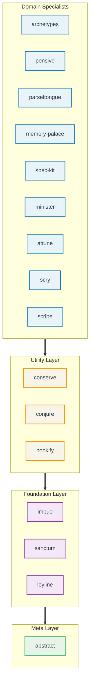

# Claude Night Market

**Claude Code plugins for software engineering workflows.**

16 plugins providing 120 skills, 96 commands, and 41 agents for git operations, code review, spec-driven development, and issue management. Each plugin installs independently.

## Quick Start

### Claude Code Plugin Commands

```bash
# 1. Add the marketplace
/plugin marketplace add athola/claude-night-market

# 2. Install plugins
/plugin install sanctum@claude-night-market    # Git workflows
/plugin install pensive@claude-night-market    # Code review
/plugin install spec-kit@claude-night-market   # Spec-driven dev

# 3. Use
/prepare-pr                                    # Prepare a pull request
/full-review                                   # Run code review
Skill(sanctum:git-workspace-review)            # Invoke a skill
```

### npx skills

```bash
# Install the entire marketplace
npx skills add athola/claude-night-market

# Or install specific plugins
npx skills add athola/claude-night-market/sanctum    # Git workflows
npx skills add athola/claude-night-market/pensive    # Code review
npx skills add athola/claude-night-market/conserve   # Resource optimization
```

### Post-Installation Setup (Claude Code 2.1.16+)

Initialize plugins with Setup hooks:

```bash
# One-time initialization
claude --init

# Weekly maintenance
claude --maintenance
```

> **Note:** If the `Skill` tool is unavailable, read skill files at `plugins/{plugin}/skills/{skill-name}/SKILL.md`.

**Detailed instructions:** See the [Installation Guide](book/src/getting-started/installation.md).

## What's Included

**16 plugins** organized in four layers:



### Plugin Catalog

| Plugin | Layer | Description | Skills | Commands |
|--------|-------|-------------|--------|----------|
| **abstract** | Meta | Skill authoring, hook development, evaluation frameworks, and self-adapting stability monitoring | 10 | 18 |
| **leyline** | Foundation | Auth flows (GitHub/GitLab/AWS), quota management, error patterns, and GitHub Discussions retrieval | 12 | 2 |
| **sanctum** | Foundation | Git workflows, commit messages, PR prep, documentation updates, version management, and session isolation | 14 | 17 |
| **imbue** | Foundation | TDD enforcement, proof-of-work validation, scope guarding, and rigorous reasoning checks | 9 | 2 |
| **conserve** | Utility | Context optimization, bloat detection, CPU/GPU monitoring, and token conservation | 10 | 4 |
| **conjure** | Utility | Delegation framework for routing tasks to external LLMs (Gemini, Qwen) | 4 | 0 |
| **hookify** | Utility | Behavioral rules engine with markdown configuration and hook-to-rule conversion | 2 | 6 |
| **pensive** | Domain | Code review, architecture review, bug hunting, Makefile audits, and NASA Power of 10 safety patterns | 11 | 12 |
| **attune** | Domain | Full project lifecycle: brainstorm, specify, plan, initialize, execute, and war-room deliberation | 12 | 10 |
| **spec-kit** | Domain | Spec-driven development: specifications, task generation, and systematic implementation | 3 | 9 |
| **parseltongue** | Domain | Python development: testing, performance, async patterns, and packaging | 4 | 3 |
| **minister** | Domain | GitHub issue management, label taxonomy, and initiative tracking | 2 | 3 |
| **memory-palace** | Domain | Spatial knowledge organization, digital garden curation, and PR review knowledge capture | 6 | 5 |
| **archetypes** | Domain | Architecture paradigm selection (hexagonal, CQRS, microservices, etc.) | 14 | 0 |
| **scribe** | Domain | Documentation with AI slop detection, style learning, and human-quality writing enforcement | 3 | 3 |
| **scry** | Domain | Terminal recordings (VHS), browser recordings (Playwright), GIF processing | 4 | 2 |

See [Capabilities Reference](book/src/reference/capabilities-reference.md) for the full breakdown of skills, commands, and agents per plugin.

## Common Workflows

Details are available in the [Common Workflows Guide](book/src/getting-started/common-workflows.md).

| Workflow | Command | Description |
|----------|---------|-------------|
| Full project lifecycle | `/attune:mission` | Auto-detects state, routes through brainstorm/specify/plan/execute phases |
| Initialize project | `/attune:arch-init` | Architecture-aware scaffolding with language detection |
| Review a PR | `/full-review` | Multi-discipline code review in a single pass |
| Architecture review | `/pensive:architecture-review` | FPF analysis and coupling assessment |
| Fix PR feedback | `/fix-pr` | Address review comments progressively |
| Implement issues | `/do-issue` | Issue resolution with parallel agent execution |
| Fix workflow issues | `/fix-workflow` | Self-correcting with Reflexion methodology |
| Prepare a PR | `/prepare-pr` | Quality gates, linting, and clean git state before merge |
| Create GitHub issue | `/create-issue` | Interactive issue creation with labels |
| Manage labels | `/update-labels` | GitHub label taxonomy management |
| Catch up on changes | `/catchup` | Context recovery from recent git history |
| Write specifications | `/speckit-specify` | Specification-first development |
| Codebase cleanup | `/unbloat` | Bloat removal with progressive depth levels |
| Update CI/CD | `/update-ci` | Reconcile hooks and workflows with code changes |
| Refine code | `/refine-code` | Duplication, algorithm, and clean code analysis |
| Safety review | `Skill(pensive:safety-critical-patterns)` | NASA Power of 10 guidelines |
| Improve plugins | `/update-plugins` | Stability metrics and module auditing |
| Generate Makefiles | `/abstract:make-dogfood` | Auto-generate targets with language detection |
| Validate rules | `/rules-eval` | Audit `.claude/rules/` for frontmatter and content quality |
| Strategic decisions | `/attune:war-room` | Expert routing with reversibility scoring |
| Embedded escalation | `Skill(attune:war-room-checkpoint)` | Inline expert deliberation at decision points |

## Key Capabilities

**Governance & Quality.** `imbue` enforces TDD via a PreToolUse hook that verifies test files before allowing implementation writes. `pensive` tracks usage frequency and failure rates. `imbue:rigorous-reasoning` requires step-by-step logic checks before tool execution. Quality gates in `/create-skill` and `/create-command` halt execution when tests fail.

**Security & Sessions.** `leyline` manages OAuth flows with local token caching. `conserve` implements permission checks, auto-approving safe commands while blocking destructive operations. `sanctum` isolates named sessions. Agents can run in worktree isolation (`isolation: worktree`) to prevent filesystem conflicts during parallel execution.

**Maintenance.** `/update-ci` reconciles pre-commit hooks and GitHub Actions with code changes. `/update-plugins` recommends updates based on stability metrics. `abstract`'s homeostatic monitor tracks skill stability and auto-triggers improvement agents when degradation is detected, creating GitHub issues for human review. `/fix-workflow` repairs failed runs by analyzing previous errors.

**Cross-Session State.** `attune`, `spec-kit`, and `sanctum` integrate with the Claude Code Tasks system, persisting state across sessions via `CLAUDE_CODE_TASK_LIST_ID`. GitHub Discussions serve as a second persistence layer: `leyline` retrieves recent Decisions at session start, `attune` publishes war-room deliberations, `memory-palace` promotes evergreen knowledge, and `imbue` links scope-guard deferrals to companion discussions. Four discussion category templates ship in `.github/DISCUSSION_TEMPLATE/`.

**Risk Classification.** `leyline:risk-classification` provides 4-tier task risk gating. GREEN and YELLOW tasks use heuristic matching. RED and CRITICAL tasks escalate to `war-room-checkpoint` for expert deliberation.

## Requirements

- **Claude Code** 2.1.16+ (2.1.32+ for agent teams, 2.1.38+ for full security features, 2.1.47 latest tested)
- **Python 3.9+**: hooks execute under the system Python (macOS ships 3.9.6). Plugin packages and scripts may target 3.10+ or 3.12+ via virtual environments, but **all hook code must be 3.9-compatible**

### Python 3.9 Hook Compatibility Rules

Hooks run outside virtual environments, so they must avoid syntax and APIs added after 3.9:

| Feature | Requires | Use Instead |
|---------|----------|-------------|
| `X \| Y` union types | 3.10+ | `from __future__ import annotations` |
| `@dataclass(slots=True)` | 3.10+ | `@dataclass` (omit `slots`) |
| `datetime.UTC` | 3.11+ | `datetime.timezone.utc` |
| `import tomllib` | 3.11+ | `import tomli` or parse manually |
| `import yaml` | not stdlib | wrap in `try/except ImportError` |

See the [Plugin Development Guide](docs/plugin-development-guide.md) for the full list.

## LSP Integration

LSP (Language Server Protocol) support requires Claude Code v2.0.74+. It enables symbol search in ~50ms vs seconds for standard text search.

**Setup:**

1.  Enable LSP in `~/.claude/settings.json`:
    ```json
    { "env": { "ENABLE_LSP_TOOL": "1" } }
    ```
2.  Install language servers (e.g., `npm install -g pyright`).
3.  Install LSP plugins:
    ```bash
    /plugin install pyright-lsp@claude-plugins-official
    ```

See [LSP Native Support Guide](docs/guides/lsp-native-support.md).

## Extending Night Market

To create a new plugin:

```bash
make create-plugin NAME=my-plugin
make validate
make lint && make test
```

Each plugin follows this layout:

```
my-plugin/
├── .claude-plugin/
│   └── plugin.json        # Metadata: skills, commands, agents, hooks
├── commands/               # Slash commands (markdown)
├── skills/                 # Agent skills (SKILL.md + modules/)
├── hooks/                  # Event handlers (Python, 3.9-compatible)
├── agents/                 # Specialized agent definitions
├── scripts/                # Supporting Python scripts
├── tests/                  # pytest suite
├── Makefile                # Build, test, lint targets
└── pyproject.toml          # Package config
```

Refer to the [Plugin Development Guide](docs/plugin-development-guide.md).

## Prompt Context Usage

The ecosystem adds ~14.8k characters to the system prompt. As of Claude Code 2.1.32+, the skill description budget scales at 2% of context window instead of a fixed limit. Plugins use modular designs and progressive loading to stay within these limits.

## Documentation

- [Installation Guide](book/src/getting-started/installation.md) - setup, marketplace, and post-install hooks
- [Quick Start](book/src/getting-started/quick-start.md) - first commands after installation
- [Common Workflows](book/src/getting-started/common-workflows.md) - task-oriented usage guide
- [Plugin Development Guide](docs/plugin-development-guide.md) - creating and testing plugins
- [Capabilities Reference](book/src/reference/capabilities-reference.md) - full skill, command, and agent inventory
- [Tutorials](book/src/tutorials/README.md) - step-by-step guides for PR workflows, debugging, and more

Per-plugin documentation lives in `book/src/plugins/` (one page per plugin).

## Contributing

Each plugin maintains its own tests and documentation. Run `make test` at the repo root to execute all plugin test suites. See the [Plugin Development Guide](docs/plugin-development-guide.md) for structure requirements and naming conventions.

## License

[MIT](LICENSE)
