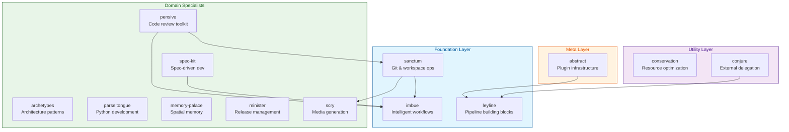

# Claude Night Market

A collection of Claude Code plugins for software engineering workflows.

[**View Capabilities Reference**](book/src/reference/capabilities-reference.md) for a detailed list of all skills, commands, and agents.

> **Recommended Dependency**: Many skills in this marketplace achieve their full potential when used alongside the [**superpowers**](https://github.com/obra/superpowers) skills. While plugins work standalone, superpowers provides foundational methodology skills (TDD, debugging, code review patterns) that enhance workflows significantly. See [Superpowers Dependencies](book/src/reference/capabilities-reference.md#superpowers-dependencies) for details.

## Installation

```bash
# Add the marketplace
/plugin marketplace add athola/claude-night-market

# Install individual plugins
/plugin install archetypes@claude-night-market
/plugin install conjure@claude-night-market
/plugin install imbue@claude-night-market
/plugin install spec-kit@claude-night-market
```

## System Prompt Budget: Optimized

The ecosystem fits within Claude Code's 15K character budget. We optimized descriptions so all 160 skills and commands load without configuration.

### Current Status

- **Description usage**: ~14,800 characters (98.7% of 15K default budget)
- **Headroom**: ~200 characters (1.3% buffer)
- **Budget enforcement**: Pre-commit hook prevents regression

### Optional: Increased Headroom

For extra buffer, you can increase the budget:

```bash
# Add to ~/.bashrc, ~/.zshrc, etc. (OPTIONAL)
export SLASH_COMMAND_TOOL_CHAR_BUDGET=30000
```

With 30K budget: 49.3% used (50.7% headroom for future growth).

### What We Optimized

See [Budget Optimization Summary](docs/budget-optimization-dec-2025.md) for details on the 404-character reduction through description refinement.

**Background**: [Claude Code Skills Not Triggering](https://blog.fsck.com/2025/12/17/claude-code-skills-not-triggering/) - why this matters

## Recommended Setup: LSP Integration

**As of v1.1.1**, this plugin ecosystem **defaults to using LSP** (Language Server Protocol) for code navigation and analysis. LSP provides semantic understanding vs. text-based grep searches.

### Why LSP?

| Capability | LSP (Preferred) | Grep (Secondary) |
|------------|-----------------|------------------|
| Find references | 50ms, semantically accurate | 45s, text-based matches |
| Code navigation | Understands structure | Pattern matching only |
| Token efficiency | 90% token reduction | High context usage |
| Type information | Full type system | Not available |

### Quick Setup

**1. Enable LSP in Claude Code** (recommended for all users):

```bash
# Add to your ~/.bashrc, ~/.zshrc, or shell rc file
export ENABLE_LSP_TOOLS=1

# Reload shell
source ~/.bashrc  # or ~/.zshrc
```

**2. Install cclsp MCP Server** (bridges LSP to Claude Code):

```bash
# Option 1: Quick setup (recommended)
npx cclsp@latest setup

# Option 2: Manual configuration (see setup guide below)
npm install -g cclsp
```

**3. Install Language Servers** for your languages:

```bash
# TypeScript/JavaScript
npm install -g typescript typescript-language-server

# Python
pip install python-lsp-server

# Rust
rustup component add rust-analyzer

# Go
go install golang.org/x/tools/gopls@latest

# More languages: See https://github.com/Piebald-AI/claude-code-lsps
```

**4. Verify Setup**:

```bash
# Test LSP is working (from within a code project)
cd /path/to/your/project
ENABLE_LSP_TOOLS=1 claude

# Then ask about a specific function in your codebase, e.g.:
# "Find all references to the processData function"
# "Show me the definition of UserService.authenticate"
```

### Manual Setup (Alternative to Interactive Setup)

If the interactive `npx cclsp@latest setup` doesn't work in your environment, configure manually:

**1. Create project configuration** (`.cclsp.json` in your project root):

```json
{
  "servers": [
    {
      "extensions": ["py", "pyi"],
      "command": ["pylsp"],
      "rootDir": "."
    },
    {
      "extensions": ["js", "ts", "jsx", "tsx"],
      "command": ["typescript-language-server", "--stdio"],
      "rootDir": "."
    }
  ]
}
```

**2. Configure MCP server** (`~/.claude/.mcp.json`):

```json
{
  "mcpServers": {
    "cclsp": {
      "type": "stdio",
      "command": "npx",
      "args": ["-y", "cclsp@latest"],
      "env": {
        "CCLSP_CONFIG_PATH": "/home/YOUR_USERNAME/.config/cclsp/config.json"
      }
    }
  }
}
```

*Note*: Replace `YOUR_USERNAME` with your actual username, or use `~/.config/cclsp/config.json` if your shell expands `~`.

**3. Restart Claude Code** to load the MCP server:

```bash
exit  # Exit current session
claude  # Start new session with LSP enabled
```

### Plugins Using LSP

- **pensive**: Code review with semantic analysis, impact detection, unused code identification
- **sanctum**: Documentation verification with API completeness checking
- **conservation**: Token-efficient code navigation (~90% token reduction)
- **All code-focused plugins**: Default to LSP, fallback to grep when unavailable

### Without LSP

Plugins use grep-based searches when LSP is unavailable. However, for best performance and accuracy, **LSP is strongly recommended**.

**See**: [`plugins/abstract/docs/claude-code-compatibility.md`](plugins/abstract/docs/claude-code-compatibility.md) for detailed LSP integration patterns and usage examples.

## Project-Level Agents

The repository includes three main-thread agent configurations in `.claude/agents/` for consistent development workflows:

- **`plugin-developer`** (default): Plugin development with validation-first workflows and skill authoring
- **`code-review-mode`**: Code review with evidence gathering and bug analysis
- **`documentation-mode`**: Documentation creation, updates, and consolidation with writing standards

These agents automatically load when starting Claude Code in this project directory. See [Project-Level Agents](book/src/reference/capabilities-reference.md#project-level-agents) for detailed usage and configuration.

## Plugins

### Meta Layer

#### abstract
Meta-skills infrastructure for the plugin ecosystem—skill authoring, hook development, modular design patterns, and evaluation frameworks.

| Skill | Purpose |
|-------|---------|
| `skill-authoring` | TDD methodology for skill creation |
| `hook-authoring` | Security-first hook development |
| `modular-skills` | Modular design patterns |
| `skills-eval` | Skill quality assessment |
| `hooks-eval` | Hook security scanning |
| `escalation-governance` | Model escalation decisions |
| `makefile-dogfooder` | Makefile completeness analysis |
| `shared-patterns` | Cross-skill patterns and utilities |

### Foundation Layer

#### imbue
Workflow methodologies for analysis, evidence gathering, and structured output. Base layer for building additional workflow plugins.

| Skill | Purpose |
|-------|---------|
| `review-core` | Shared review scaffolding and methodology |
| `diff-analysis` | Semantic changeset analysis |
| `catchup` | Quick context recovery for any delta |
| `evidence-logging` | Evidence capture methodology |
| `structured-output` | Output formatting patterns |
| `feature-review` | Evidence-based feature prioritization |
| `scope-guard` | Branch scope management and anti-overengineering |

#### sanctum
Git and workspace operations for active development workflows.

| Skill | Purpose |
|-------|---------|
| `git-workspace-review` | Preflight git status and diffs |
| `commit-messages` | Conventional commit generation |
| `pr-prep` | Pull request preparation |
| `pr-review` | PR analysis and feedback |
| `doc-updates` | Documentation updates |
| `doc-consolidation` | Merge ephemeral docs into permanent |
| `update-readme` | README modernization |
| `version-updates` | Version bumping |
| `test-updates` | Test suite maintenance |
| `fix-issue` | GitHub issue resolution workflow |
| `workflow-improvement` | Workflow optimization analysis |

#### leyline
Infrastructure and pipeline building blocks for plugins.

| Skill | Purpose |
|-------|---------|
| `quota-management` | Rate limiting and quotas |
| `usage-logging` | Telemetry and usage tracking |
| `service-registry` | Service discovery patterns |
| `error-patterns` | Standardized error handling |
| `testing-quality-standards` | Test quality enforcement |
| `authentication-patterns` | Auth implementation patterns |
| `mecw-patterns` | Minimum effective context patterns |
| `progressive-loading` | Lazy loading strategies |
| `pytest-config` | Pytest configuration templates |
| `storage-templates` | Data persistence patterns |
| `evaluation-framework` | Skill evaluation infrastructure |

### Utility Layer

#### conservation
Resource optimization and performance monitoring.

| Command/Skill | Purpose |
|-------|---------|
| `/bloat-scan` | Progressive bloat detection (dead code, God classes, duplication) |
| `/unbloat` | Safe bloat remediation with backups and test verification |
| `context-optimization` | MECW context management |
| `mcp-code-execution` | Tool-heavy workflow optimization |
| `cpu-gpu-performance` | Performance guardrails |
| `token-conservation` | Context efficiency |
| `bloat-detector` | Bloat detection algorithms and remediation strategies |

#### conjure
Delegation to external LLM services, primarily through headless calls.

| Skill | Purpose |
|-------|---------|
| `delegation-core` | Task routing framework |
| `gemini-delegation` | Gemini CLI integration |
| `qwen-delegation` | Qwen MCP integration |

### Domain Specialists

#### archetypes
Architecture paradigm selection and implementation planning.

| Skill | Purpose |
|-------|---------|
| `architecture-paradigms` | Interactive paradigm selector |
| `architecture-paradigm-*` | 13 specific paradigm guides |

#### pensive
Code review toolkit.

| Skill | Purpose |
|-------|---------|
| `api-review` | API surface evaluation |
| `architecture-review` | Principal-level architecture review |
| `bug-review` | Deep bug hunting |
| `makefile-review` | Makefile structure review |
| `math-review` | Mathematical correctness |
| `rust-review` | Rust-specific review |
| `test-review` | TDD/BDD test suite review |
| `unified-review` | Multi-discipline review orchestration |

#### parseltongue
Modern Python development suite—testing, performance optimization, async patterns, and packaging.

| Skill | Purpose |
|-------|---------|
| `python-testing` | Pytest and TDD workflows |
| `python-performance` | Profiling and optimization |
| `python-async` | Async programming patterns |
| `python-packaging` | Modern packaging with uv |

#### memory-palace
Knowledge organization using spatial memory concepts.

| Skill | Purpose |
|-------|---------|
| `memory-palace-architect` | Palace building and management |
| `knowledge-locator` | Spatial search and retrieval |
| `knowledge-intake` | Knowledge intake and curation |
| `digital-garden-cultivator` | Digital garden maintenance |
| `session-palace-builder` | Session-scoped knowledge capture |

#### spec-kit
Specification-Driven Development (SDD) toolkit—structured specification, planning, and implementation workflows.

| Skill | Purpose |
|-------|---------|
| `spec-writing` | Feature specification authoring |
| `task-planning` | Dependency-ordered task generation |
| `speckit-orchestrator` | Workflow coordination |

#### minister
GitHub initiative tracking and release management.

| Skill | Purpose |
|-------|---------|
| `github-initiative-pulse` | Initiative progress tracking |
| `release-health-gates` | Release readiness checks |

#### scry
Media generation for terminal recordings, browser recordings, GIF processing, and media composition.

| Skill | Purpose |
|-------|---------|
| `vhs-recording` | Terminal session recording via VHS |
| `browser-recording` | Browser automation recording via Playwright |
| `gif-generation` | Video-to-GIF conversion and optimization |
| `media-composition` | Multi-source media stitching |

## Plugin Dependency Graph



## Quick Start

```bash
# Get a quick catchup on changes
/git-catchup

# Start a spec-driven feature
/speckit-specify Add user authentication with OAuth2

# Review code changes on current PR
/pr-review

# Fix PR comments/issues on current PR
/fix-pr

# Review architecture on current project
/pensive:architecture-review

# Detect and clean up codebase bloat
/bloat-scan --level 2
/unbloat --from-scan bloat-report.md
```

## Setup

This marketplace contains individual plugins. To fork one or more plugins, create a new git repo.

```bash
# For each plugin directory
cd ~/archetypes && git init && git add . && git commit -m "Initial commit"
gh repo create athola/archetypes --public --source=. --push

# Repeat for any plugins as necessary
```

Then update `.claude-plugin/marketplace.json` with your alternate GitHub URLs.

## Philosophy

- **Modular**: Shallow dependency chains, single responsibility.
- **Progressive**: Load only what you need.
- **Composable**: Plugins are designed to work together.
- **Spec-driven**: Define what before implementing how.

## Contributing

See individual plugin READMEs for contribution guidelines. Each plugin maintains its own test suite and documentation.

## License

[MIT](LICENSE)
