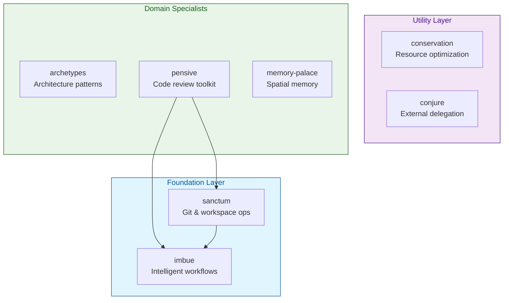

# Claude Night Market

Personal Claude Code plugin marketplace featuring architecture patterns, intelligent delegation, resource optimization, code review workflows, and spatial memory systems.

## Installation

```bash
# Add the marketplace
/plugin marketplace add athola/claude-night-market

# Install individual plugins
/plugin install archetypes@claude-night-market
/plugin install conjure@claude-night-market
/plugin install imbue@claude-night-market
```

## Plugins

### Foundation Layer

#### imbue
Intelligent workflow methodologies for analysis, evidence gathering, and structured output.

| Skill | Purpose |
|-------|---------|
| `review-core` | Shared review scaffolding and methodology |
| `diff-analysis` | Semantic changeset analysis |
| `catchup` | Quick context recovery for any delta |
| `evidence-logging` | Evidence capture methodology |
| `structured-output` | Output formatting patterns |

#### sanctum
Git and workspace operations for active development workflows.

| Skill | Purpose |
|-------|---------|
| `git-workspace-review` | Preflight git status and diffs |
| `file-analysis` | File enumeration and structure |
| `commit-messages` | Conventional commit generation |
| `pr-prep` | Pull request preparation |
| `doc-updates` | Documentation updates |
| `update-readme` | README modernization |
| `version-updates` | Version bumping |

### Utility Layer

#### conservation
Resource optimization and performance monitoring.

| Skill | Purpose |
|-------|---------|
| `cpu-gpu-performance` | Performance guardrails |
| `token-conservation` | Context efficiency |
| `token-estimator` | Usage estimation |

#### conjure
Delegation to external LLM services.

| Skill | Purpose |
|-------|---------|
| `delegation-core` | Task routing framework |
| `gemini-delegation` | Gemini CLI integration |
| `qwen-delegation` | Qwen MCP integration |

### Domain Specialists

#### archetypes
Architecture paradigm selection and implementation planning.

| Skill | Purpose |
|-------|---------|
| `architecture-paradigms` | Interactive paradigm selector |
| `architecture-paradigm-*` | 13 specific paradigm guides |

#### pensive
Code review toolkit.

| Skill | Purpose |
|-------|---------|
| `architecture-review` | Principal-level architecture review |
| `bug-review` | Deep bug hunting |
| `api-review` | API surface evaluation |
| `test-review` | TDD/BDD test suite review |
| `math-review` | Mathematical correctness |
| `rust-review` | Rust-specific review |
| `makefile-review` | Makefile structure review |

#### memory-palace
Spatial memory techniques for knowledge organization.

| Skill | Purpose |
|-------|---------|
| `memory-palace-architect` | Palace building and management |
| `knowledge-locator` | Spatial search and retrieval |
| `skill-cartographer` | Skill relationship mapping |
| `session-palace-builder` | Session-specific structures |

## Plugin Dependency Graph



## Setup

Before using this marketplace, push each plugin to GitHub:

```bash
# For each plugin directory
cd ~/archetypes && git init && git add . && git commit -m "Initial commit"
gh repo create athola/archetypes --public --source=. --push

# Repeat for: conjure, conservation, imbue, memory-palace, pensive, sanctum
```

Then update `.claude-plugin/marketplace.json` with your actual GitHub URLs.

## Philosophy

- **Modular**: Shallow dependency chains, single responsibility
- **Progressive**: Load only what you need
- **Composable**: Plugins work together seamlessly

## License

MIT License
