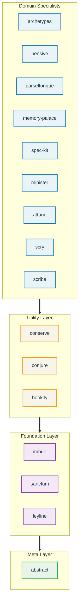

# Claude Night Market

**Claude Code plugins for software engineering workflows.**

This repository adds 16 plugins to Claude Code for git operations, code review, spec-driven development, and issue management. These plugins work independently but share a common set of patterns for testing and debugging.

## Key Features

*   **Agent-Aware Context:** Hooks (v2.1.2+) adapt context based on the active agent.
*   **Skill Metrics:** `pensive` tracks usage frequency and failure rates.
*   **Proof-of-Work TDD:** `imbue` requires failing tests before implementation begins.
*   **Anti-Cargo-Cult:** `imbue` verifies understanding with the Five Whys framework before accepting solutions.
*   **Checklist Analysis:** `imbue:rigorous-reasoning` forces a step-by-step logic check before complex tasks.
*   **Interactive Auth:** `leyline` manages OAuth flows for GitHub, GitLab, and AWS with token caching.
*   **Permission Automation:** `conserve` auto-approves safe commands (`ls`, `grep`) and blocks risky ones (`rm -rf /`, `sudo`).
*   **Session Management:** `sanctum` enables named sessions for debugging, feature work, and PR reviews.
*   **Test Enforcement:** `/create-skill` and `/create-command` abort if no failing tests exist.
*   **Self-Correction:** `/update-plugins` recommends updates based on stability; `/fix-workflow` attempts to repair failed runs.

## Workflow Improvements

Commands automate multi-step processes:

*   **Git:** `/prepare-pr` checks branch scope, runs linting, and verifies clean state before PR creation.
*   **Reviews:** `/full-review` audits syntax, logic, and security in one pass.
*   **Specs:** `/speckit-specify` forces a written specification phase before code generation.
*   **Context:** `/catchup` reads recent git history to update the context window.
*   **Setup:** `/attune:init` detects project types (Python, Node, etc.) and creates necessary config files.

## Quick Start

```bash
# 1. Add the marketplace
/plugin marketplace add athola/claude-night-market

# 2. Install plugins you need
/plugin install sanctum@claude-night-market    # Git workflows
/plugin install pensive@claude-night-market    # Code review
/plugin install spec-kit@claude-night-market   # Spec-driven dev

# 3. Start using
/prepare-pr                                    # Prepare a pull request
/full-review                                   # Run code review
Skill(sanctum:git-workspace-review)            # Invoke a skill (if Skill tool available)
```

> **Note:** If the `Skill` tool is unavailable, read skill files directly: `Read plugins/{plugin}/skills/{skill-name}/SKILL.md` and follow the instructions.

**Next steps:** See [Installation Guide](book/src/getting-started/installation.md) for recommended plugin sets and troubleshooting.

## What's Included

**16 plugins** organized in layers, each building on foundations below:



### Highlights

*   **sanctum**: Git operations (`/prepare-pr`, `/do-issue`), documentation, and session management.
*   **pensive**: Code reviews (`/full-review`) and audits.
*   **spec-kit**: Requirements definition (`/speckit-specify`).
*   **minister**: GitHub issues (`/create-issue`, `/close-issue`).
*   **conserve**: Codebase bloat reduction (`/bloat-scan`).
*   **attune**: Project scaffolding (`/attune:init`).
*   **parseltongue**: Python tools (`/analyze-tests`).
*   **archetypes**: Architecture guides.
*   **memory-palace**: Knowledge indexing (`/palace`).
*   **scribe**: Documentation review and AI slop detection (`/slop-scan`, `/doc-verify`).
*   **hookify**: Behavioral rules without configuration.
*   **leyline**: Foundation utilities (quota tracking, token estimation, authentication).
*   **imbue**: Review methodologies, proof-of-work TDD, anti-cargo-cult verification.

See [Capabilities Reference](book/src/reference/capabilities-reference.md) for the full list of 109 skills, 96 commands, and 36 agents.

## Audience

Developers use these plugins to automate CLI tasks and enforce consistency in Claude Code sessions. Teams use them to standardize LLM interactions.

## Common Workflows

See [**Common Workflows Guide**](book/src/getting-started/common-workflows.md) for execution details.

| Workflow | Command | Example |
|----------|-------------|---------|
| Initialize project | `/attune:arch-init` | `attune:arch-init --name my-api` |
| Review a PR | `/full-review` | Run multi-discipline code review |
| Architecture review | `/fpf-review` | FPF (Functional/Practical/Foundation) analysis |
| Fix PR feedback | `/fix-pr` | Address review comments |
| Implement issues | `/do-issue` | Progressive issue resolution with TDD |
| Fix workflow issues | `/fix-workflow` | Self-correcting with Reflexion |
| Prepare a PR | `/prepare-pr` | Quality gates before merge |
| Create GitHub issue | `/create-issue` | Interactive issue creation |
| Manage labels | `/update-labels` | GitHub label taxonomy |
| Catch up on changes | `/catchup` | Context recovery |
| Write specifications | `/speckit-specify` | Spec-driven development |
| Debug issues | `Skill(superpowers:debugging)` | Root cause analysis |
| Improve plugins | `/update-plugins` | Update based on stability metrics |

## Demos

### Skills Showcase


This 90-second tutorial demonstrates how to browse skills, examine their frontmatter, and chain them into workflows.

[Full Tutorial](docs/tutorials/skills-showcase.md)

---

## Documentation

*   [**Getting Started**](book/src/getting-started/README.md): Installation and setup.
*   [**Plugin Catalog**](book/src/plugins/README.md): Documentation for each plugin.
*   [**Capabilities Reference**](book/src/reference/capabilities-reference.md): List of all skills and commands.
*   [**Tutorials**](book/src/tutorials/README.md): Guides for specific tasks.
*   [**Advanced Guides**](docs/guides/README.md): Deep dives into architecture and patterns.

## LSP Integration

LSP (Language Server Protocol) support is available in Claude Code v2.0.74+. It enables faster symbol search (~50ms) compared to text search (~45s).

**Setup:**

1.  Enable LSP in `~/.claude/settings.json`:
    ```json
    { "env": { "ENABLE_LSP_TOOL": "1" } }
    ```
2.  Install language servers (e.g., `npm install -g pyright`).
3.  Install LSP plugins:
    ```bash
    /plugin install pyright-lsp@claude-plugins-official
    ```

See [LSP Native Support Guide](docs/guides/lsp-native-support.md) for details.

## Extending Night Market

To create a new plugin:

```bash
make create-plugin NAME=my-plugin
make validate
make lint && make test
```

Refer to the [Plugin Development Guide](docs/plugin-development-guide.md) for architectural patterns.

## Prompt Context Usage

The ecosystem adds ~14.8k characters to the system prompt (limit: 15k), enforced by a pre-commit hook.

## Architecture

Plugins are modular, load progressively to save tokens, and emphasize specifications before coding.

## Contributing

See the [Plugin Development Guide](docs/plugin-development-guide.md) for guidelines. Each plugin maintains its own tests and documentation.

## License

[MIT](LICENSE)
