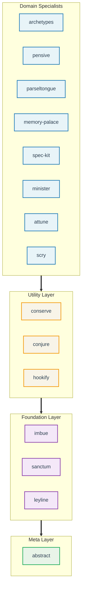

# Claude Night Market

**Claude Code plugins for software engineering workflows.**

This repository adds 15 plugins to Claude Code for git operations, code review, spec-driven development, and issue management. These plugins work independently but share a common set of patterns for testing and debugging.

## Key Features

*   **Agent-Aware Context:** Hooks in version 2.1.2+ adapt the context based on the active agent.
*   **Skill Metrics:** The `pensive` plugin tracks skill usage and stability, allowing for performance analysis via `/skill-review`.
*   **Proof-of-Work TDD:** The `imbue` plugin requires a failing test before allowing implementation code, enforcing test-driven development.
*   **Iron Law Interlock:** Creation commands (`/create-skill`, `/create-command`) block implementation until a failing test exists.
*   **Self-Correction:** The `/update-plugins` command analyzes skill stability to suggest improvements, while `/fix-workflow` uses Reflexion patterns for self-critique before implementation.

## Workflow Improvements

The Night Market replaces manual or generic steps with specialized commands:

*   **Git:** Instead of running raw git commands, `/prepare-pr` handles branch checks and scope validation.
*   **Reviews:** `/full-review` runs a multi-step audit (syntax, logic, security) rather than relying on manual inspection.
*   **Specs:** `/speckit-specify` guides you through creating a detailed specification before coding starts.
*   **Context:** `/catchup` summarizes recent changes to restore context after a break.
*   **Setup:** `/attune:init` generates project scaffolding based on detected project types.

## Quick Start

```bash
# 1. Add the marketplace
/plugin marketplace add athola/claude-night-market

# 2. Install plugins you need
/plugin install sanctum@claude-night-market    # Git workflows
/plugin install pensive@claude-night-market    # Code review
/plugin install spec-kit@claude-night-market   # Spec-driven dev

# 3. Start using
/prepare-pr                                    # Prepare a pull request
/full-review                                   # Run code review
Skill(sanctum:git-workspace-review)            # Invoke a skill (if Skill tool available)
```

> **Note:** If the `Skill` tool is unavailable, read skill files directly: `Read plugins/{plugin}/skills/{skill-name}/SKILL.md` and follow the instructions.

**Next steps:** See [Installation Guide](book/src/getting-started/installation.md) for recommended plugin sets and troubleshooting.

## What's Included

**15 plugins** organized in layers, each building on foundations below:



### Highlights

The ecosystem covers several domains:

*   **sanctum** handles git operations (`/prepare-pr`, `/commit-msg`) and documentation updates.
*   **pensive** manages code reviews (`/full-review`) and audits shell usage.
*   **spec-kit** defines requirements (`/speckit-specify`) before implementation.
*   **minister** interfaces with GitHub issues (`/create-issue`, `/close-issue`, `/update-labels`).
*   **conserve** detects and reduces codebase bloat (`/bloat-scan`, `/unbloat`).
*   **attune** scaffolds new projects (`/attune:init`).
*   **parseltongue** provides Python-specific tools like test analysis (`/analyze-tests`).
*   **archetypes** offers architecture guides.
*   **memory-palace** indexes project knowledge (`/palace`, `/garden`).
*   **hookify** applies behavioral rules without configuration.

See [Capabilities Reference](book/src/reference/capabilities-reference.md) for the full list of 107 skills, 90 commands, and 35 agents.

## Audience

This marketplace is for developers who want to automate repetitive CLI tasks and enforce consistency in their Claude Code sessions. It is also useful for teams creating a shared standard for LLM interactions.

## Common Workflows

See [**Common Workflows Guide**](book/src/getting-started/common-workflows.md) for execution details.

| Workflow | Command | Example |
|----------|-------------|---------|
| Initialize project | `/attune:arch-init` | `attune:arch-init --name my-api` |
| Review a PR | `/full-review` | Run multi-discipline code review |
| Fix PR feedback | `/fix-pr` | Address review comments |
| Fix workflow issues | `/fix-workflow` | Self-correcting with Reflexion |
| Prepare a PR | `/prepare-pr` | Quality gates before merge |
| Create GitHub issue | `/create-issue` | Interactive issue creation |
| Manage labels | `/update-labels` | GitHub label taxonomy |
| Catch up on changes | `/catchup` | Context recovery |
| Write specifications | `/speckit-specify` | Spec-driven development |
| Debug issues | `Skill(superpowers:debugging)` | Root cause analysis |
| Improve plugins | `/update-plugins` | Update based on stability metrics |

## Demos

### Skills Showcase


This 90-second tutorial demonstrates how to browse skills, examine their frontmatter, and chain them into workflows.

[→ Full Tutorial](docs/tutorials/skills-showcase.md)

---

## Documentation

*   [**Getting Started**](book/src/getting-started/README.md): Installation and setup.
*   [**Plugin Catalog**](book/src/plugins/README.md): Documentation for each plugin.
*   [**Capabilities Reference**](book/src/reference/capabilities-reference.md): List of all skills and commands.
*   [**Tutorials**](book/src/tutorials/README.md): Guides for specific tasks.
*   [**Advanced Guides**](docs/guides/README.md): Deep dives into architecture and patterns.

## LSP Integration

LSP (Language Server Protocol) support is available in Claude Code v2.0.74+. It enables faster symbol search (~50ms) compared to text search (~45s).

**Setup:**

1.  Enable LSP in `~/.claude/settings.json`:
    ```json
    { "env": { "ENABLE_LSP_TOOL": "1" } }
    ```
2.  Install language servers (e.g., `npm install -g pyright`).
3.  Install LSP plugins:
    ```bash
    /plugin install pyright-lsp@claude-plugins-official
    ```

See [LSP Native Support Guide](docs/guides/lsp-native-support.md) for details.

## Extending Night Market

To create a new plugin:

```bash
make create-plugin NAME=my-plugin
make validate
make lint && make test
```

Refer to the [Plugin Development Guide](docs/plugin-development-guide.md) for architectural patterns.

## System Prompt Budget

The ecosystem adds approximately 14,800 characters to the system prompt, staying within the 15K character budget. A pre-commit hook enforces this limit.

## Design

Plugins are modular and have minimal dependencies. They load progressively to minimize token usage. The workflow emphasizes writing specifications before writing code.

## Contributing

See [CONTRIBUTING](docs/plugin-development-guide.md#contributing) for guidelines. Each plugin maintains its own tests and documentation.

## License

[MIT](LICENSE)
