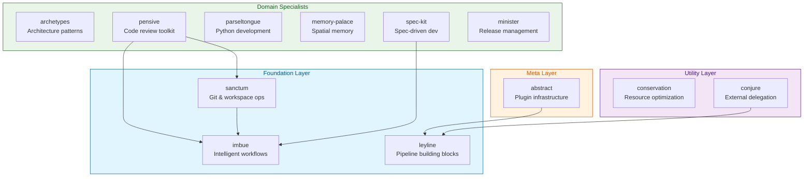

# Claude Night Market

Personal Claude Code plugin marketplace featuring architecture patterns, intelligent delegation, resource optimization, code review workflows, spec-driven development, and spatial memory systems.

## Installation

```bash
# Add the marketplace
/plugin marketplace add athola/claude-night-market

# Install individual plugins
/plugin install archetypes@claude-night-market
/plugin install conjure@claude-night-market
/plugin install imbue@claude-night-market
/plugin install spec-kit@claude-night-market
```

## Plugins

### Meta Layer

#### abstract
Meta-skills infrastructure for the plugin ecosystem—skill authoring, hook development, modular design patterns, and evaluation frameworks.

| Skill | Purpose |
|-------|---------|
| `skill-authoring` | TDD methodology for skill creation |
| `hook-authoring` | Security-first hook development |
| `modular-skills` | Modular design patterns |
| `skills-eval` | Skill quality assessment |
| `hooks-eval` | Hook security scanning |
| `escalation-governance` | Model escalation decisions |

### Foundation Layer

#### imbue
Intelligent workflow methodologies for analysis, evidence gathering, and structured output. Forms a basis for building additional workflow plugins.

| Skill | Purpose |
|-------|---------|
| `review-core` | Shared review scaffolding and methodology |
| `diff-analysis` | Semantic changeset analysis |
| `catchup` | Quick context recovery for any delta |
| `evidence-logging` | Evidence capture methodology |
| `structured-output` | Output formatting patterns |

#### sanctum
Git and workspace operations for active development workflows.

| Skill | Purpose |
|-------|---------|
| `git-workspace-review` | Preflight git status and diffs |
| `commit-messages` | Conventional commit generation |
| `pr-prep` | Pull request preparation |
| `doc-updates` | Documentation updates |
| `update-readme` | README modernization |
| `version-updates` | Version bumping |

#### leyline
Infrastructure and pipeline building blocks for plugins—like ancient ley lines connecting sacred sites.

| Skill | Purpose |
|-------|---------|
| `quota-management` | Rate limiting and quotas |
| `usage-logging` | Telemetry and usage tracking |
| `service-registry` | Service discovery patterns |
| `error-patterns` | Standardized error handling |
| `testing-quality-standards` | Test quality enforcement |

### Utility Layer

#### conservation
Resource optimization and performance monitoring.

| Skill | Purpose |
|-------|---------|
| `context-optimization` | MECW context management |
| `mcp-code-execution` | Tool-heavy workflow optimization |
| `cpu-gpu-performance` | Performance guardrails |
| `token-conservation` | Context efficiency |

#### conjure
Delegation to external LLM services, primarily through headless calls.

| Skill | Purpose |
|-------|---------|
| `delegation-core` | Task routing framework |
| `gemini-delegation` | Gemini CLI integration |
| `qwen-delegation` | Qwen MCP integration |

### Domain Specialists

#### archetypes
Architecture paradigm selection and implementation planning.

| Skill | Purpose |
|-------|---------|
| `architecture-paradigms` | Interactive paradigm selector |
| `architecture-paradigm-*` | 13 specific paradigm guides |

#### pensive
Reflective thinking toolkit to review code.

| Skill | Purpose |
|-------|---------|
| `api-review` | API surface evaluation |
| `architecture-review` | Principal-level architecture review |
| `bug-review` | Deep bug hunting |
| `makefile-review` | Makefile structure review |
| `math-review` | Mathematical correctness |
| `rust-review` | Rust-specific review |
| `test-review` | TDD/BDD test suite review |

#### parseltongue
Modern Python development suite—testing, performance optimization, async patterns, and packaging.

| Skill | Purpose |
|-------|---------|
| `python-testing` | Pytest and TDD workflows |
| `python-performance` | Profiling and optimization |
| `python-async` | Async programming patterns |
| `python-packaging` | Modern packaging with uv |

#### memory-palace
Spatial memory techniques for knowledge organization.

| Skill | Purpose |
|-------|---------|
| `palace-architect` | Palace building and management |
| `knowledge-navigator` | Spatial search and retrieval |
| `knowledge-librarian` | Knowledge intake and curation |
| `garden-curator` | Digital garden maintenance |

#### spec-kit
Spec Driven Development toolkit—structured specification, planning, and implementation workflows.

| Skill | Purpose |
|-------|---------|
| `spec-writing` | Feature specification authoring |
| `task-planning` | Dependency-ordered task generation |
| `speckit-orchestrator` | Workflow coordination |

#### minister
GitHub initiative tracking and release management.

| Skill | Purpose |
|-------|---------|
| `github-initiative-pulse` | Initiative progress tracking |
| `release-health-gates` | Release readiness checks |

## Plugin Dependency Graph



## Quick Start

```bash
# Start a spec-driven feature
/speckit.specify Add user authentication with OAuth2

# Review code changes
/sanctum:pr

# Get a quick catchup on changes
/imbue:catchup

# Run architecture analysis
Skill(archetypes:architecture-paradigms)
```

## Setup

Before using this marketplace, push each plugin to GitHub:

```bash
# For each plugin directory
cd ~/archetypes && git init && git add . && git commit -m "Initial commit"
gh repo create athola/archetypes --public --source=. --push

# Repeat for all plugins: abstract, conjure, conservation, imbue, leyline,
# memory-palace, minister, parseltongue, pensive, sanctum, spec-kit
```

Then update `.claude-plugin/marketplace.json` with your actual GitHub URLs.

## Philosophy

- **Modular**: Shallow dependency chains, single responsibility
- **Progressive**: Load only what you need
- **Composable**: Plugins work together seamlessly
- **Spec-driven**: Define what before implementing how

## Contributing

See individual plugin READMEs for contribution guidelines. Each plugin maintains its own test suite and documentation.

## License

[MIT](LICENSE)
