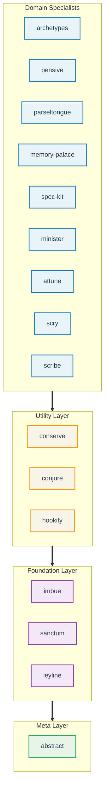

# Claude Night Market

**Claude Code plugins for software engineering workflows.**

This repository adds 16 plugins to Claude Code for git operations, code review, spec-driven development, and issue management. Each plugin functions independently to allow selective installation while sharing a common testing framework for consistency.

## Features

**Governance & Quality**
Hooks adapt context based on the active agent. `pensive` tracks usage frequency and failure rates to identify unstable workflows. `imbue` enforces test-driven development via a PreToolUse hook that verifies the existence of test files before allowing implementation writes. For complex tasks, `imbue:rigorous-reasoning` requires step-by-step logic checks before tool execution.

**Security & Session Management**
`leyline` manages OAuth flows for GitHub, GitLab, and AWS with local token caching. `conserve` implements permission checks, automatically approving safe commands like `ls` while blocking high-risk operations like `rm -rf /`. `sanctum` isolates named sessions for debugging, feature work, and PR reviews. Quality gates in `/create-skill` and `/create-command` halt execution if the project has failing tests.

**Maintenance & Resilience**
`/cleanup` orchestrates bloat removal, code refinement, and AI hygiene auditing in a single pass with progressive depth levels. `/update-ci` reconciles pre-commit hooks and GitHub Actions workflows with recent code changes, detecting renamed files and orphaned references. `/update-plugins` recommends updates based on plugin stability metrics and includes module auditing to detect orphaned or missing skill references. `/fix-workflow` attempts to repair failed runs by analyzing previous errors. `/abstract:make-dogfood` generates or validates Makefile targets for all documented commands across plugins, with automatic language detection for Python, Rust, and TypeScript projects. For strategic decisions, `/attune:war-room` uses a Type 1/2 reversibility framework to route choices to appropriate expert subagents, with `war-room-checkpoint` enabling embedded escalation at decision points during implementation.

**Cross-Session State (Claude Code 2.1.16+)**
`attune`, `spec-kit`, and `sanctum` integrate with the native Claude Code Tasks system. Task creation occurs on-demand, and state persists across sessions via `CLAUDE_CODE_TASK_LIST_ID`. The `war-room-checkpoint` skill integrates with commands like `/do-issue`, `/pr-review`, `/fix-pr`, and `/architecture-review` to trigger expert deliberation when high-stakes decisions emerge during workflows. Ambiguity detection prompts for user decisions when task boundaries are unclear. Versions prior to 2.1.16 use file-based state by default. Claude Code 2.1.20+ supports task deletion via `TaskUpdate`, and 2.1.33+ adds persistent agent memory scoped to user, project, or session.

## Workflow Improvements

Commands automate multi-step processes to reduce manual intervention. `/prepare-pr` validates branch scope, runs configured linters, and verifies a clean git state before drafting a pull request. `/full-review` audits syntax, logic, and security in a single pass. `/speckit-specify` requires a written specification phase before generating code. To maintain context, `/catchup` reads recent git history, and `/attune:project-init` detects project types (Python, Node) to scaffold configuration files.

## Quick Start

### Claude Code Plugin Commands

```bash
# 1. Add the marketplace
/plugin marketplace add athola/claude-night-market

# 2. Install plugins
/plugin install sanctum@claude-night-market    # Git workflows
/plugin install pensive@claude-night-market    # Code review
/plugin install spec-kit@claude-night-market   # Spec-driven dev

# 3. Use
/prepare-pr                                    # Prepare a pull request
/full-review                                   # Run code review
Skill(sanctum:git-workspace-review)            # Invoke a skill
```

### npx skills

```bash
# Install the entire marketplace
npx skills add athola/claude-night-market

# Or install specific plugins
npx skills add athola/claude-night-market/sanctum    # Git workflows
npx skills add athola/claude-night-market/pensive    # Code review
npx skills add athola/claude-night-market/conserve   # Resource optimization
```

### Post-Installation Setup (Claude Code 2.1.16+)

Initialize plugins with Setup hooks:

```bash
# One-time initialization
claude --init

# Weekly maintenance
claude --maintenance
```

> **Note:** If the `Skill` tool is unavailable, read skill files at `plugins/{plugin}/skills/{skill-name}/SKILL.md`.

**Detailed instructions:** See the [Installation Guide](book/src/getting-started/installation.md).

## What's Included

**16 plugins** organized in layers, each building on foundations below:



### Layer Overview

1.  **Foundation Layer**: Core utilities. `sanctum` (git and sessions), `leyline` (auth and quotas), and `imbue` (TDD cycles).
2.  **Utility Layer**: Resource management. `conserve` (context optimization) and `hookify` (rules engine with hook conversion and context-aware rule suggestions).
3.  **Domain Specialists**: Task-specific logic. `pensive` (code review and refinement, including NASA Power of 10 safety patterns), `spec-kit` (requirements), `minister` (issue tracking), and `attune` (project lifecycle from brainstorm to execution). `attune` uses an enhanced discoverability pattern for automatic command matching from natural language. The `/attune:plan` command was renamed to `/attune:blueprint` in v1.4.1.
4.  **Meta Layer**: `abstract` provides tools for plugin and skill authoring, including Makefile generation and command-to-target validation.

See [Capabilities Reference](book/src/reference/capabilities-reference.md) for the full list of 120 skills, 114 commands, and 41 agents.

## Common Workflows

Details are available in the [Common Workflows Guide](book/src/getting-started/common-workflows.md).

| Workflow | Command | Example |
|----------|-------------|---------|
| Initialize project | `/attune:arch-init` | `attune:arch-init --name my-api` |
| Review a PR | `/full-review` | Run multi-discipline code review |
| Architecture review | `/fpf-review` | FPF analysis |
| Fix PR feedback | `/fix-pr` | Address review comments |
| Implement issues | `/do-issue` | Progressive issue resolution |
| Fix workflow issues | `/fix-workflow` | Self-correcting with Reflexion |
| Prepare a PR | `/prepare-pr` | Quality gates before merge |
| Create GitHub issue | `/create-issue` | Interactive issue creation |
| Manage labels | `/update-labels` | GitHub label taxonomy |
| Catch up on changes | `/catchup` | Context recovery |
| Write specifications | `/speckit-specify` | Spec-driven development |
| Debug issues | `Skill(superpowers:debugging)` | Root cause analysis |
| Codebase cleanup | `/cleanup` | Orchestrated bloat, quality, and hygiene scan |
| Update CI/CD | `/update-ci` | Reconcile hooks and workflows with code changes |
| Refine code | `/refine-code` | Duplication, algorithms, and clean code analysis |
| Safety review | `Skill(pensive:safety-critical-patterns)` | NASA Power of 10 guidelines for robust code |
| Improve plugins | `/update-plugins` | Update based on stability metrics + module audit |
| Generate Makefiles | `/abstract:make-dogfood` | Auto-generate Makefiles for plugins with language detection |
| Strategic decisions | `/attune:war-room` | Expert routing with reversibility scoring |
| Embedded escalation | `Skill(attune:war-room-checkpoint)` | Inline expert deliberation at decision points |

## LSP Integration

LSP (Language Server Protocol) support requires Claude Code v2.0.74+. It enables symbol search in ~50ms, significantly faster than standard text search.

**Setup:**

1.  Enable LSP in `~/.claude/settings.json`:
    ```json
    { "env": { "ENABLE_LSP_TOOL": "1" } }
    ```
2.  Install language servers (e.g., `npm install -g pyright`).
3.  Install LSP plugins:
    ```bash
    /plugin install pyright-lsp@claude-plugins-official
    ```

See [LSP Native Support Guide](docs/guides/lsp-native-support.md).

## Extending Night Market

To create a new plugin:

```bash
make create-plugin NAME=my-plugin
make validate
make lint && make test
```

Refer to the [Plugin Development Guide](docs/plugin-development-guide.md).

## Prompt Context Usage

The ecosystem adds ~14.8k characters to the system prompt. As of Claude Code 2.1.32+, the skill description budget scales at 2% of context window instead of a fixed limit. Plugins use modular designs and progressive loading to stay within these limits.

## Contributing

Each plugin maintains its own tests and documentation. See the [Plugin Development Guide](docs/plugin-development-guide.md).

## License

[MIT](LICENSE)
