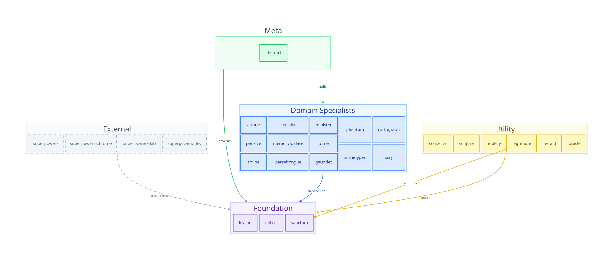

# Claude Night Market

[](CHANGELOG.md)
[](LICENSE)
[](book/src/plugins/)
[](book/src/reference/capabilities-reference.md)
[](https://code.claude.com/docs/en/overview)

**A plugin marketplace for Claude Code.** Install only the
plugins you need to run git workflows, code review,
spec-driven development, and autonomous agents from inside
your Claude Code session.

<p align="center">
  
</p>

## Install

Requires **Claude Code 2.1.16+** and **Python 3.9+** for hooks.

```bash
# Add the marketplace, then install the plugins you want
/plugin marketplace add athola/claude-night-market
/plugin install sanctum@claude-night-market    # Git workflows
/plugin install pensive@claude-night-market    # Code review
/plugin install spec-kit@claude-night-market   # Spec-driven dev
```

Run `claude --init` once after installing. Two other paths
exist: [`npx skills`][skills-cli] pulls the skill files alone
into `.claude/skills/`, without commands, agents, or hooks, and
`opkg i gh@athola/claude-night-market --plugins sanctum,pensive`
installs whole plugins from the `openpackage.yml` each one ships.
Full options are in the
[Installation Guide](book/src/getting-started/installation.md).

> If the `Skill` tool is unavailable, read skill files directly
> at `plugins/{plugin}/skills/{skill-name}/SKILL.md`.

## Everyday Use

Night Market is built around the loop you already work in.
A typical feature runs end to end on a handful of commands:

1. **Start a feature.** `/attune:mission` routes you through
   brainstorm, specify, plan, and execute phases.
2. **Write the code.** `imbue` enforces a failing test first,
   so implementation follows the test, not the other way around.
3. **Review before you push.** `/full-review` runs a
   multi-discipline pass; `/refine-code` cleans up duplication
   and dead code.
4. **Ship it.** `/prepare-pr` runs quality gates and drafts a
   description that says who the change is for, where it lands
   inside and outside the codebase, and when it is fully
   integrated.
5. **Pick up where you left off.** `/catchup` rebuilds context
   from recent git history after a break.

The commands you reach for most:

| Task | Command |
|------|---------|
| Run the project lifecycle | `/attune:mission` |
| Initialize a new project | `/attune:arch-init` |
| Review a PR | `/full-review` |
| Address review feedback | `/fix-pr` |
| Implement an issue | `/do-issue` |
| Prepare a pull request | `/prepare-pr` |
| Write a spec | `/speckit-specify` |
| Catch up on changes | `/catchup` |
| Package project knowledge as skills | `/attune:skill-library` |
| Clean up the codebase | `/unbloat` |
| Pressure-test a decision | `/attune:war-room` |

Full task-by-task walkthroughs are in the
[Common Workflows Guide][workflows].

## What's Inside

23 plugins in four layers. Each installs independently, and
dependencies pull their shared runtime automatically.

**Foundation** is the base every other layer builds on:
`leyline` (auth, quotas, error patterns, trust verification),
`sanctum` (git, commits, PR prep, sessions), and `imbue`
(TDD enforcement, proof-of-work, scope guarding).

**Utility** handles cross-cutting concerns: `conserve` (context
and token optimization), `conjure` (delegation to seven external
model CLIs plus a local runner), `hookify` (a behavioral rules
engine with a security catalog), `egregore` (autonomous agent
orchestration), `herald` (notifications), and `oracle` (local ML
inference).

**Domain** is where the day-to-day work happens: `pensive` (code
and architecture review), `attune` (project lifecycle), `spec-kit`
(spec-driven development), `parseltongue` (Python), `minister`
(GitHub issues and DORA metrics), `memory-palace` (knowledge
organization), `archetypes` (architecture paradigms), `gauntlet`
(codebase learning), `phantom` (computer use), `scribe`
(documentation and slop detection), `scry` (recordings), `tome`
(research), and `cartograph` (codebase visualization).

**Meta** improves the system itself: `abstract` (skill authoring,
hook development, evaluation, and skill-stability tracking).

<picture>
  <source media="(prefers-color-scheme: dark)" srcset="assets/architecture-dark.svg">
  
</picture>

The full skill, command, and agent inventory is in the
[Capabilities Reference](book/src/reference/capabilities-reference.md).

## Safety

> ⚠️ Plugins run inside your Claude Code session and can read or
> edit your repo, run shell commands, and call external services.
> **Review any plugin before installing it.**

Three guards reduce the blast radius, but none replace your own
review:

- **TDD gates** (`imbue`) block implementation writes that lack a
  failing test.
- **Destructive-command blockers** (`conserve`, `hookify`)
  auto-approve safe commands and halt or warn on `rm -rf`,
  `git push --force`, and production-shaped targets.
- **Additive-bias audits** (`leyline`) flag unjustified additions
  before commit.

[CONSTITUTION.md](CONSTITUTION.md) holds the immutable rules that
override any conflicting skill or hook;
[STEWARDSHIP.md](STEWARDSHIP.md) is the maintenance contract.

## Network and data

Three parts of the marketplace reach off your machine. Each can be
turned off.

Two hooks use your existing GitHub credentials, and both fail
silently when `gh` is unauthenticated or the network is
unavailable.

- **Star prompt** (`leyline`,
  `plugins/leyline/hooks/auto-star-repo.sh`). On session start it
  checks whether you have starred `athola/claude-night-market`,
  using your `gh` CLI auth or a `GITHUB_TOKEN` / `GH_TOKEN` env
  var. It only reads star status and asks once per session; it
  never stars or unstars without your consent. Opt out by setting
  `CLAUDE_NIGHT_MARKET_NO_STAR_PROMPT=1`.
- **Learnings and insights posting** (`abstract`,
  `plugins/abstract/hooks/post_learnings_stop.py`). On session
  stop, if `~/.claude/skills/LEARNINGS.md` has content, it posts a
  skill-usage summary (and may promote high-severity items to
  issues) via your authenticated `gh` CLI. The target is detected
  at runtime: a `target_repo` override in
  `~/.claude/skills/discussions/config.json`, otherwise the
  current repo from `gh repo view`. Posting defaults to on; opt
  out by setting `auto_post_learnings` to `false` in that config
  file.

The third sends the contents of your files. **Delegation**
(`conjure`, also reached by `attune` missions and `egregore`
pipeline steps) hands execution work to whichever external model
CLI answers first, in the order Gemini, Qwen, MiniMax, GLM, Muse,
Codex, OpenCode. The prompt and the file contents it carries go to
that provider, under the credentials you configured for it. This
runs by default. Decline it for one run with
`CONJURE_DELEGATION=off`, or for one machine by setting
`"enabled": false` in
`~/.claude/hooks/delegation/config.json`. When no provider
answers, the work stays on your machine.

## Requirements

- **Claude Code** 2.1.16+ (2.1.32+ for agent teams, 2.1.38+ for
  security features).
- **Python 3.9+** for hooks (macOS ships 3.9.6). Hook code must
  stay 3.9-compatible; plugin packages may target 3.10+ via
  virtual environments. Working on this repo itself needs
  **Python 3.12+**, which the root `pyproject.toml` pins. See the
  [Plugin Development Guide][dev-guide] for the rules.
- **GNU make 3.82+** to build this repo. The Xcode command line
  tools ship 3.81, which runs the recipes without the flags they
  rely on. `make` warns once per invocation when it detects this.
  On macOS: `brew install make`, then run `gmake`.

## What's New

**1.9.20** teaches `scribe` who a document is for. Every generated
document now declares a reader tier, `newcomer`, `practitioner` or
`expert`, and content written for a different tier moves to a linked
page instead of being deleted. `scripts/slop_score.py --audit` prints
a file and a line for every finding, including the low-confidence
categories the merge gate declines to score, and a ratchet at commit
time fails a document only when it scores worse than its own last
version. The rest is a fix pass: twenty-three Makefile findings, the
macOS toolchain assumptions that let a failing pipeline stage pass,
and eight June review findings that still stood in September. Full
history is in the [CHANGELOG](CHANGELOG.md).

## Plugin Development

```bash
make validate-all
make lint && make test   # checks only; rewrites nothing
make fix                 # ruff format + ruff check --fix
```

A plugin directory holds `.claude-plugin/plugin.json` (metadata)
plus any of `commands/`, `skills/`, `hooks/`, `agents/`,
`workflows/`, and `tests/`, with a `Makefile` and
`pyproject.toml`. A `workflows/` script orchestrates several
subagents at once and runs only when you ask for one. Copy the
layout from an existing plugin such as `plugins/abstract`, then
see the [Plugin Development Guide][dev-guide] for structure and
naming conventions.

## Documentation

- [Installation Guide](book/src/getting-started/installation.md)
- [Quick Start](book/src/getting-started/quick-start.md)
- [Common Workflows][workflows]
- [Plugin Development Guide][dev-guide]
- [Capabilities Reference](book/src/reference/capabilities-reference.md)
- [Tutorials](book/src/tutorials/README.md)
- [Architecture Decision Records](docs/adr/)
- [CHANGELOG](CHANGELOG.md)

Per-plugin pages are in `book/src/plugins/`.

## Stewardship and Contributing

Every plugin is entrusted to the community: steward rather than
own, and think several iterations ahead. Each plugin maintains
its own tests and docs; run `make test` at the repo root to
execute every suite, and `/stewardship-health` to view per-plugin
health. Contribution guidelines are in the
[Plugin Development Guide][dev-guide].

## Acknowledgements

Night Market builds on [Anthropic Claude Code][claude-code] and
integrates with [github/spec-kit][spec-kit-upstream] (v0.5.0),
[obra/superpowers][superpowers-upstream] (v5.0.7, see the
[integration guide][superpowers-doc]), and three patterns adapted
from [QAInsights/Quillx][quillx]. Per-plugin attributions are in
each plugin's `pyproject.toml`.

## License

[MIT](LICENSE)

[claude-code]: https://docs.anthropic.com/en/docs/build-with-claude/claude-code
[dev-guide]: docs/plugin-development-guide.md
[workflows]: book/src/getting-started/common-workflows.md
[spec-kit-upstream]: https://github.com/github/spec-kit
[superpowers-upstream]: https://github.com/obra/superpowers
[superpowers-doc]: book/src/reference/superpowers-integration.md
[quillx]: https://github.com/QAInsights/Quillx
[skills-cli]: https://github.com/vercel-labs/skills
