# Claude Night Market

**Claude Code plugins for software engineering workflows.**

Claude Night Market extends Claude Code with skills, commands, and agents for git workflows, code review, spec-driven development, and architecture planning.

> **Note:** These plugins function independently but use [superpowers](https://github.com/obra/superpowers) for TDD and debugging.

## Comparison

| Standard Workflow | With Night Market |
|-------------------|-------------------|
| Generic git commands | `/pr` - PR preparation with scope checking |
| Manual code review | `/full-review` - Multi-discipline review orchestration |
| Ad-hoc specifications | `/speckit-specify` - Spec-driven development workflow |
| Context lost between sessions | `/catchup` - Context recovery |
| Manual setup | `/attune:init` - Project scaffolding with best practices |

## Quick Start

```bash
# 1. Add the marketplace
/plugin marketplace add athola/claude-night-market

# 2. Install plugins you need
/plugin install sanctum@claude-night-market    # Git workflows
/plugin install pensive@claude-night-market    # Code review
/plugin install spec-kit@claude-night-market   # Spec-driven dev

# 3. Start using
/pr                                            # Prepare a pull request
/full-review                                   # Run code review
Skill(sanctum:git-workspace-review)            # Invoke a skill
```

**Next steps:** See [Installation Guide](book/src/getting-started/installation.md) for recommended plugin sets and troubleshooting.

## What's Included

**14 plugins** organized in layers, each building on foundations below:

```mermaid
flowchart TB
    subgraph Domain["🎯 Domain Specialists"]
        direction LR
        archetypes & pensive & parseltongue & memory-palace
        spec-kit & minister & attune & scry
    end
    subgraph Utility["🔧 Utility Layer"]
        direction LR
        conserve["conserve<br/>(resource optimization)"]
        conjure["conjure<br/>(LLM delegation)"]
    end
    subgraph Foundation["🏗️ Foundation Layer"]
        direction LR
        imbue["imbue<br/>(workflows)"]
        sanctum["sanctum<br/>(git ops)"]
        leyline["leyline<br/>(infra)"]
    end
    subgraph Meta["⚙️ Meta Layer"]
        abstract["abstract<br/>(plugin infrastructure)"]
    end

    Domain --> Utility --> Foundation --> Meta
```



### Highlights

| Plugin | What It Does | Key Commands |
|--------|--------------|--------------|
| **sanctum** | Git workflows, PR prep, commit messages | `/pr`, `/commit-msg`, `/fix-issue` |
| **pensive** | Code review toolkit (API, architecture, bugs) | `/full-review`, `/architecture-review` |
| **spec-kit** | Specification-driven development | `/speckit-specify`, `/speckit-plan` |
| **minister** | Project management and GitHub integration | `/create-issue`, `/close-issue`, `/status` |
| **conserve** | Codebase health and bloat detection | `/bloat-scan`, `/unbloat` |
| **attune** | Project scaffolding and initialization | `/attune:init`, `/attune:brainstorm` |
| **parseltongue** | Python development suite | `/analyze-tests`, `/run-profiler` |
| **archetypes** | Architecture paradigm selection | 13 architecture guides |
| **memory-palace** | Knowledge management | `/palace`, `/garden` |

See [Capabilities Reference](book/src/reference/capabilities-reference.md) for all 105 skills, 77 commands, and 34 agents.

## Audience

- **Developers** seeking automated workflows.
- **Teams** standardizing Claude Code practices.
- **Plugin authors** building on standard patterns.
- **Maintainers** automating PR preparation and scaffolding.

## Common Workflows

See [**Common Workflows Guide**](docs/common-workflows.md) for when and how to use commands, skills, and agents:

| Workflow | What to Use | Example |
|----------|-------------|---------|
| Initialize project | `/attune:arch-init` | `attune:arch-init --name my-api` |
| Review a PR | `/full-review` | Run multi-discipline code review |
| Fix PR feedback | `/fix-pr` | Address review comments |
| Prepare a PR | `/pr` + `/sanctum:update-*` | Quality gates before merge |
| Create GitHub issue | `/create-issue` | Interactive issue creation with templates |
| Catch up on changes | `/catchup` | Context recovery after break |
| Write specifications | `/speckit-specify` | Spec-driven development |
| Debug issues | `Skill(superpowers:debugging)` | Systematic root cause analysis |

## Demos

### Skills Showcase Tutorial


**Discover 105+ skills** across all plugins, understand their structure, and see how they compose into powerful development workflows.

**What you'll learn:**
- Browse and discover skills across 14 plugins
- Examine skill frontmatter, metadata, and structure
- Use `abstract:plugin-validator` to check quality
- See how skills chain into complex workflows

[→ Full Tutorial](docs/tutorials/skills-showcase.md) (90 seconds, beginner-friendly)

---

## Documentation

| Resource | Description |
|----------|-------------|
| [**Getting Started**](book/src/getting-started/README.md) | Installation and first steps |
| [**Common Workflows**](docs/common-workflows.md) | When to use commands/skills/agents |
| [**Quick Start Guide**](book/src/getting-started/quick-start.md) | Common workflow recipes |
| [**Plugin Catalog**](book/src/plugins/README.md) | Detailed plugin documentation |
| [**Capabilities Reference**](book/src/reference/capabilities-reference.md) | Complete skill/command listing |
| [**Tutorials**](book/src/tutorials/README.md) | Step-by-step guides |
| [**Quality Gates**](docs/quality-gates.md) | Code quality system and pre-commit hooks |
| [**Testing Guide**](docs/testing-guide.md) | Testing patterns and troubleshooting |
| [**LSP Integration**](docs/guides/lsp-native-support.md) | Language Server Protocol setup and verification |

## LSP Integration

### ✅ LSP Support (Recommended)

LSP (Language Server Protocol) provides **symbol-aware search** with 900x performance improvement over text search (50ms vs 45s for reference finding). Available in Claude Code v2.0.74+.

**Setup (Settings-Level Configuration):**

Add to `~/.claude/settings.json`:

```json
{
  "env": {
    "ENABLE_LSP_TOOL": "1"
  }
}
```

Then install language servers:

```bash
# Install language servers
npm install -g pyright typescript-language-server typescript
rustup component add rust-analyzer  # For Rust projects

# Install Claude Code LSP plugins (official)
/plugin install pyright-lsp@claude-plugins-official       # Python
/plugin install typescript-lsp@claude-plugins-official    # TypeScript/JavaScript
/plugin install rust-analyzer-lsp@claude-plugins-official # Rust
```

**Verification:**

```bash
# Run diagnostic script
./scripts/lsp-diagnostic.sh

# Or manually verify
claude
> "Find all references to AsyncAnalysisSkill"  # Triggers LSP
```

**Benefits:**
- **Performance**: 900x faster for semantic queries (50ms vs 45s)
- **Context**: 90% reduction in usage for reference finding
- **Accuracy**: Symbol awareness vs text matching

See [LSP Native Support Guide](docs/guides/lsp-native-support.md) for troubleshooting and advanced usage.

## Extending Night Market

To build your own plugins:

```bash
# Scaffold a new plugin
make create-plugin NAME=my-plugin

# Validate structure
make validate

# Run quality checks
make lint && make test

# Or use quality scripts directly
./scripts/run-plugin-lint.sh my-plugin
./scripts/run-plugin-tests.sh my-plugin
./scripts/check-all-quality.sh --report
```

See [Plugin Development Guide](docs/plugin-development-guide.md) for patterns and contribution guidelines, or [Quality Gates](docs/quality-gates.md) for the three-layer quality system.

## System Prompt Budget

The ecosystem operates within Claude Code's 15K character budget. All 182 skills, commands, and agents load without configuration.

- **Current usage**: ~14,800 characters (98.7% of budget)
- **Enforcement**: A pre-commit hook prevents regression.

See [Budget Optimization](docs/budget-optimization-dec-2025.md) for details.

## Philosophy

- **Modular**: Shallow dependency chains and single responsibility.
- **Progressive**: Load only what is needed.
- **Composable**: Plugins work together.
- **Spec-driven**: Prioritize specifications before implementation.

## Contributing

See [CONTRIBUTING](docs/plugin-development-guide.md#contributing) for guidelines. Each plugin maintains its own tests and documentation.

## License

[MIT](LICENSE)
