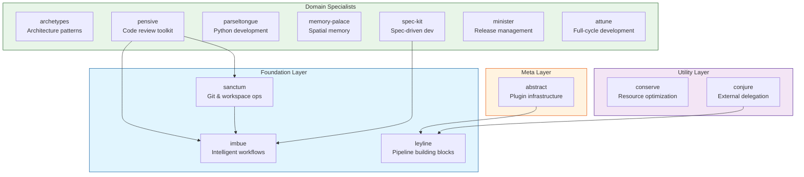

# Plugin Overview

The Claude Night Market organizes plugins into four layers, each building on the foundations below.

## Architecture



## Layer Summary

| Layer | Purpose | Plugins |
|-------|---------|---------|
| **Meta** | Plugin infrastructure and evaluation | abstract |
| **Foundation** | Core workflow methodologies | imbue, sanctum, leyline |
| **Utility** | Resource optimization and delegation | conserve, conjure |
| **Domain** | Specialized task execution | archetypes, pensive, parseltongue, memory-palace, spec-kit, minister, attune |

## Dependency Rules

1. **Downward Only**: Plugins depend on lower layers, never upward
2. **Foundation First**: Most domain plugins work better with foundation plugins installed
3. **Graceful Degradation**: Plugins function standalone but gain capabilities with dependencies

## Quick Installation

### Minimal (Git Workflows)
```bash
/plugin install sanctum@claude-night-market
```

### Standard (Development)
```bash
/plugin install sanctum@claude-night-market
/plugin install imbue@claude-night-market
/plugin install spec-kit@claude-night-market
```

### Full (All Capabilities)
```bash
/plugin install abstract@claude-night-market
/plugin install imbue@claude-night-market
/plugin install sanctum@claude-night-market
/plugin install leyline@claude-night-market
/plugin install conserve@claude-night-market
/plugin install conjure@claude-night-market
/plugin install archetypes@claude-night-market
/plugin install pensive@claude-night-market
/plugin install parseltongue@claude-night-market
/plugin install memory-palace@claude-night-market
/plugin install spec-kit@claude-night-market
/plugin install minister@claude-night-market
/plugin install attune@claude-night-market
```

## Browse by Layer

- [Meta Layer](meta-layer.md) - Plugin infrastructure
- [Foundation Layer](foundation-layer.md) - Core workflows
- [Utility Layer](utility-layer.md) - Resource optimization
- [Domain Specialists](domain-specialists.md) - Specialized tasks

## Browse by Plugin

| Plugin | Description |
|--------|-------------|
| [abstract](abstract.md) | Meta-skills for plugin development |
| [imbue](imbue.md) | Analysis and evidence gathering |
| [sanctum](sanctum.md) | Git and workspace operations |
| [leyline](leyline.md) | Infrastructure building blocks |
| [conserve](conserve.md) | Context and resource optimization |
| [conjure](conjure.md) | External LLM delegation |
| [archetypes](archetypes.md) | Architecture paradigms |
| [pensive](pensive.md) | Code review toolkit |
| [parseltongue](parseltongue.md) | Python development |
| [memory-palace](memory-palace.md) | Knowledge organization |
| [spec-kit](spec-kit.md) | Specification-driven development |
| [minister](minister.md) | Release management |
| [attune](attune.md) | Full-cycle project development |

<div class="achievement-hint" data-achievement="plugin-explorer">
Read all plugin pages to unlock: Plugin Explorer
</div>
