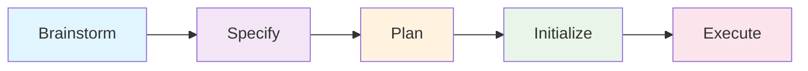

# Attune

Full-cycle project development from ideation to implementation.

## Overview

Attune integrates the brainstorm-plan-execute workflow from superpowers with spec-driven development from spec-kit to provide a complete project lifecycle.

## Workflow



## Commands

| Command | Phase | Description |
|---------|-------|-------------|
| `/attune:brainstorm` | 1. Ideation | Socratic questioning to explore problem space |
| `/attune:specify` | 2. Specification | Create detailed specs from brainstorm |
| `/attune:plan` | 3. Planning | Design architecture and break down tasks |
| `/attune:init` | 4. Initialization | Generate project structure and tooling |
| `/attune:execute` | 5. Implementation | Execute tasks with TDD discipline |
| `/attune:upgrade` | Maintenance | Add configs to existing projects |
| `/attune:validate` | Quality | Validate project structure |

## Supported Languages

- **Python**: uv, pytest, ruff, mypy, pre-commit
- **Rust**: cargo, clippy, rustfmt, CI workflows
- **TypeScript/React**: npm/pnpm/yarn, vite, jest, eslint, prettier

## What Gets Configured

- Git initialization with detailed .gitignore
- ✅ GitHub Actions workflows (test, lint, typecheck, publish)
- ✅ Pre-commit hooks (formatting, linting, security)
- ✅ Makefile with standard development targets
- ✅ Dependency management (uv/cargo/package managers)
- ✅ Project structure (src/, tests/, README.md)

## Quick Start

### New Python Project

```bash
# Interactive mode
/attune:init

# Non-interactive
/attune:init --lang python --name my-project --author "Your Name"
```

### Full Cycle Workflow

```bash
# 1. Brainstorm the idea
/attune:brainstorm

# 2. Create specification
/attune:specify

# 3. Plan architecture
/attune:plan

# 4. Initialize project
/attune:init

# 5. Execute implementation
/attune:execute
```

## Skills

| Skill | Purpose |
|-------|---------|
| `project-brainstorming` | Socratic ideation workflow |
| `project-specification` | Spec creation from brainstorm |
| `project-planning` | Architecture and task breakdown |
| `project-init` | Interactive project initialization |
| `project-execution` | Systematic implementation |
| `makefile-generation` | Generate language-specific Makefiles |
| `workflow-setup` | Configure CI/CD pipelines |
| `precommit-setup` | Set up code quality hooks |

## Agents

| Agent | Role |
|-------|------|
| `project-architect` | Guides full-cycle workflow (brainstorm → plan) |
| `project-implementer` | Executes implementation with TDD |

## Integration

Attune combines capabilities from:
- **superpowers**: Brainstorming, planning, execution workflows
- **spec-kit**: Specification-driven development
- **abstract**: Plugin and skill authoring for plugin projects

## Examples

### Initialize Python CLI Project

```bash
/attune:init --lang python --type cli
```

Creates:
- `pyproject.toml` with uv configuration
- `Makefile` with test/lint/format targets
- GitHub Actions workflows
- Pre-commit hooks for ruff and mypy
- Basic CLI structure

### Upgrade Existing Project

```bash
# Add missing configs
/attune:upgrade

# Validate structure
/attune:validate
```

## Configuration

### Custom Templates

Place custom templates in:
- `~/.claude/attune/templates/` (user-level)
- `.attune/templates/` (project-level)
- `$ATTUNE_TEMPLATES_PATH` (environment variable)

### Reference Projects

Templates sync from reference projects:
- `simple-resume` (Python)
- `skrills` (multi-language)
- `importobot` (automation)

<div class="achievement-hint" data-achievement="project-initialized">
Initialize your first project with /attune:init to unlock: Project Architect
</div>
