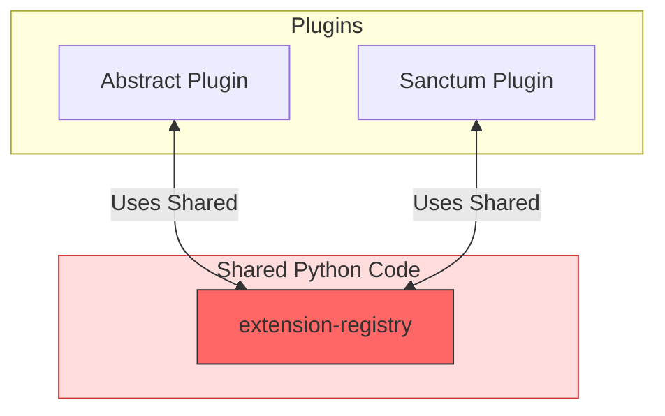
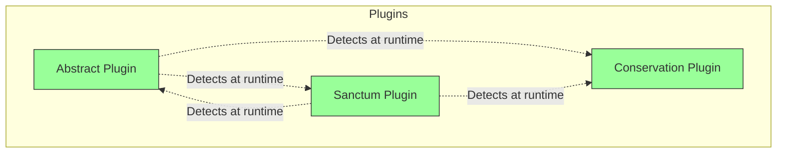
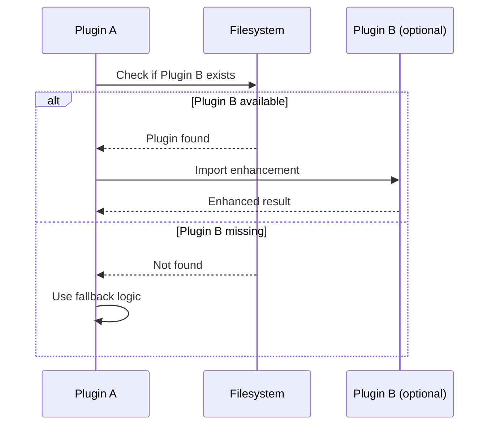
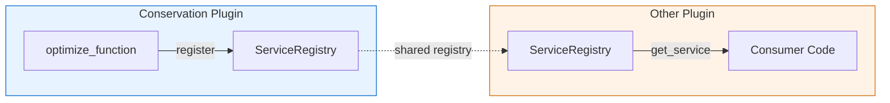

# ADR-0001: Plugin Dependency Isolation

**Date**: 2024-12-14
**Status**: Accepted
**Deciders**: Claude Night Market maintainers

## Context

The plugin ecosystem initially used a shared extension registry (`/plugins/abstract/src/extension-registry/`) to enable communication between plugins. This created tight coupling through shared Python dependencies, leading to:

- Version conflicts between plugins
- Deployment complexity
- Inability to install/remove plugins independently
- Cascading failures when shared code changed

## Decision

Remove the shared extension registry and adopt a **plugin isolation pattern** where each plugin:

1. **Detects** other plugins at runtime via filesystem checks
2. **Enhances** functionality when dependencies are available
3. **Degrades gracefully** when dependencies are missing
4. **Documents** optional integrations clearly

### Exception: leyline (intentional)

`leyline` is the one intentional exception: it is a shared *infrastructure* plugin that provides reusable building blocks (e.g., token estimation, quota tracking) intended to be imported by other plugins.

**Rule**: Any import of `leyline` must be optional (guarded with `try/except ImportError`) and must provide a safe fallback so the consumer plugin still loads and runs without leyline installed.

## Architecture

### Before (Shared Registry)



**Problem**: Tight coupling through shared dependencies causes version conflicts and cascading failures.

### After (Plugin Isolation)



**Solution**: Plugins detect each other at runtime with graceful fallbacks when dependencies are missing.

## Implementation Pattern



### 1. Detection
```python
def is_plugin_available(plugin_name: str) -> bool:
    """Check if a plugin is installed"""
    plugin_path = Path.home() / ".claude" / "plugins" / plugin_name
    return plugin_path.exists() and (plugin_path / "plugin.json").exists()
```

### 2. Optional Enhancement
```python
def enhance_with_plugin(data: dict) -> dict:
    """Enhance data using other plugins if available"""
    if is_plugin_available("other-plugin"):
        try:
            from other_plugin import enhancement
            return enhancement.process(data)
        except ImportError:
            pass  # Plugin exists but functionality unavailable

    # Fallback behavior
    return basic_process(data)
```

### 3. Service Provider Pattern



```python
# Conservation plugin provides a service
registry = ServiceRegistry()
registry.register_service("optimize", optimize_function)

# Other plugins discover and use it
registry = ServiceRegistry()
optimize = registry.get_service("optimize")
if optimize:
    result = optimize(content)
```

## Consequences

### Positive
- **Self-contained**: No shared Python dependencies
- **Independent**: Plugins can be installed/removed independently
- **Graceful**: Fallbacks when dependencies are missing
- **Documented**: Clear patterns and examples
- **Discoverable**: Plugins can detect each other's capabilities
- **Version-safe**: No version conflicts between plugins

### Negative
- Slightly more boilerplate for plugin detection
- Each plugin must implement its own fallback logic
- Integration testing requires more explicit setup

## Migration Guide

For plugins using the old shared registry:

1. **Remove** any imports from `extension-registry`
2. **Add** plugin detection code
3. **Implement** fallbacks for missing dependencies
4. **Document** optional integrations
5. **Test** with and without each dependency

## Documentation Requirements

Each plugin should document:

1. **Optional Dependencies**: What other plugins it can use
2. **Enhanced Features**: What additional functionality is available
3. **Fallback Behavior**: What happens without dependencies
4. **Integration Points**: How other plugins can detect and use it

## Related

- `docs/guides/plugin-dependency-pattern.md` - Detailed implementation guide
- `plugins/abstract/examples/sanctum_integration_example.py`
- `plugins/sanctum/examples/abstract_integration_example.py`
- `plugins/conserve/examples/context_optimization_service.py`
