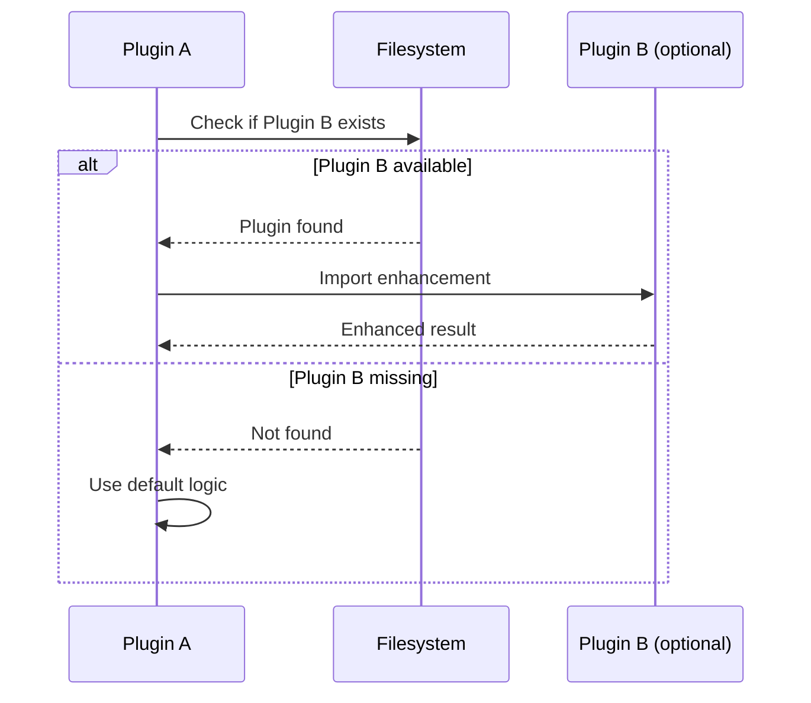

# ADR-0001: Plugin Dependency Isolation

**Date**: 2024-12-14
**Status**: Accepted
**Deciders**: Claude Night Market maintainers

## Context

The plugin ecosystem initially used a shared extension registry (`/plugins/abstract/src/extension-registry/`) to enable communication between plugins. This created tight coupling through shared Python dependencies, leading to:

- Version conflicts between plugins
- Deployment complexity
- Inability to install/remove plugins independently
- Cascading failures when shared code changed

## Decision

We have decided to remove the shared extension registry and adopt a plugin isolation pattern. Under this pattern, each plugin detects other plugins at runtime via filesystem checks and enhances its functionality only when those dependencies are available. If dependencies are missing, the plugin must degrade gracefully and continue to operate using its internal logic. All optional integrations must be documented clearly so users and other plugins understand the available enhancements.

### Exception: leyline (intentional)

`leyline` is the one intentional exception: it is a shared infrastructure plugin that provides reusable building blocks (e.g., token estimation, quota tracking) intended to be imported by other plugins. Any import of `leyline` must be optional, typically guarded with a try/except ImportError block, and must provide a safe secondary behavior so the consumer plugin still loads and runs without leyline installed.

## Architecture

### Before (Shared Registry)


**Problem**: Tight coupling through shared dependencies causes version conflicts and cascading failures.

### After (Plugin Isolation)


**Solution**: Plugins detect each other at runtime with graceful default behaviors when dependencies are missing.

## Implementation Pattern



### 1. Detection
```python
def is_plugin_available(plugin_name: str) -> bool:
    """Check if a plugin is installed"""
    plugin_path = Path.home() / ".claude" / "plugins" / plugin_name
    return plugin_path.exists() and (plugin_path / "plugin.json").exists()
```

### 2. Optional Enhancement
```python
def enhance_with_plugin(data: dict) -> dict:
    """Enhance data using other plugins if available"""
    if is_plugin_available("other-plugin"):
        try:
            from other_plugin import enhancement
            return enhancement.process(data)
        except ImportError:
            pass  # Plugin exists but functionality unavailable

    # Default behavior
    return basic_process(data)
```

### 3. Service Provider Pattern


```python
# Conservation plugin provides a service
registry = ServiceRegistry()
registry.register_service("optimize", optimize_function)

# Other plugins discover and use it
registry = ServiceRegistry()
optimize = registry.get_service("optimize")
if optimize:
    result = optimize(content)
```

## Consequences

This architectural shift makes plugins self-contained and independent, as they no longer share Python dependencies and can be installed or removed without affecting others. Graceful degradation ensures that plugins remain functional even when optional dependencies are missing. While this approach requires slightly more boilerplate for detection and each plugin must implement its own default logic, it results in a version-safe ecosystem that is better documented and easier to maintain.

## Migration Guide

To migrate plugins from the old shared registry, first remove any imports from `extension-registry` and implement the runtime detection pattern. You must then add internal default behaviors for missing dependencies and document these optional integration points. Finally, verify the plugin's operation both with and without its optional dependencies to ensure stability.

## Documentation Requirements

Each plugin must document its optional dependencies and the enhanced features they provide. It is also necessary to describe the default behavior of the plugin when these dependencies are unavailable and define the integration points that allow other plugins to detect its capabilities.

## Related

- `docs/guides/plugin-dependency-pattern.md` - Detailed implementation guide
- `plugins/abstract/examples/sanctum_integration_example.py`
- `plugins/sanctum/examples/abstract_integration_example.py`
