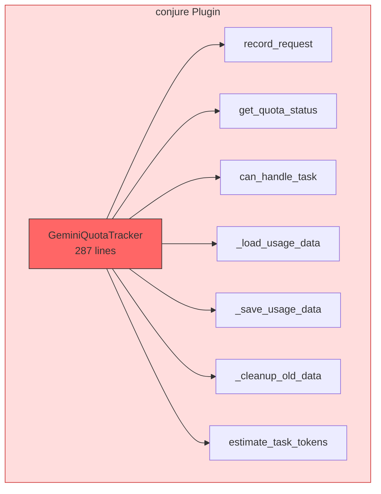
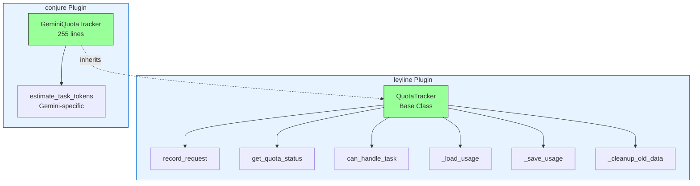

# ADR-0002: Extract QuotaTracker to Leyline

**Date**: 2025-12-05
**Status**: Accepted
**Deciders**: Claude Night Market maintainers

## Context

The `conjure` plugin initially implemented its own quota tracking system (`GeminiQuotaTracker`) to manage API rate limits for Gemini delegation. This implementation duplicated quota tracking logic that could benefit other plugins like Qwen and Claude.

The original approach presented several problems. Code duplication meant that each service-specific plugin would need to implement identical quota tracking, increasing the maintenance burden as bug fixes and improvements had to be manually copied across implementations. This also led to inconsistent behavior between plugins and increased testing overhead by requiring each plugin to test common functionality. The original `GeminiQuotaTracker` was 287 lines with 11 methods that were generic to any quota tracking system.

## Decision

Extract the service-agnostic quota tracking logic into `leyline.QuotaTracker` as a reusable base class, with the following principles:

1. **Service-agnostic base**: `leyline.QuotaTracker` provides core quota tracking for any service
2. **Service-specific extensions**: Plugins extend the base class with service-specific features
3. **Backward compatibility**: Existing code continues to work without changes
4. **Optional dependency**: Plugins work without leyline (graceful degradation)

### Exception: leyline (intentional dependency)

Unlike the plugin isolation pattern (ADR-0001), `leyline` is intentionally imported as a required dependency for quota tracking. This is acceptable because:

- `leyline` is infrastructure, not a feature plugin
- The dependency is declared in `pyproject.toml`
- The import is at the module level, not runtime detection
- Plugin loading is not affected (no hooks depend on quota tracking)

## Architecture

### Before (Duplicated Implementation)



**Problem**: All quota logic duplicated in each plugin.

### After (Inherited Implementation)



**Solution**: Common quota logic in leyline, service-specific features in plugins.

## Implementation

### 1. Base Class Structure

```python
# leyline/src/leyline/quota_tracker.py
@dataclass
class QuotaConfig:
    """Service-agnostic quota configuration"""
    requests_per_minute: int
    requests_per_day: int
    tokens_per_minute: int
    tokens_per_day: int

class QuotaTracker:
    def __init__(self, service: str, config: QuotaConfig, storage_dir: Path):
        self.service = service
        self.config = config
        self.usage_file = storage_dir / f"{service}/usage.json"

    # 8 methods inherited by all plugins
    def record_request(self, tokens: int, success: bool) -> None: ...
    def get_quota_status(self) -> tuple[bool, list[str]]: ...
    def can_handle_task(self, estimated_tokens: int) -> tuple[bool, list[str]]: ...
    # ... etc
```

### 2. Plugin Extension

```python
# conjure/scripts/quota_tracker.py
from leyline import QuotaTracker, QuotaConfig

class GeminiQuotaTracker(QuotaTracker):
    """Gemini-specific quota tracker with advanced token estimation"""

    def __init__(self, limits: dict[str, int] | None = None):
        config = GEMINI_QUOTA_CONFIG if not limits else QuotaConfig(...)
        super().__init__(
            service="gemini",
            config=config,
            storage_dir=Path.home() / ".claude" / "hooks" / "gemini"
        )

    def estimate_task_tokens(self, file_paths: list[Path], prompt_length: int) -> int:
        """Gemini-specific estimation with tiktoken support"""
        # Advanced estimation logic
```

### 3. Configuration Pattern

```python
# Service-specific configuration
GEMINI_QUOTA_CONFIG = QuotaConfig(
    requests_per_minute=60,
    requests_per_day=1000,
    tokens_per_minute=32000,
    tokens_per_day=1000000,
)
```

### 4. Dependency Declaration

```toml
# conjure/pyproject.toml
[project]
dependencies = [
    "leyline>=1.0.0",  # Explicit dependency
    "tiktoken>=0.7.0",
]
```

## Results

### Code Reduction

| Metric | Before | After | Change |
|--------|--------|-------|--------|
| **GeminiQuotaTracker** | 287 lines | 255 lines | -32 (-11.1%) |
| **Inherited methods** | - | 8 methods | Removed from plugin |
| **Base class** | - | 282 lines | In leyline |

### Benefits

This refactoring provides significant improvements in code maintenance by establishing a single source of truth for quota tracking logic. Bug fixes in the base class now benefit all plugins, and behavior remains consistent across different services. From a testing perspective, we can now focus on service-specific features while the base class tests cover common functionality, resulting in a smaller test surface. The pattern is also highly extensible, allowing other plugins to extend the `QuotaTracker` with clear extension points through override methods.

### Backward Compatibility

All existing code continues to work:

```python
# Instantiation
tracker = GeminiQuotaTracker()
tracker = GeminiQuotaTracker(limits={"requests_per_minute": 100, ...})

# Methods
status, warnings = tracker.get_quota_status()
can_handle, issues = tracker.can_handle_task(estimated_tokens)
tokens = tracker.estimate_task_tokens(file_paths, prompt_length)
tracker.record_request(estimated_tokens, success=True)

# Properties
limits_dict = tracker.limits  # Backward-compatible property
```

## Consequences

Moving core logic to a shared base class has reduced duplication by eliminating 11 redundant methods from the plugin. This centralization makes the ecosystem easier to maintain and ensures that all plugins follow the same quota patterns. While this introduces a dependency on `leyline` and creates some version coupling between the base class and its consumers, the overall consistency and improved testability provide a more stable foundation for multi-model delegation.

## Migration Guide

To migrate a plugin to the new quota tracking system, add the `leyline` dependency to your `pyproject.toml` and extend the `QuotaTracker` base class. You should then configure the service-specific `QuotaConfig` and override only the methods that require unique logic, such as `estimate_task_tokens`. Once the functionality is verified with tests, any duplicated quota tracking code can be safely removed from the plugin.

## Related

- `plugins/conjure/scripts/quota_tracker.py` - Reference implementation
- `leyline/src/leyline/quota_tracker.py` - Base class
- `docs/adr/0001-plugin-dependency-isolation.md` - Plugin isolation pattern
