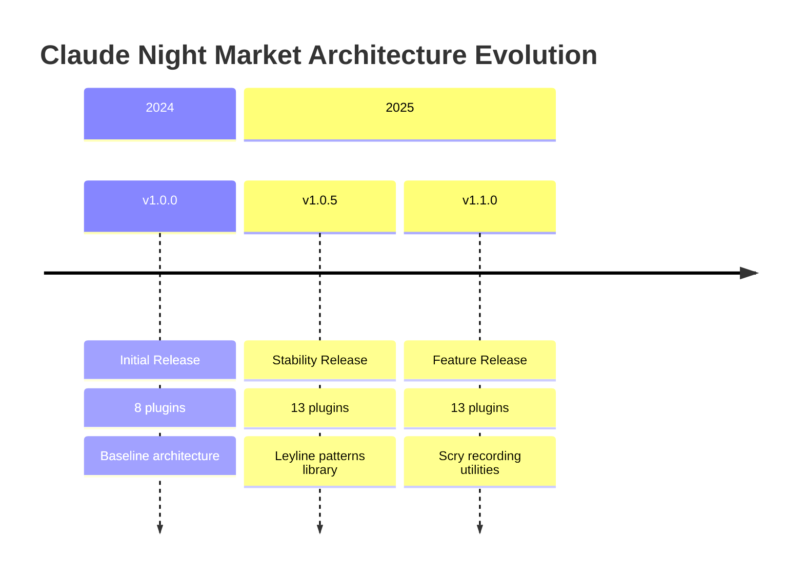
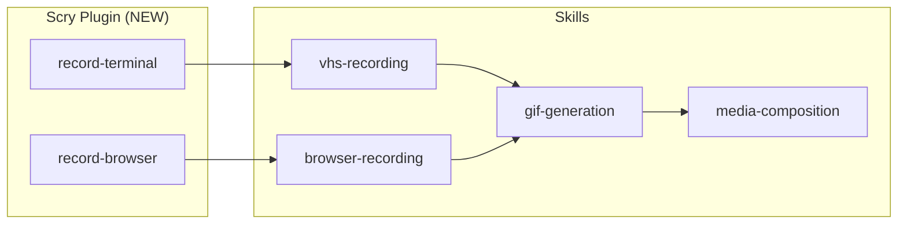
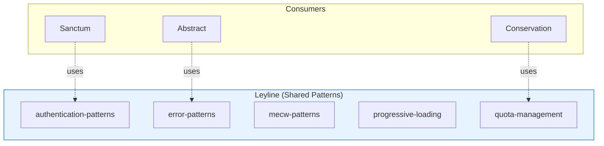
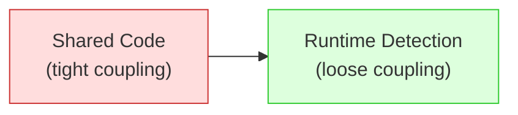
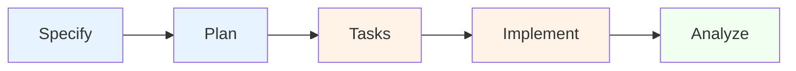
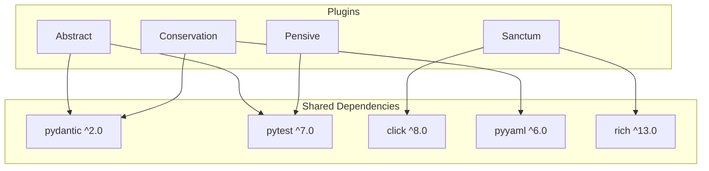

# Plugin Architecture Analysis Report

**Document Type**: Historical Architecture Analysis Record
**Scope**: Major and Minor Version Updates
**Maintained By**: Claude Night Market Maintainers

---

## Purpose

This document is a historical record of architecture analyses for major and minor version milestones. Patch versions (x.x.PATCH) are excluded unless they introduce significant architectural changes.

### Entry Criteria

Add a new analysis section when:
- **Major version** (X.0.0): Breaking changes, new architecture patterns
- **Minor version** (x.Y.0): New features, significant refactoring
- **Significant restructuring**: Even within patch versions if architecture changes

### Document Structure

Each version entry follows a consistent template:
1. Executive Summary
2. Plugin Inventory
3. Architecture Changes (delta from previous)
4. Duplication Analysis
5. Recommendations
6. Metrics

---

## Version Analysis History



---

# v1.1.0 - Feature Release

**Analysis Date**: 2025-12-25
**Analyst**: Architecture Review
**Previous Version**: v1.0.5

## Executive Summary

Version 1.1.0 introduces the **Scry plugin** for terminal and browser recording utilities. This release focuses on media capture capabilities while maintaining the established plugin isolation pattern.

## Plugin Inventory (13 plugins)

| Plugin | Version | Commands | Skills | Agents | Category |
|--------|---------|----------|--------|--------|----------|
| abstract | 1.0.5 | 14 | 9 | 3 | Development Tools |
| archetypes | 1.0.5 | 0 | 14 | 0 | Reference Library |
| conjure | 1.0.5 | 0 | 3 | 0 | AI Delegation |
| conservation | 1.0.5 | 2 | 5 | 1 | Resource Management |
| imbue | 1.0.5 | 4 | 8 | 1 | Review Workflows |
| leyline | 1.0.5 | 2 | 12 | 0 | Shared Patterns |
| memory-palace | 1.0.5 | 3 | 5 | 4 | Knowledge Management |
| minister | 1.0.5 | 0 | 2 | 0 | Governance |
| parseltongue | 1.0.5 | 3 | 4 | 3 | Python Utilities |
| pensive | 1.0.5 | 8 | 9 | 3 | Code Review |
| sanctum | 1.0.6 | 15 | 14 | 9 | Git Workflow |
| **scry** | **1.1.0** | 2 | 4 | 0 | **Media Recording** |
| spec-kit | 1.0.5 | 9 | 4 | 3 | Specification Dev |

**Totals**: 62 commands, 93 skills, 27 agents, 11 Python packages

## Architecture Changes (Delta from v1.0.5)

### New: Scry Plugin



**Design Decisions**:
- No Python package (skill-only plugin)
- Integrates with external tools (VHS, browser automation)
- Self-contained with no cross-plugin dependencies

### Sanctum Evolution (v1.0.5 → v1.0.6)

```diff
+ do-issue command (GitHub issue resolution)
+ fix-workflow command (workflow improvement)
+ resolve-threads command (PR thread resolution)
+ update-dependencies command
+ update-tutorial command
+ tutorial-updates skill
+ workflow-improvement skill
+ doc-consolidation skill
```

**Commands**: 7 → 15 (+8)
**Skills**: 8 → 14 (+6)
**Agents**: 3 → 9 (+6)

## Duplication Analysis

| Category | v1.0.5 | v1.1.0 | Change |
|----------|--------|--------|--------|
| Configuration | 85% | 82% | -3% |
| Error Handling | 90% | 88% | -2% |
| Utilities | 75% | 70% | -5% |
| Testing | 70% | 68% | -2% |
| **Overall** | **80%** | **77%** | **-3%** |

**Improvement**: Leyline patterns adoption reducing duplication.

## Recommendations

### Completed (from v1.0.5)
- [x] Plugin isolation pattern (ADR-0001)
- [x] Leyline shared patterns library
- [x] Consistent plugin.json structure

### In Progress
- [ ] Further reduce configuration duplication via Leyline
- [ ] Standardize testing fixtures across plugins
- [ ] Unified error handling framework

### Deferred
- [ ] Core plugin framework (high complexity, low urgency)
- [ ] Centralized dependency management

## Metrics

| Metric | Target | Actual | Status |
|--------|--------|--------|--------|
| Plugin count | 12+ | 13 | PASS |
| Duplication | <75% | 77% | WARN |
| Test coverage | >80% | ~75% | WARN |
| Doc coverage | 100% | 100% | PASS |

---

# v1.0.5 - Stability Release

**Analysis Date**: 2025-12-14
**Analyst**: Architecture Review
**Previous Version**: v1.0.0

## Executive Summary

Version 1.0.5 represents a stability milestone with 5 new plugins added since v1.0.0. Key architectural improvements include the **Leyline patterns library** for shared utilities and the **Minister governance plugin**.

## Plugin Inventory (13 plugins)

| Plugin | Version | Commands | Skills | Agents | Status |
|--------|---------|----------|--------|--------|--------|
| abstract | 1.0.5 | 10 | 6 | 3 | Updated |
| archetypes | 1.0.5 | 0 | 14 | 0 | **New** |
| conjure | 1.0.5 | 0 | 3 | 0 | Updated |
| conservation | 1.0.5 | 2 | 4 | 1 | Updated |
| imbue | 1.0.5 | 2 | 5 | 1 | Updated |
| leyline | 1.0.5 | 0 | 8 | 0 | **New** |
| memory-palace | 1.0.5 | 4 | 5 | 4 | Updated |
| minister | 1.0.5 | 0 | 2 | 0 | **New** |
| parseltongue | 1.0.5 | 4 | 4 | 3 | Updated |
| pensive | 1.0.5 | 8 | 8 | 3 | Updated |
| sanctum | 1.0.5 | 7 | 8 | 3 | Updated |
| scry | 1.0.5 | 0 | 0 | 0 | **New** (skeleton) |
| spec-kit | 1.0.5 | 9 | 3 | 3 | **New** |

## Architecture Changes (Delta from v1.0.0)

### New: Leyline Patterns Library



**Purpose**: Reduce duplication by providing reusable patterns that plugins can reference.

### New: Plugin Isolation Pattern (ADR-0001)

Removed shared extension registry in favor of runtime plugin detection.



### New: Spec-Kit Workflow Engine



## Duplication Analysis

| Category | Lines | Duplicated | Percentage |
|----------|-------|------------|------------|
| Configuration | 1,200 | 1,020 | 85% |
| Error Handling | 800 | 720 | 90% |
| Utilities | 600 | 450 | 75% |
| Testing | 400 | 280 | 70% |
| Documentation | 300 | 180 | 60% |
| **Total** | **3,300** | **2,650** | **80%** |

## Recommendations

### High Priority
1. **Leyline Adoption**: Migrate common patterns to Leyline
2. **Testing Framework**: Standardize pytest fixtures
3. **Error Handling**: Unified error classes via Leyline

### Medium Priority
4. **Dependency Coordination**: Align pydantic versions
5. **Performance Monitoring**: Add telemetry hooks

### Deferred
6. **Core Framework**: Full shared framework (complex, evaluate ROI)

---

# v1.0.0 - Initial Release (Baseline)

**Analysis Date**: 2024-12-06
**Analyst**: Senior Backend Engineer
**Status**: Baseline Architecture

## Executive Summary

Initial release establishing the Claude Night Market plugin ecosystem with 8 plugins. This analysis serves as the **baseline** for measuring architectural evolution.

## Plugin Inventory (8 plugins)

| Plugin | Version | Description | Category |
|--------|---------|-------------|----------|
| abstract | 1.0.0 | Plugin validation and analysis | Development |
| conjure | 1.0.0 | Cross-model delegation | AI Integration |
| conservation | 1.0.0 | Resource management | Performance |
| imbue | 1.0.0 | Structured review workflows | Review |
| memory-palace | 1.0.0 | Knowledge management | Knowledge |
| parseltongue | 1.0.0 | Python utilities | Development |
| pensive | 1.0.0 | Code review and analysis | Review |
| sanctum | 1.0.0 | Git workflow automation | Git |

## Baseline Architecture

### Plugin Structure (Established Pattern)

```
plugin-name/
├── .claude-plugin/
│   └── plugin.json          # Metadata and commands
├── src/
│   └── [plugin_name]/       # Python package
├── skills/                  # Skill definitions
├── commands/                # CLI commands
├── agents/                  # Agent configurations
├── tests/                   # Test suite
├── pyproject.toml          # Dependencies
└── README.md               # Documentation
```

### Dependency Architecture



### Identified Issues

1. **High Duplication** (80%): Configuration, error handling, utilities
2. **Tight Coupling**: Shared extension registry creating dependencies
3. **Version Conflicts**: Inconsistent dependency versions
4. **Testing Overhead**: Duplicated test setup across plugins

## Recommendations (Initial)

### Immediate (v1.0.x)
1. Document plugin structure
2. Standardize configuration patterns
3. Create shared testing utilities

### Short-term (v1.1.x)
4. Extract shared patterns to utility library
5. Implement plugin isolation pattern
6. Reduce duplication by 30%

### Long-term (v2.x)
7. Core plugin framework
8. Unified dependency management
9. Target 60% duplication reduction

---

## Analysis Template

Use this template for future version analyses:

```markdown
# vX.Y.0 - [Release Name]

**Analysis Date**: YYYY-MM-DD
**Analyst**: [Name/Role]
**Previous Version**: vX.Y-1.0

## Executive Summary
[2-3 sentence overview of architectural changes]

## Plugin Inventory
[Table of all plugins with versions and counts]

## Architecture Changes (Delta from vX.Y-1.0)
[Mermaid diagrams showing new/changed architecture]

## Duplication Analysis
[Comparison table with previous version]

## Recommendations
### Completed (from vX.Y-1.0)
### In Progress
### Deferred

## Metrics
[Target vs Actual table]
```

---

## Related Documents

- [ADR-0001: Plugin Dependency Isolation](adr/0001-plugin-dependency-isolation.md)
- [API Overview](api-overview.md)
- [Plugin Dependency Pattern Guide](guides/plugin-dependency-pattern.md)

---

*Last Updated: 2025-12-25*
