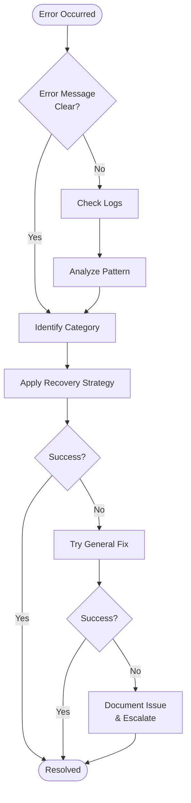

# Error Handling Documentation Template

This template provides a cognitive structure for adding error handling documentation to skills. It covers common failure scenarios, recovery strategies, troubleshooting guides, and best practices.

## Template Structure

Copy and adapt this template for your skill's specific needs:

---

## Error Handling and Troubleshooting

### Common Failure Scenarios

| Scenario | Symptoms | Root Cause | Prevention |
|----------|----------|------------|------------|
| **Configuration Error** | Skill fails to load or crashes immediately | Missing required dependencies, invalid configuration files | Validate configuration on startup, provide clear error messages |
| **Input Validation Error** | Unexpected output or crashes during execution | Invalid input format, missing required fields | Implement input validation, provide examples of correct format |
| **Resource Exhaustion** | Slow performance, timeouts, out-of-memory errors | Processing too much data, inefficient algorithms | Implement chunking, add resource limits, provide progress feedback |
| **External Service Failure** | API calls fail, timeouts, rate limiting | Service unavailable, network issues, authentication problems | Implement retries, secondary mechanisms, status checks |
| **Permission/Access Error** | Permission denied, file not found errors | Insufficient permissions, incorrect paths | Check permissions before operations, use relative paths |
| **Concurrency Issues** | Race conditions, deadlocks, data corruption | Multiple processes accessing shared resources | Use proper locking, implement atomic operations |
| **Version Compatibility** | API changes break functionality, deprecated features | Using outdated libraries or APIs | Version pinning, compatibility checks, migration guides |

### Error Classification

#### Critical Errors (Halt Execution)
- **Authentication Failures**: Invalid credentials, expired tokens
- **Configuration Errors**: Missing required settings, invalid formats
- **Resource Exhaustion**: Out of memory, disk space full
- **Permission Denied**: Insufficient rights to perform operations

#### Recoverable Errors (Retry or Secondary)
- **Network Timeouts**: Temporary connectivity issues
- **Rate Limiting**: API limits exceeded, retry after delay
- **Partial Failures**: Some operations succeeded, others failed
- **Service Unavailable**: External services temporarily down

#### Warnings (Continue with Logging)
- **Deprecated Features**: Using outdated functionality
- **Performance Issues**: Slow operations, inefficient patterns
- **Non-Critical Failures**: Optional features unavailable

### Recovery Strategies

#### Immediate Recovery
```python
# Example: Retry with exponential backoff
import time
import random

def retry_with_backoff(operation, max_retries=3, base_delay=1):
    for attempt in range(max_retries):
        try:
            return operation()
        except Exception as e:
            if attempt == max_retries - 1:
                raise e

            delay = base_delay * (2 ** attempt) + random.uniform(0, 1)
            time.sleep(delay)
```

#### Graceful Degradation
```python
# Example: Secondary method as a default
def process_with_secondary(primary_method, secondary_method, data):
    try:
        return primary_method(data)
    except PrimaryMethodError:
        logger.warning("Primary method failed, using secondary")
        return secondary_method(data)
```

#### Partial Processing
```python
# Example: Process valid items, report failures
def process_batch(items):
    results = []
    failures = []

    for item in items:
        try:
            result = process_item(item)
            results.append(result)
        except Exception as e:
            failures.append({"item": item, "error": str(e)})

    return results, failures
```

### Troubleshooting Guide

#### Quick Diagnosis Flowchart



#### Step-by-Step Resolution

1. **Check the Basics**
   - [ ] Verify all dependencies are installed
   - [ ] Check configuration files are present and valid
   - [ ] validate sufficient disk space and memory
   - [ ] Verify network connectivity

2. **Analyze Error Messages**
   - [ ] Note the exact error message and code
   - [ ] Check if error is consistent or intermittent
   - [ ] Identify when the error occurs (startup, during operation, shutdown)

3. **Review Logs**
   - [ ] Check application logs for detailed error information
   - [ ] Look for patterns or recurring issues
   - [ ] Note any warnings that preceded the error

4. **Isolate the Problem**
   - [ ] Test with minimal input/data
   - [ ] Try different parameters or settings
   - [ ] Test individual components separately

5. **Apply Fixes**
   - [ ] Try the most common fix for your error type
   - [ ] Implement one change at a time
   - [ ] Test after each change

6. **Document and Report**
   - [ ] Document the solution that worked
   - [ ] Report persistent issues with reproduction steps
   - [ ] Share workarounds with the community

### Common Error Codes and Messages

| Code | Message | Meaning | Action |
|------|---------|---------|--------|
| `E001` | "Configuration file not found" | Missing required config file | Create config with required settings |
| `E002` | "Invalid authentication credentials" | Auth failed | Check/update API keys or tokens |
| `E003` | "Rate limit exceeded" | API limit reached | Wait and retry, or upgrade quota |
| `E004` | "Input validation failed" | Bad input format | Check input requirements and examples |
| `E005` | "Resource temporarily unavailable" | Service busy | Retry with backoff, use secondary |
| `E006` | "Permission denied" | Access rights insufficient | Check file permissions or user roles |
| `E007` | "Network timeout" | Connection timed out | Check network, increase timeout |
| `E008` | "Memory allocation failed" | Out of memory | Reduce data size, use streaming |
| `E009` | "Version mismatch" | Incompatible versions | Update dependencies or pin versions |
| `E010` | "Database connection failed" | Cannot connect to DB | Check connection string and DB status |

### Debugging and Logging

#### Structured Logging
```python
import logging
import json
from datetime import datetime

def setup_logging():
    logging.basicConfig(
        level=logging.INFO,
        format='%(asctime)s - %(name)s - %(levelname)s - %(message)s'
    )

def log_operation(operation, data, result=None, error=None):
    log_entry = {
        "timestamp": datetime.utcnow().isoformat(),
        "operation": operation,
        "data_size": len(str(data)),
        "success": error is None
    }

    if error:
        log_entry["error"] = str(error)
        log_entry["error_type"] = type(error).__name__

    logging.info(json.dumps(log_entry))
```

#### Debug Mode
```python
import os

def debug_mode():
    return os.environ.get('DEBUG', '').lower() in ('true', '1', 'yes')

def debug_log(message, data=None):
    if debug_mode():
        print(f"DEBUG: {message}")
        if data:
            import pprint
            pprint.pprint(data)
```

### Best Practices

#### Prevention
1. **Input Validation**: Always validate inputs before processing
2. **Resource Management**: Use context managers for cleanup
3. **Error Boundaries**: Isolate critical operations with try/catch
4. **Monitoring**: Implement health checks and metrics
5. **Testing**: Write tests for error conditions

#### Graceful Handling
1. **Meaningful Messages**: Provide clear, actionable error messages
2. **Consistent Format**: Use standard error codes and formats
3. **Recovery Options**: Suggest specific recovery actions
4. **Secondary Plans**: Have alternative approaches ready
5. **User Guidance**: Help users understand what went wrong and how to fix it

#### Documentation
1. **Error Catalog**: Document all possible errors and solutions
2. **Troubleshooting Guides**: Provide step-by-step resolution steps
3. **Examples**: Include code examples for common scenarios
4. **FAQ**: Address frequently encountered issues
5. **Contact Info**: Provide ways to report new issues

### Integration with Existing Error Infrastructure

If using leyline:error-patterns:

```yaml
# In skill frontmatter
dependencies:
  - leyline:error-patterns
```

Follow leyline patterns for:
- Error classification (Critical, Error, Warning, Info)
- Recovery strategies (Transient, Permanent, Configuration, Resource)
- Logging formats and metadata

### Testing Error Handling

#### Test Cases to Include
- [ ] Invalid input formats
- [ ] Missing configuration
- [ ] Network failures
- [ ] Resource exhaustion
- [ ] Permission issues
- [ ] Timeout scenarios
- [ ] Malformed responses
- [ ] Concurrent access
- [ ] Version compatibility

#### Example Test Structure
```python
import pytest

def test_handles_invalid_input():
    with pytest.raises(ValidationError) as exc_info:
        process_invalid_data()

    assert "validation failed" in str(exc_info.value)
    assert exc_info.value.error_code == "E004"

def test_graceful_degradation():
    result = process_with_secondary(failing_input)
    assert result is not None
    assert result.method == "secondary"
```

---

Remember to customize this template to your skill's specific requirements, common failure modes, and user needs. The key is to anticipate problems and provide clear, actionable guidance for resolution.
