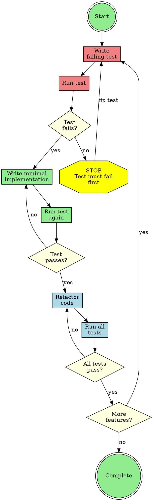
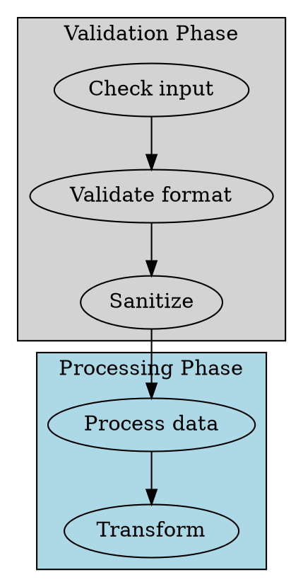
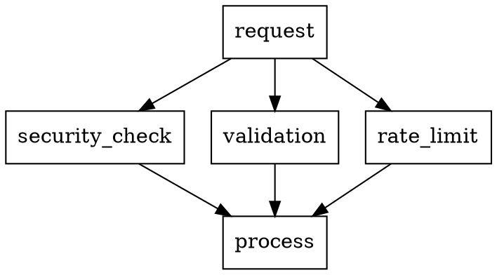
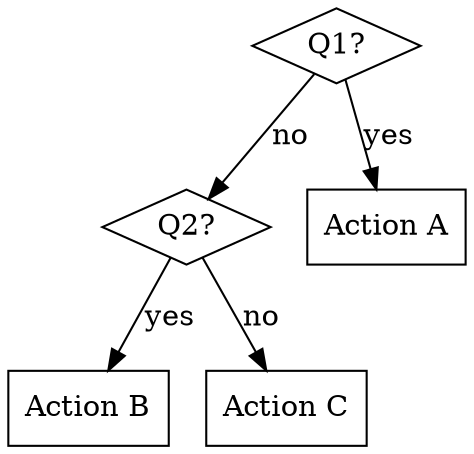
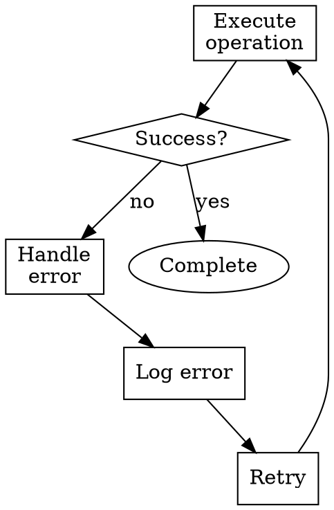
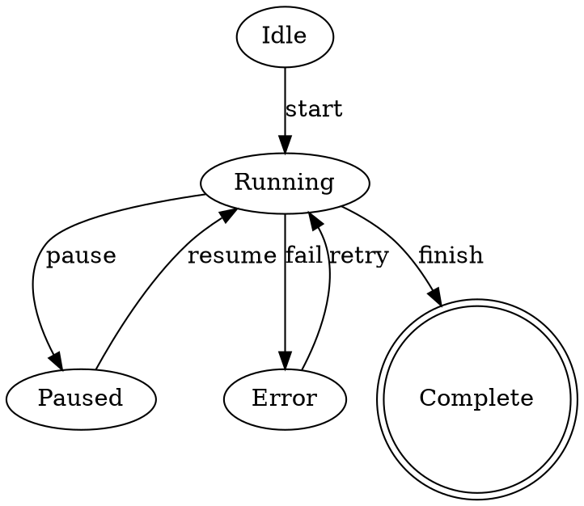

# Graphviz Examples for Skill Diagrams

Comprehensive examples for creating process diagrams in skills. For conventions and quick reference, see the [graphviz-conventions module](../../../plugins/abstract/skills/skill-authoring/modules/graphviz-conventions.md).

## Complete Example: TDD Workflow



## Layout Examples

### Grouping with Subgraphs



### Rank Alignment for Parallel Processes



## Common Patterns

### Binary Decision Tree



### Error Handling Flow



### State Machine



## Color Reference

### Semantic Colors


## Rendering Commands

```bash
# Generate PNG
dot -Tpng workflow.dot -o workflow.png

# Generate SVG (recommended for documentation)
dot -Tsvg workflow.dot -o workflow.svg

# Generate PDF
dot -Tpdf workflow.dot -o workflow.pdf
```

## Anti-Patterns

### Overly Complex Diagrams

**Problem**: Too many nodes, hard to follow

**Solution**: Break into multiple focused diagrams or use hierarchical grouping

### Missing Labels

**Problem**: Unlabeled edges in complex flows

**Solution**: Always label decision edges, optional for obvious sequences

### Inconsistent Shapes

**Problem**: Using box for both questions and actions

**Solution**: Follow shape conventions consistently

### Decoration-Only Diagrams

**Problem**: Diagram doesn't add information beyond text

**Solution**: Only include diagrams that clarify complex flows

### Unreadable Text

**Problem**: Font too small or labels too long

**Solution**: Use 10-12pt fonts, wrap long labels
