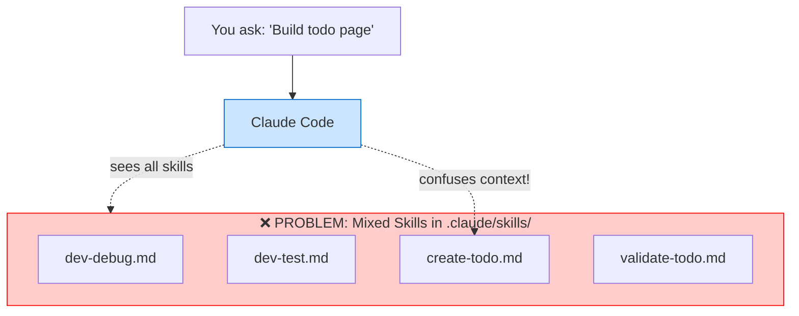
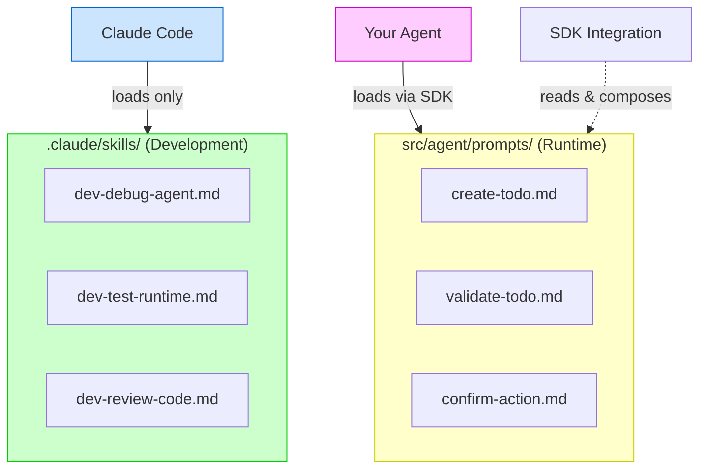
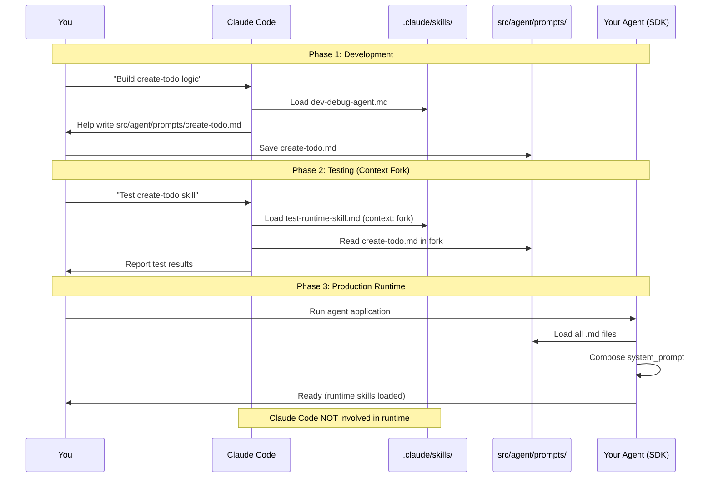
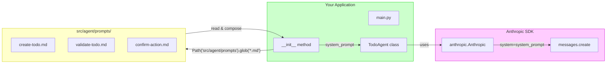
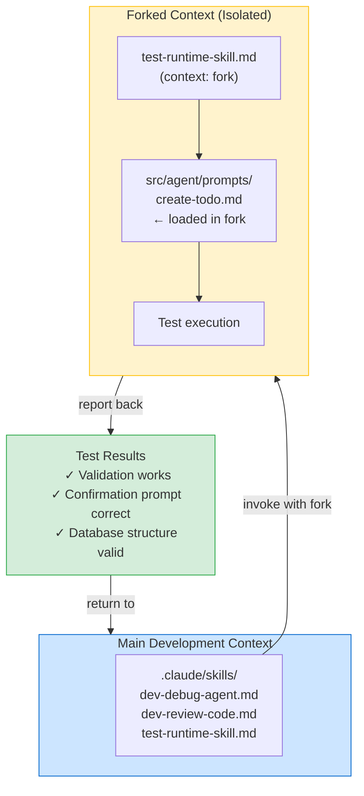
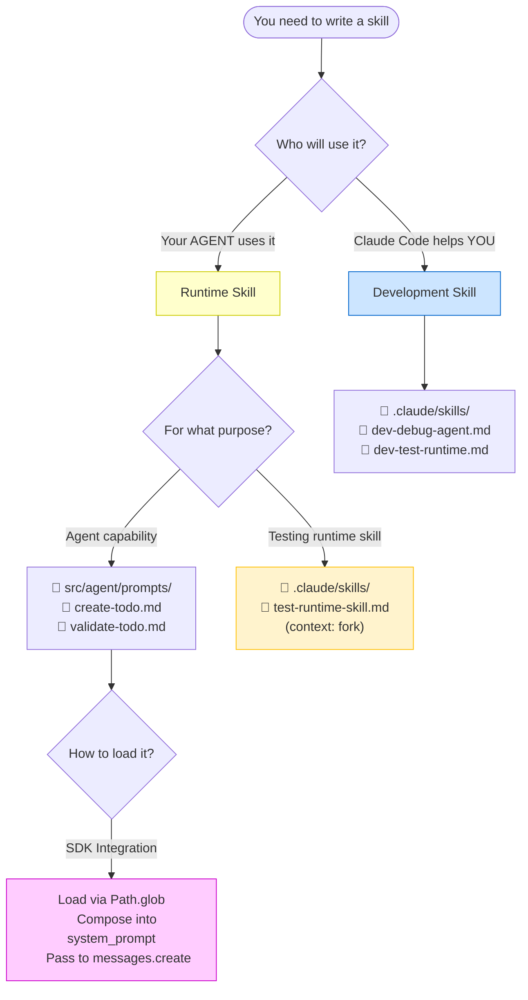

# Skills Separation Visual Guide

Visual diagrams showing the separation between development skills and runtime skills.

---

## The Problem: Namespace Collision



**What goes wrong**:
- You: "Build the to-do list page"
- Claude Code: *Sees `create-todo.md`*
- Claude Code: *Tries to CREATE a todo instead of BUILDING THE PAGE*

---

## The Solution: Physical Separation



---

## Complete Workflow



---

## Directory Structure

```
my-todo-agent/
│
├── .claude/                               ← DEVELOPMENT NAMESPACE
│   ├── skills/                            ← Claude Code loads these
│   │   ├── dev-debug-agent.md             │  (helps YOU build)
│   │   ├── dev-test-runtime.md            │
│   │   └── dev-review-architecture.md     │
│   │                                       │
│   ├── hooks/                              │
│   │   ├── hooks.json                      │
│   │   └── scope_skills.py                │  (optional: scoped loading)
│   │                                       │
│   └── settings.json                       │
│
├── src/
│   └── agent/
│       ├── prompts/                       ← RUNTIME NAMESPACE
│       │   ├── create-todo.md             │  (agent capabilities)
│       │   ├── validate-todo.md           │
│       │   ├── update-todo.md             │
│       │   └── confirm-action.md          │
│       │                                   │
│       ├── main.py ←──────────────────────┘  loads prompts/ via SDK
│       └── database.py
│
├── tests/
│   ├── test_agent.py
│   └── test_skills/
│       └── test_create_todo.py
│
└── pyproject.toml


CRITICAL RULES:
═══════════════
1. Claude Code ONLY sees .claude/skills/
2. Your agent ONLY loads src/agent/prompts/ (via SDK)
3. NEVER import .claude/ from your agent code
4. NEVER put runtime skills in .claude/skills/
```

---

## SDK Integration Flow



**Code**:
```python
# In src/agent/main.py
def _build_system_prompt(self) -> str:
    skills = []
    for f in Path("src/agent/prompts").glob("*.md"):  # ← Runtime skills
        skills.append(f.read_text())
    return "\n\n".join(skills)

# In chat method
self.client.messages.create(
    system=self.system_prompt,  # ← Composed from runtime skills
    messages=[{"role": "user", "content": message}]
)
```

---

## Context Isolation with Forking



**How it works**:
1. You invoke `Skill(test-runtime-skill)` in Claude Code
2. `context: fork` creates isolated context window
3. Runtime skill loads ONLY in fork (no pollution)
4. Results return to main development context
5. Main context stays clean

---

## Anti-Patterns vs Correct Patterns

### ❌ Anti-Pattern: Mixed Namespace

```
.claude/skills/
├── debug-python.md          ← Development
├── review-architecture.md   ← Development
├── create-todo.md           ← Runtime (WRONG!)
└── validate-todo.md         ← Runtime (WRONG!)
```

**Problem**: Claude Code will confuse runtime skills with requests

### ✅ Correct Pattern: Separated Namespaces

```
.claude/skills/              ← Development ONLY
├── dev-debug-python.md
├── dev-review-architecture.md
└── test-runtime-skill.md    (uses context: fork)

src/agent/prompts/           ← Runtime ONLY
├── create-todo.md
└── validate-todo.md
```

**Benefit**: Clear separation, no confusion

---

### ❌ Anti-Pattern: Hardcoded System Prompt

```python
# main.py
system_prompt = """
You are a todo agent. When user asks to create a todo:
1. Validate the input
2. Confirm with user
3. Insert into database
"""
```

**Problem**:
- Not maintainable (hardcoded)
- No separation from application logic
- Can't reuse skills

### ✅ Correct Pattern: Dynamic Composition

```python
# main.py
def _build_system_prompt(self) -> str:
    skills = []
    for f in Path("src/agent/prompts").glob("*.md"):
        skills.append(f.read_text())
    return "\n\n".join(skills)
```

**Benefit**:
- Skills are files (maintainable)
- Easy to add/remove capabilities
- Can test skills independently

---

## Decision Tree



---

## Summary Diagram

```
┌─────────────────────────────────────────────────────────────────────┐
│                     SKILLS SEPARATION RULES                         │
├─────────────────────────────────────────────────────────────────────┤
│                                                                      │
│  Development Skills              Runtime Skills                     │
│  ┌─────────────────┐            ┌──────────────────┐               │
│  │ .claude/skills/ │            │ src/agent/       │               │
│  │                 │            │ prompts/         │               │
│  │ dev-*.md        │            │                  │               │
│  │ test-*.md       │            │ create-todo.md   │               │
│  │                 │            │ validate-todo.md │               │
│  └─────────────────┘            └──────────────────┘               │
│         ▲                                ▲                          │
│         │                                │                          │
│         │ loads                          │ loads                   │
│         │                                │                          │
│  ┌──────┴────────┐            ┌─────────┴────────┐                │
│  │ Claude Code   │            │ Your Agent (SDK) │                │
│  │               │            │                  │                │
│  │ Helps YOU     │            │ Runtime behavior │                │
│  │ build agent   │            │ (independent)    │                │
│  └───────────────┘            └──────────────────┘                │
│                                                                      │
│  CRITICAL: These namespaces NEVER overlap                          │
│                                                                      │
└─────────────────────────────────────────────────────────────────────┘
```

---

## References

- **Full Guide**: [development-vs-runtime-skills-separation.md](development-vs-runtime-skills-separation.md)
- **Quick Reference**: [skills-separation-quickref.md](skills-separation-quickref.md)
- **Guides Index**: [README.md](README.md)

---

**Last Updated**: 2026-01-10
**Applies To**: Claude Code 2.1.0+, Anthropic SDK 0.40.0+
