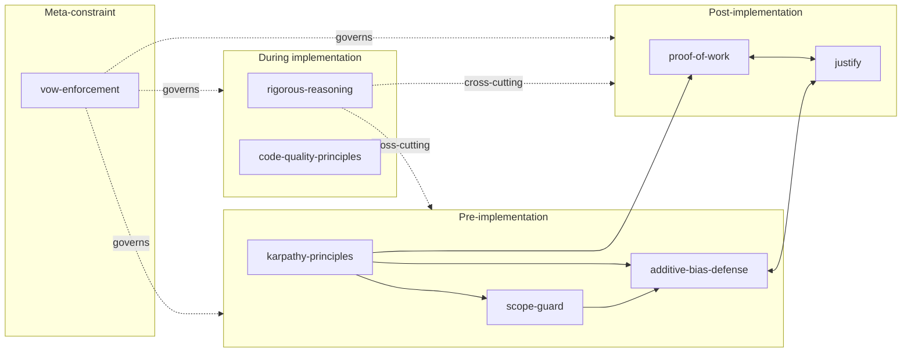

# Quality Gates and Code Quality System

We use a three-layer system to maintain code standards within the Claude Night
Market ecosystem.

## Table of Contents

- [Overview](#overview)
- [The Three Layers](#the-three-layers)
- [Skill-Level Quality Gate Composition](#skill-level-quality-gate-composition)
- [Pre-Commit Hooks](#pre-commit-hooks)
- [Manual Quality Scripts](#manual-quality-scripts)
- [Configuration Files](#configuration-files)
- [Usage Guide](#usage-guide)
- [Troubleshooting](#troubleshooting)
- [Best Practices](#best-practices)

## Overview

Our quality system relies on three layers:
**Pre-Commit Hooks** (Layer 1) for automatic enforcement,
**Manual/CI Scripts** (Layer 2) for full checks,
and **Documentation & Tracking** (Layer 3) for auditing.

**Status**
- **New Code**: Every commit undergoes linting, type checks, tests,
  and security scans.
- **Existing Code**: We track legacy issues through baseline audits.

## The Three Layers

We organize quality checks into three distinct layers to balance speed
and thoroughness.

**Layer 1: Fast Global Checks**
Ruff handles linting and formatting,
while Mypy verifies type annotations across all Python files.
These run quickly to catch common errors immediately.

**Layer 2: Plugin-Specific Checks**
These run only on changed plugins to execute targets like `run-plugin-lint.sh`
and `run-plugin-tests.sh`.
This keeps feedback loops tight during focused development.

**Layer 3: Validation Hooks**
We verify plugin structure, skill frontmatter, context optimization,
and security using tools like Bandit.
This ensures structural integrity and security compliance.

## Skill-Level Quality Gate Composition

Layers 1-3 above run in CI and pre-commit hooks. A complementary
set of **skill-level gates** runs inside Claude Code sessions and
governs the *reasoning* layer: when to refuse a task, when to
demand evidence, when to reject sycophantic agreement.

These skills do not enforce a strict pipeline. They form a
**federation with phase affinity**: each one is at home in a
specific stage of the work, but several can fire at once if the
situation warrants.

### The Gate Federation



### Phase Affinities

**Pre-implementation** (before code is written)

- `imbue:scope-guard` -- worthiness scoring, branch-size
  budgets, defer nice-to-haves. The first question.
- `imbue:karpathy-principles` -- four-principle gate (think
  first, simplicity, surgical edits, verifiable goals).
  Synthesis hub; routes into the others.
- `leyline:additive-bias-defense` -- inverts burden of proof
  for additions. Cross-cutting contract that reviews consult.

**During implementation** (cross-cutting)

- `imbue:rigorous-reasoning` -- anti-sycophancy checklist for
  contested claims, conflicts, and reasoning quality.
- `conserve:code-quality-principles` -- KISS, YAGNI, SOLID
  applied as living-code review heuristics.

**Post-implementation** (validation and audit)

- `imbue:proof-of-work` -- evidence and acceptance gates with
  `[E1]`/`[E2]` citations. The "is it actually done?" gate.
- `imbue:justify` -- minimal-intervention audit; every change
  must justify itself against a "do nothing" baseline.

**Meta-constraint** (governs all phases)

- `imbue:vow-enforcement` -- three-layer constraint
  classifier (soft vows in skills, hard vows in hooks,
  governance vows in policy). Sits above the federation.

### Composition Patterns

**Linear sequence** (typical greenfield work):

```
karpathy-principles -> scope-guard -> [implement]
  -> proof-of-work -> justify
```

**Cross-cutting parallel** (during contested work):

```
[any phase above] + rigorous-reasoning (whenever sycophancy
  signals or contested claims appear)
```

**Hub-and-spoke entry** (using karpathy-principles as router):

`imbue:karpathy-principles` references 18 outbound skills --
the highest count in the marketplace. It is the de-facto
entry point for the federation: invoking it pulls in the
relevant gates for the work at hand without forcing a
particular sequence.

### When to Use Which

| Symptom                                | Skill                              |
|----------------------------------------|------------------------------------|
| About to add a feature or abstraction  | `scope-guard`                      |
| Starting LLM-assisted implementation   | `karpathy-principles`              |
| Reviewing a proposed code addition     | `additive-bias-defense`            |
| Finding yourself agreeing too quickly  | `rigorous-reasoning`               |
| About to claim "should work"           | `proof-of-work`                    |
| Pre-PR audit of a completed branch     | `justify`                          |
| Need to encode a hard policy           | `vow-enforcement`                  |
| Refactoring or living-code reviews     | `code-quality-principles`          |

### Why These Are Skills, Not Hooks

Layers 1-3 (pre-commit hooks, CI checks) are **mechanical**:
they run regardless of intent and cannot be reasoned with. The
gate skills are **discursive**: they intervene by being read
into context and shaping the model's reasoning, not by
blocking actions outright. The two layers are complementary --
hooks catch what skills miss, and skills catch what hooks
cannot articulate.

## Pre-Commit Hooks

### Hook Execution Order

Commits trigger a specific sequence of checks:
1. File validation (syntax)
2. Security scanning (bandit)
3. Global Linting (ruff)
4. Global Type Checking (mypy)
5. Plugin-Specific checks (lint, typecheck, tests)
6. Structure/Skill/Context validation

All checks must pass for the commit to succeed.

### Plugin Validation Hooks

The `plugins/abstract/scripts/` directory contains our validators:
`abstract_validator.py` for skills, `validate_plugin.py` for structure,
and `context_optimizer.py`.

### Standard Quality Checks

We use standard hooks for formatting (`trailing-whitespace`,
`end-of-file-fixer`), configuration validation (`check-yaml`, `check-toml`,
`check-json`), security (`bandit`), linting (`ruff`),
and type checking (`mypy`).

## Manual Quality Scripts

### Individual Scripts

You can run full checks on-demand.

```bash
# Lint all plugins (or specific ones)
./scripts/run-plugin-lint.sh --all
./scripts/run-plugin-lint.sh minister imbue

# Type check all plugins (or specific ones)
./scripts/run-plugin-typecheck.sh --all
./scripts/run-plugin-typecheck.sh minister imbue

# Test all plugins (or specific ones)
./scripts/run-plugin-tests.sh --all
./scripts/run-plugin-tests.sh minister imbue

# Full check (all three)
./scripts/check-all-quality.sh
./scripts/check-all-quality.sh --report
```

### Use Cases

For daily development, rely on the automatic pre-commit hooks (10-30s).
Before submitting a PR, run `./scripts/check-all-quality.sh` (2-5min) to ensure
everything is clean. We run full reports monthly using the `--report` flag.
CI/CD pipelines execute `make lint && make typecheck && make test`.

## Configuration Files

### Quality Gates (`.claude/quality_gates.json`)

This file defines thresholds across four dimensions:

- **Performance**: Files must be under 20KB and 5000 tokens,
  with a complexity score below 12.
- **Security**: We block hardcoded secrets and insecure functions.
- **Maintainability**: Technical debt ratio must be below 0.3,
  with nesting depth no more than 5.
- **Compliance**: Plugins must follow the required structure
  and include proper metadata.

### Context Governance (`.claude/context_governance.json`)

Enforces context optimization patterns,
requiring progressive disclosure (overview, basic, advanced,
reference) and modular structure.

### Pre-Commit Configuration

The `.pre-commit-config.yaml` file defines our hooks,
categorized into code quality, global quality, validation, and standard hooks.

## Usage Guide

### For Daily Development

Develop normally. Pre-commit hooks will handle the checks.

```bash
# Edit code
vim plugins/minister/src/minister/tracker.py

# Commit (hooks run automatically)
git add plugins/minister/src/minister/tracker.py
git commit -m "feat: improve tracker logic"

# If checks fail, fix and try again
```

### For Testing Before Commit

To see what will run in pre-commit without committing:

```bash
./scripts/run-plugin-lint.sh minister
./scripts/run-plugin-typecheck.sh minister
./scripts/run-plugin-tests.sh minister
```

### For Full Codebase Audit

```bash
# Quick check
./scripts/check-all-quality.sh

# Detailed check with report
./scripts/check-all-quality.sh --report
```

## Troubleshooting

### Common Issues & Fixes

For test failures, see the [Testing Guide](./testing-guide.md).

**Linting Errors:** Ruff often auto-fixes issues.
Run `uv run ruff check --fix` in the plugin directory.

**Type Errors:** If an attribute is missing (e.g.,
`"ProjectTracker" has no attribute "initiative_tracker"`), add the attribute,
remove the reference, or update the type stubs.

**"Hook script not found":** Reinstall hooks with `pre-commit install
--install-hooks`.

### Skipping Hooks (Emergency)

Use sparingly.

```bash
# Skip all hooks (not recommended)
git commit --no-verify -m "emergency: critical hotfix"

# Skip specific hook
SKIP=run-plugin-tests git commit -m "WIP: tests in progress"
```

## Best Practices

**For Developers:** Run checks before committing, fix issues incrementally,
write type hints for new functions, and keep tests green.

**For Plugin Maintainers:** Configure strict type checking,
add Makefile targets for quality checks, and document requirements.

## Running Validation

```bash
# Run all pre-commit hooks
pre-commit run --all-files

# Run specific hooks
pre-commit run run-plugin-lint
pre-commit run run-plugin-typecheck
pre-commit run run-plugin-tests

# Run manual quality scripts
./scripts/run-plugin-lint.sh --all
./scripts/run-plugin-typecheck.sh --all
./scripts/run-plugin-tests.sh --all
./scripts/check-all-quality.sh --report
```

## Gate Orchestration Map

The federation graph above shows which skills are gates
and how they relate. This section closes the next gap:
**which skill is allowed to compose them, and in what
order**.

Without an explicit orchestrator, every consumer (sanctum,
attune, scribe, abstract) cherry-picks individual gates.
The federation exists in code (18 outbound references
from `imbue:karpathy-principles`) but never runs as a
coherent sequence at the marketplace level. One gate
(`imbue:vow-enforcement`) has zero `Skill()` callers in
prose despite being the third layer of the imbue
constraint system.

### Who currently orchestrates

Of the 23 plugins, exactly one ships an orchestrator that
sequences gates: `egregore:quality-gate` runs convention
checks and routes through review skills as part of its
QUALITY pipeline stage.

Other plugins reference individual gates:

| Caller | Gates invoked | Sequence |
|--------|---------------|----------|
| `sanctum:pr-review` | proof-of-work, scope-guard | parallel, ad-hoc |
| `attune:project-execution` | proof-of-work, scope-guard | per-task |
| `scribe:session-to-post` | proof-of-work | once at end |
| `abstract:bulletproof-skill` | rigorous-reasoning | once before refactor |

No caller invokes the full federation in the order the
gate authors intended. `imbue:vow-enforcement` is invoked
nowhere in skill prose -- it only fires through hook
paths (`imbue/hooks/vow_*.py`).

### Recommended composition order

When a workflow needs the full constraint stack, run gates
in this order:

```
1. imbue:rigorous-reasoning      (clarify the question)
2. imbue:scope-guard             (worthiness gate)
   + leyline:additive-bias-defense (parallel; same gate)
3. imbue:karpathy-principles     (pre-implementation gate)
4. <implementation>
5. imbue:proof-of-work           (evidence gate)
6. imbue:justify                 (post-implementation audit)
7. imbue:vow-enforcement         (constraint classification)
```

Steps 1-3 run before any code changes; 4 is the
implementation; 5-7 run before the work is declared
complete. The order matters: rigorous-reasoning shapes
the question before scope-guard scores it, and
karpathy-principles requires a question that's already
been clarified and scoped.

### Proposed canonical orchestrator

`egregore:quality-gate` is the right home for this
sequence because:

- It already orchestrates the QUALITY pipeline stage in
  egregore.
- It already declares routing tables for review skills
  per step.
- It runs in both self-review and PR-review modes, so the
  same orchestration applies whether you're gating your
  own work or someone else's.
- It is invoked from `egregore:summon` as part of the
  development lifecycle, so adding the federation gives
  every autonomous mission the same gate discipline.

Integration path for `imbue:vow-enforcement`: the skill is
currently a hook target (read by `imbue/hooks/vow_*.py`)
but has no Skill() entry path. The orchestration should
add it as the final step of the QUALITY stage, giving the
skill a real entry path without removing the hook layer.
The hook continues to enforce hard vows mechanically while
the skill runs its classification logic under the
orchestrator. Tracked as deferred work in
`docs/backlog/queue.md`; the federation is documented and
the orchestration is proposed, but the implementation is
deferred to keep change blast-radius bounded.

## See Also

- [Testing Guide](./testing-guide.md) - Testing documentation
- [Plugin Development Guide](./plugin-development-guide.md) - Plugin
  development standards
- [Pre-commit configuration](../.pre-commit-config.yaml) - Hook definitions
- [Skill Integration Guide](./skill-integration-guide.md) - Role
  taxonomy for entrypoint / library / hook-target skills
