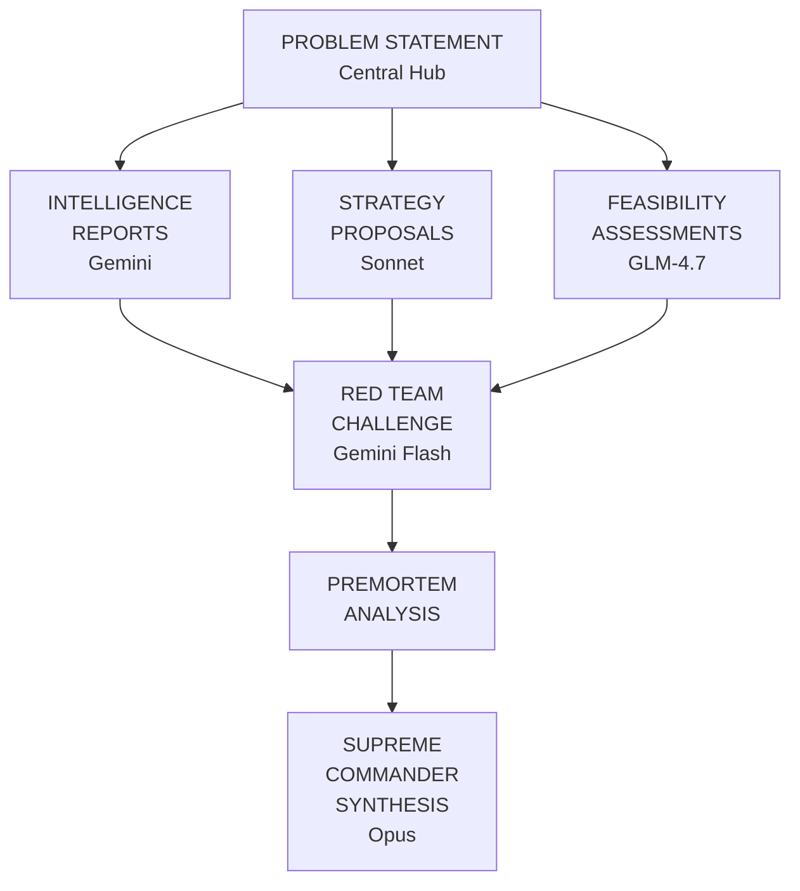
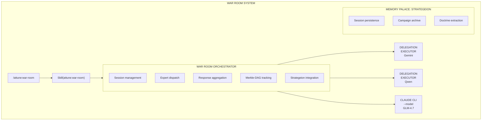
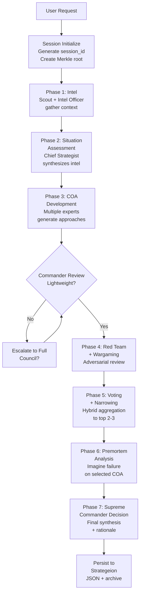

# War Room Specification: Architecture

**Part of**: [War Room Specification](war-room-spec-overview.md)

---

## The Strategeion: Memory Palace Integration

### Concept: The War Palace

The **Strategeion** (Greek: στρατηγεῖον, "general's headquarters") is a dedicated chamber within the Memory Palace for strategic deliberation. It extends the existing palace metaphor with spaces for war council sessions.

### Architectural Metaphor

```
memory-palace/
├── entrance/           # README, getting started
├── library/            # Documentation, ADRs
├── workshop/           # Development patterns
├── review-chamber/     # PR Reviews (existing)
├── garden/             # Evolving knowledge
│
└── strategeion/        # NEW: War Palace
    ├── war-table/      # Active deliberation sessions
    │   └── {session-id}/
    │       ├── intelligence/   # Expert reports
    │       ├── battle-plans/   # Courses of action
    │       ├── wargames/       # Red team challenges
    │       └── orders/         # Final decisions
    │
    ├── campaign-archive/  # Historical sessions
    │   └── {project}/
    │       └── {decision-date}/
    │
    ├── doctrine/          # Strategic principles learned
    │   ├── patterns/      # Recurring decision patterns
    │   └── lessons/       # Post-campaign analysis
    │
    └── armory/            # Expert configurations
        ├── panels/        # Saved expert compositions
        └── protocols/     # Custom deliberation flows
```

### The Crucible

Within the Strategeion, **The Crucible** is where raw ideas are pressure-tested:



### Integration Commands

```bash
# Access the Strategeion
/memory-palace:strategeion

# Review past campaigns
/memory-palace:strategeion archive --project claude-night-market

# Extract doctrine from campaign
/memory-palace:strategeion doctrine --extract {session-id}
```

---

## System Components



---

## Data Flow



---

**Next**: See [Expert Panel](war-room-spec-experts.md) for expert roles and escalation.
