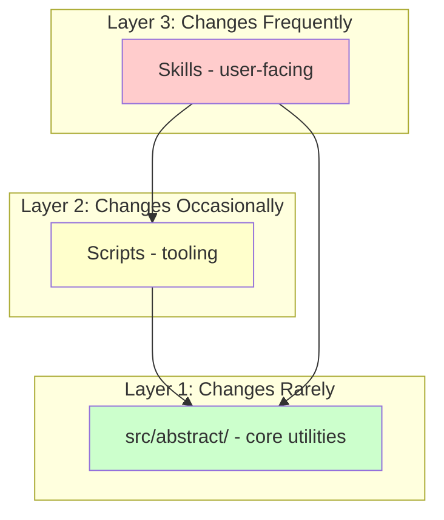
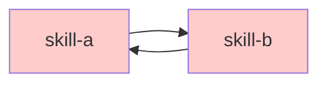

# Architecture Evolution Patterns

This document describes how the Abstract plugin architecture is expected to evolve over time. These patterns guide architectural decisions and help contributors understand the growth trajectory.

## Pattern 1: Hub-and-Spoke Skills

Skills start simple and grow modular.

### Initial State

Single-file skill:
```
skills/my-skill/
  SKILL.md          # Everything in one file
```

### Evolved State

Hub with modules:
```
skills/my-skill/
  SKILL.md          # Hub: overview, quick start, when to use
  modules/
    core-workflow.md
    implementation-patterns.md
    troubleshooting.md
```

### Guidelines

- **Hub remains stable**: The `SKILL.md` interface doesn't change when modules are added
- **Modules are optional**: Hub provides value alone; modules add depth
- **Single responsibility**: Each module serves one clear purpose
- **Progressive disclosure**: Users get overview first, details on demand

### When to Modularize

Use `scripts/skill_analyzer.py` to assess:
- Skill exceeds 150 lines
- Covers multiple distinct topics
- Contains sections rarely needed together

---

## Pattern 2: Utility Extraction

Shared code migrates to the core package.

### Trigger

When 2+ skills/scripts share similar code:

```python
# BAD: Duplicated in multiple places
def parse_frontmatter(content):
    ...

# GOOD: Extracted to shared package
from abstract.parsers import parse_frontmatter
```

### Extraction Process

1. Identify duplication across skills/scripts
2. Design clean interface in `src/abstract/`
3. Write tests for extracted utility
4. Replace all usages with import
5. Document in `src/abstract/README.md`

### Rules

- **Never duplicate**: If it exists in `src/abstract/`, use it
- **Stable interfaces**: Core utilities change rarely
- **Well-tested**: Higher test coverage for shared code

---

## Pattern 3: Capability Layers

Dependencies flow downward through stability layers.



### Layer Characteristics

| Layer | Contents | Change Frequency | Stability |
|-------|----------|------------------|-----------|
| 3 | Skills (`skills/`) | High | Low |
| 2 | Scripts (`scripts/`) | Medium | Medium |
| 1 | Core (`src/abstract/`) | Low | High |

### Dependency Rules

- **Downward only**: Higher layers depend on lower layers
- **Never upward**: `src/abstract/` never imports from skills or scripts
- **Lateral discouraged**: Skills should not import from other skills directly

### Violation Detection

`abstract_validator.py` checks for dependency direction violations.

---

## Pattern 4: Deprecation Path

Graceful removal of features over time.

### Timeline


### Process

1. **Mark deprecated**
   - Add to CHANGELOG under "Deprecated"
   - Update skill frontmatter: `deprecated: true`
   - Add deprecation notice in skill content

2. **Emit warning** (1 minor version)
   - When deprecated skill loads, warn user
   - Point to replacement or migration path

3. **Remove** (next major version)
   - Delete deprecated code
   - Document removal in CHANGELOG
   - Update migration guide

### Example Frontmatter

```yaml
---
name: old-skill
deprecated: true
deprecated_in: 1.3.0
removed_in: 2.0.0
replacement: new-skill
migration_guide: docs/migration/old-to-new.md
---
```

---

## Pattern 5: Feature Flags (Future)

Gradual rollout of experimental features.

### Structure

```yaml
# In plugin.json
{
  "features": {
    "experimental_composition": {
      "enabled": false,
      "description": "New plugin composition model"
    }
  }
}
```

### Lifecycle

```
Experimental (off by default)
    → Beta (opt-in)
    → Stable (on by default)
    → Deprecated (if superseded)
```

### Guidelines

- Use for significant behavioral changes
- Always provide fallback to stable behavior
- Document in CHANGELOG when feature graduates

---

## Anti-Patterns to Avoid

### 1. Circular Dependencies



**Fix**: Extract shared functionality to `src/abstract/`

### 2. God Skills

A single skill that does everything.

**Fix**: Apply hub-and-spoke pattern, extract modules

### 3. Leaky Abstractions

Internal implementation details exposed in public interface.

**Fix**: Design stable public API, hide internals

### 4. Premature Optimization

Over-engineering for hypothetical scale.

**Fix**: YAGNI - build for current needs, evolve when necessary

---

## Evolution Decisions

Significant evolution changes are documented in ADRs. See `docs/adr/` for the decision record.
