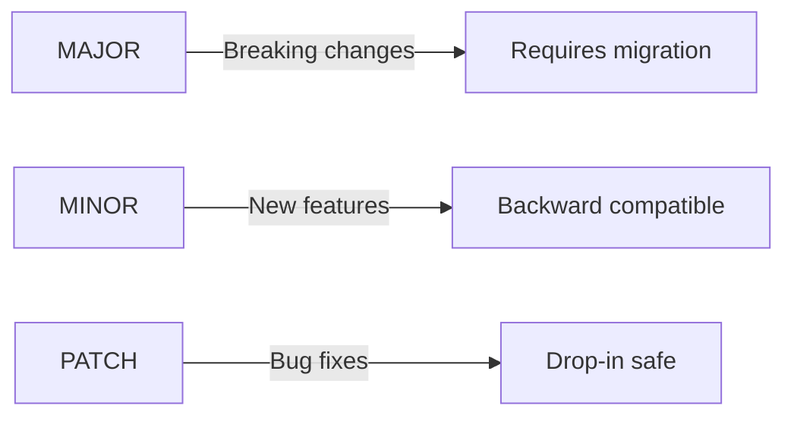

# Plugin Compatibility Matrix

This document tracks version compatibility between Abstract and plugins in the claude-night-market ecosystem.

## Version Strategy

Abstract follows [Semantic Versioning](https://semver.org/):



## Version Constraints

Plugins declare version constraints in `plugin.json`:

| Constraint | Meaning | Example |
|------------|---------|---------|
| `>=1.0.0 <2.0.0` | Any 1.x version | Common case |
| `>=1.2.0` | Requires features from 1.2+ | Needs specific capability |
| `==1.3.5` | Exact version | Discouraged, use for known issues |
| `>=1.0.0` | Any version 1.0 or later | Maximum flexibility |

## Compatibility Matrix

| abstract | Plugin | Min Version | Notes |
|----------|--------|-------------|-------|
| 1.0.x | (ecosystem foundation) | - | Initial release with modular-skills, skills-eval |

### Future Entries

As the ecosystem grows, this matrix tracks compatibility:

```
| abstract | plugin-alpha | plugin-beta | Notes |
|----------|--------------|-------------|-------|
| 1.0.x    | 1.0+         | 1.0+        | Initial release |
| 1.1.x    | 1.0+         | 1.1+        | Beta requires new eval features |
| 2.0.x    | 2.0+         | 2.0+        | Breaking: skill frontmatter changes |
```

## Deprecation Schedule

| Feature | Deprecated In | Removed In | Replacement | Migration Guide |
|---------|---------------|------------|-------------|-----------------|
| (none yet) | - | - | - | - |

## Deprecation Notices

When loading outdated version combinations:

```
WARNING: abstract 1.x will be deprecated in 3 months.
    plugin-alpha 1.2+ requires abstract 2.0.

    Migration guide: docs/migration/v1-to-v2.md
```

## Breaking Changes Log

### v1.0.0 (Initial)

No breaking changes - initial release.

### Future Major Versions

Breaking changes will be documented here with:
- What changed
- Why it changed
- Migration path
- Affected plugins

## Checking Compatibility

```bash
# Validate all plugins against current abstract version
python scripts/abstract_validator.py --check-compatibility

# Check specific plugin
python scripts/abstract_validator.py --check-compatibility --plugin path/to/plugin
```

## Reporting Compatibility Issues

If you encounter compatibility problems:

1. Check this matrix for known issues
2. Verify version constraints in `plugin.json`
3. Run compatibility check script
4. Open issue with:
   - Abstract version
   - Plugin name and version
   - Error message
   - Steps to reproduce
