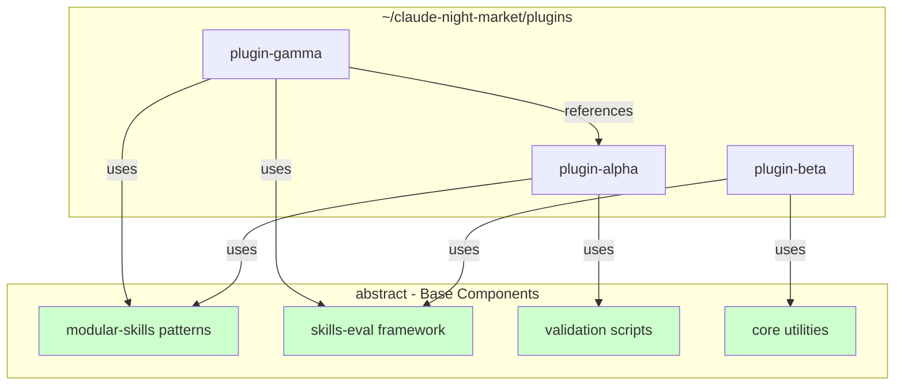
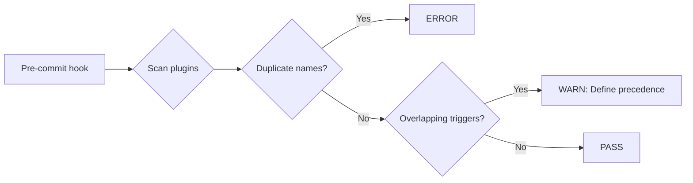

# Multi-Plugin Composition Design

This document describes how Abstract serves as a base component library for the claude-night-market plugin ecosystem. Plugins compose from Abstract's building blocks rather than inheriting from it.

## Philosophy: Composition Over Inheritance

Abstract provides reusable components. Other plugins pick what they need.



### Why Composition?

| Inheritance | Composition |
|-------------|-------------|
| Tight coupling | Loose coupling |
| Child breaks when parent changes | Only used components matter |
| All-or-nothing | Pick what you need |
| Single parent | Multiple sources |

---

## Composable Units

Abstract provides these building blocks:

### modular-skills

Skill architecture patterns and templates.

**Use when**: Designing new skills, refactoring existing skills

**Provides**:
- Hub-and-spoke templates
- Module structure guidelines
- Token optimization patterns

### skills-eval

Quality evaluation framework.

**Use when**: Assessing skill quality, auditing compliance

**Provides**:
- Evaluation criteria
- Improvement suggestions
- Compliance checking

### validation-scripts

Python analysis utilities.

**Use when**: Automating quality checks, CI/CD integration

**Provides**:
- `skill_analyzer.py` - Complexity analysis
- `token_estimator.py` - Token usage estimation
- `abstract_validator.py` - Pattern validation

### core-utilities

Shared Python package (`src/abstract/`).

**Use when**: Building plugin tooling, avoiding duplication

**Provides**:
- Frontmatter parsing
- File utilities
- Common patterns

---

## Declaration Format

Plugins declare their composition in `plugin.json`:

```json
{
  "name": "my-plugin",
  "version": "1.0.0",
  "uses": {
    "abstract": {
      "components": ["modular-skills", "validation-scripts"],
      "version": ">=1.0.0 <2.0.0"
    }
  },
  "references": [
    {"plugin": "plugin-beta", "required": true},
    {"plugin": "plugin-gamma", "required": false}
  ],
  "resource_hints": {
    "base_tokens": 1200,
    "max_tokens": 3500
  }
}
```

### Fields

| Field | Purpose |
|-------|---------|
| `uses` | Components from abstract this plugin composes with |
| `uses.version` | Version constraint for abstract compatibility |
| `references` | Other plugins this plugin integrates with |
| `references.required` | Whether plugin fails without this dependency |
| `resource_hints` | Estimated token cost for Claude's context budgeting |

---

## Namespace Conventions

All components use namespaced identifiers:

```
<plugin-name>:<component>
```

### Examples

- `abstract:modular-skills`
- `abstract:skills-eval`
- `plugin-alpha:custom-workflow`
- `plugin-beta:data-processing`

### Benefits

- Prevents naming collisions
- Clear ownership
- Enables conflict detection

---

## Conflict Detection



### Conflict Types

1. **Namespace collision**: Two plugins define same `<plugin>:<skill>` name
   - Resolution: ERROR - must rename

2. **Trigger overlap**: Two skills respond to similar patterns
   - Resolution: WARN - define explicit precedence in plugin.json

3. **Resource contention**: Too many plugins exhaust context window
   - Resolution: `resource_hints` enable intelligent loading

---

## Dependency Resolution

When Claude loads plugins:

1. **Parse declarations**: Read all `plugin.json` files
2. **Build graph**: Map dependencies between plugins
3. **Detect cycles**: Error if circular dependencies found
4. **Order loading**: Topological sort validates dependencies load first
5. **Validate versions**: Check version constraints are satisfiable

### Load Order Example

```
abstract (no dependencies)
  → plugin-alpha (uses abstract)
    → plugin-gamma (uses abstract, references plugin-alpha)
```

---

## Graceful Degradation

When a referenced plugin is missing:

### Required Dependency Missing

```
ERROR: Missing required dependency

    Plugin 'my-plugin' requires 'plugin-beta' which is not installed.

    To install, add to your marketplace.json:

    {
      "name": "plugin-beta",
      "source": {"source": "url", "url": "https://github.com/athola/plugin-beta.git"}
    }

    Then restart Claude Code to load the plugin.
```

### Optional Dependency Missing

```
WARNING: Optional dependency not available

    Plugin 'my-plugin' works better with 'plugin-gamma'.
    Some features may be limited.

    To enable full functionality, add to marketplace.json:

    {
      "name": "plugin-gamma",
      "source": {"source": "url", "url": "https://github.com/athola/plugin-gamma.git"}
    }
```

---

## Resource Budgeting

Each plugin declares its token footprint:

```json
{
  "resource_hints": {
    "base_tokens": 1200,
    "max_tokens": 3500
  }
}
```

| Field | Meaning |
|-------|---------|
| `base_tokens` | Minimum tokens when skill loads |
| `max_tokens` | Maximum tokens if all modules loaded |

### Claude's Behavior

When context is constrained, Claude can:
- Prioritize plugins by relevance to task
- Load minimal skill content first
- Defer module loading until needed

---

## Adding a New Plugin

1. **Create plugin structure**
   ```
   my-plugin/
     plugin.json
     skills/
       my-skill/
         SKILL.md
   ```

2. **Declare composition**
   ```json
   {
     "uses": {
       "abstract": {
         "components": ["modular-skills"],
         "version": ">=1.0.0"
       }
     }
   }
   ```

3. **Follow abstract patterns**
   - Use modular-skills architecture
   - Run validation scripts
   - Namespace your skills

4. **Test integration**
   ```bash
   # From abstract directory
   python scripts/abstract_validator.py --scan ~/claude-night-market/plugins/
   ```

5. **Document in compatibility matrix**
   - Add entry to `docs/compatibility.md`

---

## Future Enhancements

- **Plugin registry**: Centralized discovery of available plugins
- **Auto-install prompts**: Platform-level dependency resolution
- **Dependency graph visualization**: Tool to visualize plugin relationships
- **Hot reloading**: Update plugins without restarting Claude Code
