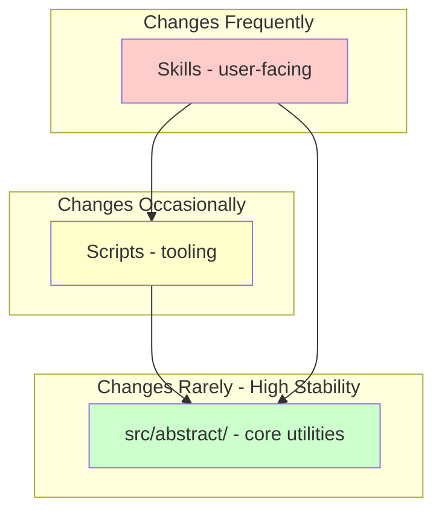
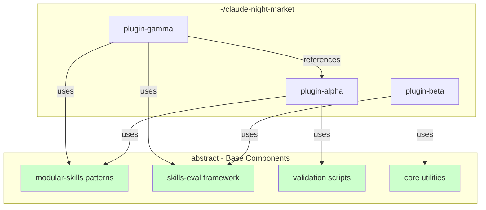
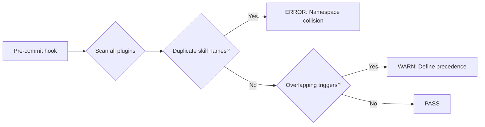
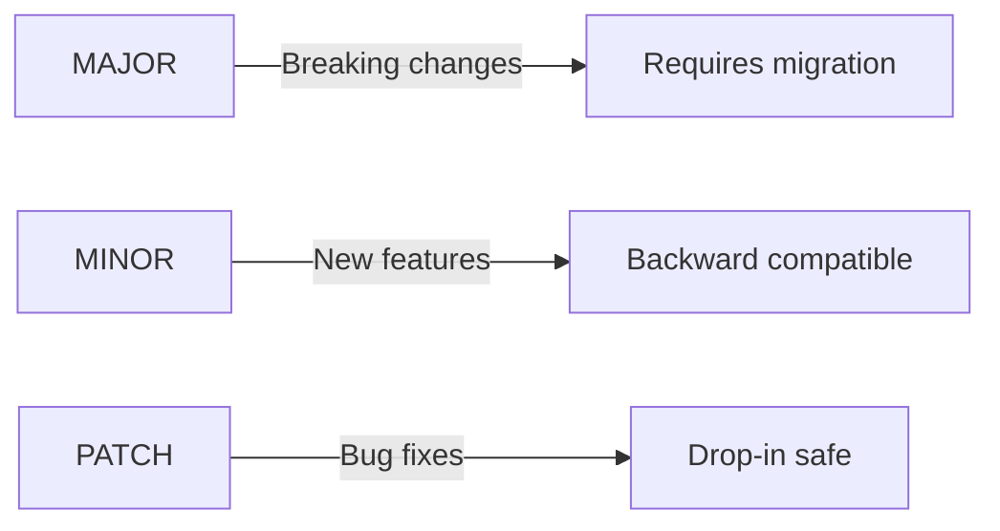

# Architecture Governance & Scaling Design

**Date**: 2025-12-04
**Status**: Approved
**Author**: @athola

## Overview

This document outlines the architecture governance framework and multi-plugin scaling strategy for the Abstract plugin infrastructure. Abstract serves as a base component library that other plugins in `~/claude-night-market` compose from.

---

## 1. ADR (Architecture Decision Record) Process

### Location

`docs/adr/` directory

### Template

```markdown
# ADR-NNNN: [Title]

**Status**: Proposed | Accepted | Deprecated | Superseded by ADR-XXXX
**Date**: YYYY-MM-DD
**Author**: @handle

## Context
What situation or problem prompted this decision?

## Decision
What is the change being proposed or made?

## Consequences
What trade-offs result? What becomes easier/harder?

## Alternatives Considered
What other options were evaluated? Why were they rejected?

## Related ADRs
- [ADR-XXXX](./XXXX-title.md) - How this relates
- [ADR-YYYY](./YYYY-title.md) - How this relates
```

### Scope (Medium)

Write an ADR for:
- Breaking changes to skills or APIs
- New skill additions
- Significant refactors (>3 files, architectural changes)
- New external dependencies
- Changes to plugin loading/isolation mechanisms

### Naming Convention

Sequential 4-digit with date: `0001-2025-12-04-initial-adr-process.md`

### Purpose

- **Knowledge preservation**: Document decisions so future contributors understand *why* things are built this way
- **Communication**: Ensure stakeholders are informed about architectural evolution

---

## 2. Architecture Review Checklist

### Tier 1: Pre-commit (Automated)

Added to `.pre-commit/` hooks - runs on every commit:

- [ ] New dependencies declared? → Require entry in CHANGELOG
- [ ] New skill file added? → Validate frontmatter, check for ADR reference
- [ ] Module structure changed? → Run abstract_validator.py
- [ ] Breaking change detected? → Warn: "Consider ADR"

### Tier 2: ADR-linked (Manual)

When writing an ADR, author completes this checklist in the ADR itself:

```markdown
## Architecture Review Checklist
- [ ] Single responsibility: Does this change serve one clear purpose?
- [ ] Dependency direction: Are dependencies pointing toward stable abstractions?
- [ ] Token impact: Estimated context window cost documented?
- [ ] Plugin isolation: Can this coexist with other plugins?
- [ ] Backward compatibility: Migration path documented if breaking?
- [ ] Testability: Can this be validated in isolation?
```

---

## 3. Evolution Patterns

### Pattern 1: Hub-and-Spoke Skills

Skills start as single files, evolve to hub (`SKILL.md`) + modules (`modules/*.md`). The hub remains stable; modules can be added/removed without breaking consumers.

### Pattern 2: Utility Extraction

When 2+ skills share code, extract to `src/abstract/`. Never duplicate - always reference the centralized package.

### Pattern 3: Capability Layers



Dependencies flow **downward only**. Core utilities never import from skills or scripts.

### Pattern 4: Deprecation Path

1. Mark deprecated in CHANGELOG + skill frontmatter
2. Emit warning when skill loads (1 minor version)
3. Remove in next major version

---

## 4. Multi-Plugin Composition Architecture

### Context

Abstract provides reusable building blocks. Plugins in `~/claude-night-market` compose by importing what they need.

### Composition Model



### Composition Declaration

In plugin's `plugin.json`:

```json
{
  "name": "plugin-alpha",
  "uses": {
    "abstract": ["modular-skills", "validation-scripts"]
  },
  "references": ["plugin-beta"]
}
```

- `uses`: Components from abstract this plugin composes with
- `references`: Other plugins this plugin integrates with

### What Abstract Provides (Composable Units)

| Component | Use Case |
|-----------|----------|
| `modular-skills` | Skill architecture patterns, hub-and-spoke templates |
| `skills-eval` | Quality evaluation framework |
| `validation-scripts` | `abstract_validator.py`, `skill_analyzer.py` |
| `core-utilities` | `src/abstract/` shared Python code |

Plugins pick what they need - no obligation to use everything.

---

## 5. Plugin Isolation Mechanisms

### 5.1 Namespace Conventions

```
<plugin-name>:<component>
```

Examples:
- `abstract:modular-skills`
- `abstract:skills-eval`
- `plugin-alpha:custom-workflow`

### 5.2 Conflict Detection



Implemented via extension to `abstract_validator.py` that scans `~/claude-night-market` for conflicts.

### 5.3 Resource Budgeting

Each plugin declares estimated token cost in `plugin.json`:

```json
{
  "resource_hints": {
    "base_tokens": 1200,
    "max_tokens": 3500
  }
}
```

This enables Claude to make informed decisions about which plugins to load when context is constrained.

### 5.4 Graceful Degradation

When referenced plugin unavailable:

```
Warning: Missing dependency: 'plugin-beta' (required by plugin-alpha)

    To enable full functionality, add to your marketplace.json:

    {
      "name": "plugin-beta",
      "source": {"source": "url", "url": "https://github.com/athola/plugin-beta.git"}
    }

    Then restart Claude Code to load the plugin.
```

For optional references, continue with reduced functionality and note what's missing.

---

## 6. Version Compatibility

### 6.1 Semantic Versioning Contract



### 6.2 Version Constraints in References

```json
{
  "uses": {
    "abstract": {
      "components": ["modular-skills", "validation-scripts"],
      "version": ">=1.0.0 <2.0.0"
    }
  }
}
```

- `>=1.0.0 <2.0.0`: Any 1.x version (common case)
- `>=1.2.0`: Requires specific features added in 1.2
- `==1.3.5`: Pin exact version (discouraged, use for known issues)

### 6.3 Compatibility Matrix

Maintained in `docs/compatibility.md`:

| abstract | plugin-alpha | plugin-beta | Notes |
|----------|--------------|-------------|-------|
| 1.0.x | 1.0+ | 1.0+ | Initial release |
| 1.1.x | 1.0+ | 1.1+ | Beta requires new eval features |
| 2.0.x | 2.0+ | 2.0+ | Breaking: skill frontmatter changes |

### 6.4 Deprecation Notices

When loading outdated combinations:

```
Warning: abstract 1.x will be deprecated in 3 months.
    plugin-alpha 1.2+ requires abstract 2.0.

    Migration guide: docs/migration/v1-to-v2.md
```

---

## Implementation Deliverables

| Item | Deliverable |
|------|-------------|
| ADR Process | `docs/adr/` + template + scope guidelines |
| Architecture Review | Pre-commit automation + ADR-linked checklist |
| Evolution Patterns | `docs/architecture-evolution.md` with Mermaid diagrams |
| Multi-Plugin Design | `docs/multi-plugin-design.md` - composition model |
| Plugin Isolation | Namespace conventions + conflict detection + resource hints |
| Version Compatibility | SemVer contract + constraints + compatibility matrix |

---

## Future Considerations

- **Auto-install dependencies**: Platform-level dependency resolution that auto-prompts for installation (requires Claude Code platform support)
- **Plugin registry**: Centralized discovery of available plugins and their capabilities
- **Dependency graph visualization**: Tool to visualize plugin interdependencies
