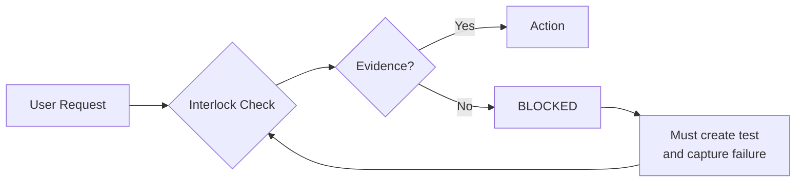

# Iron Law Interlock

## Purpose

This module provides a **hard gate** that MUST be satisfied before any file creation using the Write tool. It transforms the Iron Law from advisory guidance into a structural enforcement mechanism.

## The Problem

The core rule states:
```
NO IMPLEMENTATION WITHOUT A FAILING TEST FIRST
```

Currently, this is advisory. This module creates a gate that requires evidence to proceed.

## Interlock Definition

This mechanism prevents an action until preconditions are met. Unlike advice, it blocks the action path entirely.



## Pre-Flight Checklist (MANDATORY)

Before invoking the Write tool for ANY implementation file:

### Step 1: Declare Intent

State aloud in your response:
```markdown
**Iron Law Checkpoint**: I am about to create [filename].
```

### Step 2: Provide Test Evidence

You MUST include one of the following:

**Option A: Failing Test Output**
```markdown
**Test that drives this implementation**:
- File: tests/[test_file].py
- Test: test_[behavior]
- Status: RED (failing)
- Evidence:
  ```
  [E1] Command: pytest tests/[test_file].py::[test_name] -v
  Output: FAILED - [error message]
  ```
```

**Option B: Test File Created First**
```markdown
**Test created first** (proof:iron-law-red):
- Committed test at: [sha or "staged"]
- Test file: tests/[test_file].py
- Failure captured: [E1] evidence reference
```

**Option C: Explicit Exemption**
```markdown
**Iron Law Exemption** (requires user approval):
- Category: [documentation-only | configuration | user-directed]
- Reason: [why this doesn't need test-first]
- User approved: [yes/no - if no, STOP and ask]
```

### Step 3: Verify Preconditions

```markdown
**Iron Law Self-Check**:
- [ ] I have documented evidence of a failure/need
- [ ] I am NOT writing a test that validates a pre-conceived implementation
- [ ] The test drives the implementation, not vice versa
- [ ] I can show the test failure that this file addresses
```

If ANY checkbox is unchecked, you CANNOT proceed with Write.

## Integration into Creation Workflows

### For /create-command, /create-skill, /create-hook

These workflows MUST include Phase 0 before any file scaffolding:

```markdown
### Phase 0: Iron Law Compliance (BLOCKING)

Before creating any files:

1. **Create test file first**:
   ```
   tests/unit/test_<name>.py
   ```

2. **Write structural validation tests**:
   - File exists at expected path
   - Frontmatter contains required fields
   - Referenced in plugin.json (if applicable)

3. **Run tests - capture RED state**:
   ```bash
   pytest tests/unit/test_<name>.py -v
   # Expected: FAILED (file does not exist)
   ```

4. **Capture evidence**:
   ```markdown
   [E1] Command: pytest tests/unit/test_<name>.py -v
   Output: FAILED - FileNotFoundError: [path]
   ```

5. **ONLY THEN proceed to Phase 1**

**TodoWrite items (REQUIRED)**:
- `proof:iron-law-red` - Test failure captured
- `proof:iron-law-interlock-satisfied` - Interlock passed
```

## Exemption Categories

Some file types do not require test-first:

| Category | Examples | Rationale |
|----------|----------|-----------|
| Pure Documentation | README.md, CHANGELOG.md | No behavior to test |
| Configuration | .gitignore, pyproject.toml | Validated by tooling |
| User-Directed | "Just create the file" | Explicit bypass |
| Hotfix (with acknowledgment) | Emergency fixes | Must document violation |

**To claim exemption**:
```markdown
**Exemption Claimed**: [category]
**Rationale**: [why test-first doesn't apply]
**User Confirmation**: [required for non-documentation]
```

## Impact of Violation

When the Iron Law is violated:

1. **Immediate**: Work is incomplete (tests will be written later, debt incurred)
2. **Short-term**: Trust erosion with user
3. **Long-term**: Unvalidated behavior that will diverge from intent

The interlock exists because **rationalization is the failure mode**, not ignorance.

## Red Flags

| Thought | Interlock Response |
|---------|-------------------|
| "This is just a markdown file" | Is it a skill/command/hook? → Test required |
| "I'll add tests after" | BLOCKED - test BEFORE implementation |
| "The test is obvious" | Then write it first - should be quick |
| "Let me scaffold first, then test" | BLOCKED - scaffolding IS implementation |
| "This is urgent" | Hotfix exemption available WITH acknowledgment |

## Usage Example

**Correct Pattern**:
```markdown
**Iron Law Checkpoint**: I am about to create `commands/update-labels.md`.

**Test that drives this implementation**:
- File: tests/unit/test_update_labels_command.py (created first)
- Status: RED (failing)
- Evidence:
  [E1] Command: pytest tests/unit/test_update_labels_command.py -v
  Output: FAILED - FileNotFoundError: commands/update-labels.md does not exist

**Iron Law Self-Check**:
- [x] I have documented evidence of a failure/need
- [x] I am NOT writing a test that validates a pre-conceived implementation
- [x] The test drives the implementation
- [x] I can show the test failure that this file addresses

Proceeding with Write tool...
```

**Violation Pattern** (what the interlock prevents):
```markdown
Let me create the command file...

[Write tool invocation]

I'll add tests now...
```

This is BLOCKED. The Write tool cannot be invoked until interlock is satisfied.

## Module Reference

This module should be referenced from:
- `abstract:create-command` - Phase 0
- `abstract:create-skill` - Phase 0
- `abstract:create-hook` - Phase 0
- `imbue:proof-of-work` - Integration section
- Any skill that creates implementation files

**Reference syntax**:
```markdown
See [Iron Law Interlock](../../../abstract/shared-modules/iron-law-interlock.md) for hard gate requirements.
```

## Related Modules

- [enforcement-language.md](enforcement-language.md) - Language intensity calibration
- [anti-rationalization.md](anti-rationalization.md) - Bypass prevention patterns
- [iron-law-enforcement.md](../../imbue/skills/proof-of-work/modules/iron-law-enforcement.md) - Full TDD enforcement
