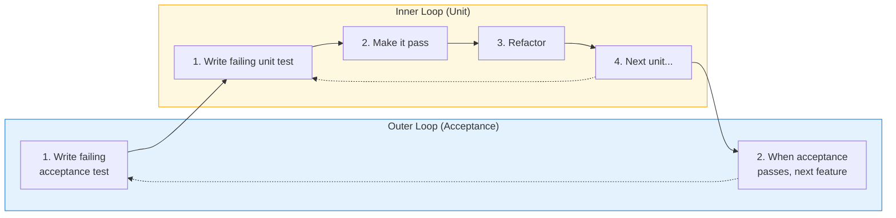

# Testing & TDD Masters

Expert frameworks for test-driven development, test design, and building confidence in code through systematic verification.

## Masters Overview

| Expert | Key Contribution | Best For |
|--------|-----------------|----------|
| Kent Beck | TDD, xUnit Patterns | Test-first development |
| Steve Freeman & Nat Pryce | GOOS (Growing Object-Oriented Software) | Outside-in TDD |
| Gerard Meszaros | xUnit Test Patterns | Test design & maintenance |
| Michael Feathers | Legacy Code Testing | Adding tests to existing code |
| James Bach & Michael Bolton | Exploratory Testing | Manual testing rigor |

## Detailed Frameworks

### Beck's Test-Driven Development

**Source**: Kent Beck - "Test-Driven Development: By Example" (2002)

**Core Idea**: Write failing test first, then minimal code to pass, then refactor.

**The TDD Cycle**:
```
RED    → Write failing test (design the interface)
GREEN  → Write minimal code to pass (make it work)
REFACTOR → Improve code (make it right)
REPEAT
```

**Key Principles**:
- **Test first, not test after**: Tests drive design
- **Small steps**: One assertion, one tiny change
- **Minimal code**: Only enough to pass the test
- **Continuous refactoring**: Clean as you go

**Beck's Three Laws of TDD**:
1. Don't write production code until you have a failing test
2. Don't write more test than sufficient to fail
3. Don't write more production code than sufficient to pass

**Use When**: Greenfield development, clear requirements, need design guidance.

**Avoid When**: Exploratory prototyping, highly uncertain domains.

---

### Freeman & Pryce's Outside-In TDD (GOOS)

**Source**: "Growing Object-Oriented Software, Guided by Tests" (2009)

**Core Idea**: Start from acceptance tests, work inward, discover design.

**The Double Loop**:


**Key Principles**:
- **Outside-in**: Start at edges (UI/API), work toward core
- **Mock at boundaries**: Use mocks to discover collaborators
- **Listen to tests**: Painful tests reveal design problems
- **Walking skeleton**: First test is end-to-end (thin vertical slice)

**Design Discovery**:
```
"When we write a test, we're designing the API we want to use."
"Mocks tell us what collaborators we need."
```

**Use When**: Complex systems, need design guidance, object-oriented code.

---

### Meszaros' xUnit Test Patterns

**Source**: Gerard Meszaros - "xUnit Test Patterns" (2007)

**Core Idea**: Catalog of patterns for well-designed, maintainable tests.

**Test Structure (Four-Phase)**:
```
1. SETUP    - Establish preconditions
2. EXERCISE - Execute behavior under test
3. VERIFY   - Check expected outcomes
4. TEARDOWN - Clean up (often implicit)
```

**Key Patterns**:
| Pattern | Problem | Solution |
|---------|---------|----------|
| Test Double | Need to isolate | Use Dummy, Stub, Spy, Mock, Fake |
| Object Mother | Repetitive setup | Factory for test objects |
| Test Data Builder | Complex object construction | Fluent builder for tests |
| Parameterized Test | Similar tests, different data | Data-driven test |

**Test Smells**:
| Smell | Symptom | Cure |
|-------|---------|------|
| Fragile Test | Breaks on unrelated changes | Better isolation, less coupling |
| Obscure Test | Hard to understand | Clear names, one assertion |
| Slow Test | Takes too long | Mock external deps, parallelize |
| Erratic Test | Sometimes passes/fails | Fix non-determinism |

**Use When**: Test suite is growing complex, tests becoming maintenance burden.

---

### Feathers' Legacy Code Techniques

**Source**: Michael Feathers - "Working Effectively with Legacy Code" (2004)

**Core Idea**: "Legacy code is code without tests." Strategies to add them.

**Definition**: Legacy code = code without tests (regardless of age)

**The Legacy Code Change Algorithm**:
1. **Identify change points**
2. **Find test points**
3. **Break dependencies**
4. **Write characterization tests** (capture current behavior)
5. **Make changes and refactor**

**Key Techniques**:
| Technique | Purpose |
|-----------|---------|
| Characterization Test | Document what code actually does (not what it should do) |
| Sprout Method | Add new code in testable method, call from legacy |
| Sprout Class | New functionality in new testable class |
| Wrap Method | Wrap existing method to add behavior |
| Extract Interface | Break dependency on concrete class |

**Seam Types** (places to inject test behavior):
- **Object seams**: Override in subclass
- **Compile seams**: Swap at build time
- **Link seams**: Swap libraries

**Use When**: Adding tests to existing codebase, modifying untested code.

---

### Bach & Bolton's Exploratory Testing

**Source**: James Bach & Michael Bolton - Rapid Software Testing

**Core Idea**: Skilled, intentional exploration guided by heuristics, not scripts.

**Key Concepts**:
- **Testing vs. Checking**: Testing = exploration, Checking = verification
- **Heuristics**: Guidelines, not rules
- **Session-based**: Timeboxed, focused exploration
- **Charter**: Goal for exploration session

**SFDPOT Heuristic** (what to test):
| Letter | Category | Questions |
|--------|----------|-----------|
| S | Structure | What is it made of? |
| F | Function | What does it do? |
| D | Data | What data does it process? |
| P | Platform | What does it depend on? |
| O | Operations | How is it used? |
| T | Time | How does it change over time? |

**Use When**: Need human judgment, can't specify all cases, exploring new features.

## Selection Matrix

| Your Context | Primary Framework | Supporting |
|--------------|------------------|------------|
| New feature development | Beck TDD | Freeman GOOS |
| Complex system design | Freeman GOOS | Beck |
| Test suite maintenance | Meszaros | Feathers |
| Legacy codebase | Feathers | Meszaros |
| Manual testing guidance | Bach/Bolton | - |
| Clear requirements | Beck | Meszaros |
| Discovering requirements | Freeman GOOS | Bach/Bolton |

## TDD Workflow Template

Blended from Beck + Freeman:

```markdown
## Feature: [Name]

### Acceptance Criteria (Outer Loop)
- [ ] Given [context], when [action], then [outcome]

### Implementation Plan

#### Cycle 1
**RED**:
- Test: `test_[what]_[scenario]`
- Assertion: [expected behavior]
- Status: FAILING

**GREEN**:
- Minimal implementation: [approach]
- Status: PASSING

**REFACTOR**:
- Improvement: [what cleaned up]
- Tests still passing: YES

#### Cycle 2
[Continue...]
```

## Test Quality Checklist

Based on Meszaros patterns:

```markdown
## Test Review Checklist

### Structure
- [ ] Clear arrange/act/assert phases
- [ ] One logical assertion per test
- [ ] Descriptive test name (what_when_then)

### Independence
- [ ] No test depends on another's side effects
- [ ] Can run in any order
- [ ] Clean setup/teardown

### Readability
- [ ] Test tells a story
- [ ] No mystery guests (unexplained values)
- [ ] Relevant data visible in test

### Maintainability
- [ ] No fragile assertions (over-specification)
- [ ] Uses appropriate test doubles
- [ ] DRY via helpers, not copy-paste
```

## Anti-Patterns to Avoid

- **Test after**: Writing tests after code removes design benefits
- **Testing implementation**: Coupling tests to internal structure
- **Slow tests**: Not isolating from slow dependencies
- **Test-per-method**: Testing methods instead of behaviors
- **100% coverage worship**: Coverage doesn't equal quality
- **Commented tests**: Delete or fix, never comment out
