# Graphviz Conventions for Skill Diagrams

## Overview

Process diagrams help visualize skill workflows, decision trees, and error handling. This module defines standard conventions for creating consistent, readable Graphviz diagrams in skills.

## When to Include Diagrams

 **Use diagrams for:**
- Complex decision trees (3+ decision points)
- Multi-step workflows with branches
- Error handling flows
- State transitions
- Tool orchestration sequences

 **Skip diagrams for:**
- Simple linear workflows (just use numbered lists)
- Single decision points
- Purely conceptual relationships (use tables instead)

## Node Type Conventions

### Diamond: Questions/Decisions

**Shape**: `shape=diamond`

**Purpose**: Binary or multiple-choice decision points

**Naming**: Always end with question mark


**Example Labels:**
- "Tests exist?"
- "Security critical?"
- "Production code?"
- "Validation passed?"

### Box: Actions/Processes

**Shape**: `shape=box` (default)

**Purpose**: Actions Claude should take

**Naming**: Start with verb (imperative form)


**Example Labels:**
- "Run tests"
- "Write validation"
- "Generate report"
- "Update documentation"

### Plaintext: Commands/Code

**Shape**: `shape=plaintext`

**Purpose**: Literal commands or code to execute

**Naming**: Show actual syntax


**Example Labels:**
- "pytest tests/"
- "git commit -m '...'"
- "make build"
- "./script.sh"

### Ellipse: States/Results

**Shape**: `shape=ellipse`

**Purpose**: Outcomes, states, or results

**Naming**: Descriptive noun phrases


**Example Labels:**
- "Tests passing"
- "Deployment ready"
- "Security validated"
- "Error state"

### Octagon: Warnings/Stops

**Shape**: `shape=octagon`

**Purpose**: Critical warnings or stop conditions

**Naming**: Imperative warnings


**Example Labels:**
- "STOP: Security risk"
- "WARNING: Untested code"
- "HALT: Missing validation"

### Double Circle: Start/End Points

**Shape**: `shape=doublecircle`

**Purpose**: Entry and exit points


## Edge Labeling Conventions

### Binary Decisions

Use "yes"/"no" for diamond nodes:


### Multiple Choice

Use descriptive labels:


### Sequential Flow

Use no labels for obvious sequences:


### Conditional Edges

Use descriptive conditions:

```dot
digraph {
    node [shape=box]
    check [label="Check coverage"]
    improve [label="Add tests"]
    proceed [label="Continue"]

    check -> improve [label="< 80%"]
    check -> proceed [label="≥ 80%"]
}
```



## Complete Example: TDD Workflow


## Layout Best Practices

### Direction

**Top to Bottom** (default): Use for most workflows
```dot
digraph {
    rankdir=TB  // or omit, TB is default
}
```

**Left to Right**: Use for sequential processes
```dot
digraph {
    rankdir=LR
}
```

### Grouping with Subgraphs

Group related nodes:


### Alignment

Force nodes onto same rank for parallel processes:


## Color Usage

### Semantic Colors


### Accessible Colors

Avoid red/green only combinations (colorblind accessible):
- Use shapes + colors
- Add text indicators
- Use patterns when possible

## Font and Styling

### Standard Settings


### Text Wrapping

Use `\n` for line breaks in labels:

```dot
node [label="This is a long label\nthat spans\nmultiple lines"]
```

Aim for 10-15 characters per line maximum.

## Common Patterns

### Binary Decision Tree


### Error Handling Flow


### State Machine

```dot
digraph {
    node [shape=ellipse]
    idle [label="Idle"]
    running [label="Running"]
    paused [label="Paused"]
    error [label="Error"]

    node [shape=doublecircle]
    complete [label="Complete"]

    idle -> running [label="start"]
    running -> paused [label="pause"]
    paused -> running [label="resume"]
    running -> error [label="fail"]
    error -> running [label="retry"]
    running -> complete [label="finish"]
}
```

## Validation Checklist

Before including a diagram in a skill:

- [ ] All decision nodes are diamonds with questions
- [ ] All action nodes are boxes with verbs
- [ ] Binary decisions use "yes"/"no" labels
- [ ] Complex decisions use descriptive labels
- [ ] Commands/code use plaintext shape
- [ ] Colors are semantic and accessible
- [ ] Text wraps at reasonable width
- [ ] Start/end points marked (if applicable)
- [ ] Critical warnings use octagon shape
- [ ] Direction (TB/LR) suits the workflow
- [ ] Font is readable (10-12pt)
- [ ] Diagram adds value (not just decoration)

## Rendering

### In Markdown Skills

Use fenced code blocks:

````markdown
```dot
digraph example {
    start -> process -> end
}
```
````

### Command-Line Rendering

```bash
# Generate PNG
dot -Tpng workflow.dot -o workflow.png

# Generate SVG (recommended for documentation)
dot -Tsvg workflow.dot -o workflow.svg

# Generate PDF
dot -Tpdf workflow.dot -o workflow.pdf
```

## Anti-Patterns

###  Overly Complex Diagrams

**Problem**: Too many nodes, hard to follow

**Solution**: Break into multiple focused diagrams or use hierarchical grouping

###  Missing Labels

**Problem**: Unlabeled edges in complex flows

**Solution**: Always label decision edges, optional for obvious sequences

###  Inconsistent Shapes

**Problem**: Using box for both questions and actions

**Solution**: Follow shape conventions consistently

###  Decoration-Only Diagrams

**Problem**: Diagram doesn't add information beyond text

**Solution**: Only include diagrams that clarify complex flows

###  Unreadable Text

**Problem**: Font too small or labels too long

**Solution**: Use 10-12pt fonts, wrap long labels

## Summary

Standard Graphviz conventions:
- **Diamond**: Questions/decisions
- **Box**: Actions/processes
- **Plaintext**: Commands/code
- **Ellipse**: States/results
- **Octagon**: Warnings/stops
- **Double circle**: Start/end

Label edges clearly, use semantic colors, and only include diagrams that add value beyond text descriptions.
