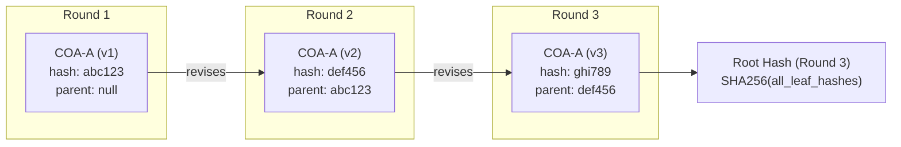

# Merkle-DAG Anonymization

## Purpose

Research shows LLMs exhibit "self-preference bias" - favoring their own outputs or outputs from the same model family. The Merkle-DAG structure:

1. **Anonymizes** contributions during deliberation
2. **Tracks versions** across rounds
3. **Verifies integrity** via cryptographic hashes
4. **Reveals attribution** only after decision

## Data Structure

```python
from dataclasses import dataclass, field
from datetime import datetime
from hashlib import sha256
from typing import Optional


@dataclass
class DeliberationNode:
    """A single contribution in the deliberation graph."""

    node_id: str           # Short hash (first 16 chars)
    parent_id: Optional[str]  # Previous version (for revisions)
    round_number: int      # Which deliberation round
    phase: str             # intel, coa, red_team, vote, premortem, synthesis

    # Anonymized during deliberation
    anonymous_label: str   # "Response A", "Expert 2", etc.
    content: str           # The actual contribution

    # Revealed after decision (sealed until then)
    expert_role: str       # "Intelligence Officer", "Red Team", etc.
    expert_model: str      # "gemini-2.5-pro", "qwen-turbo", etc.

    # Merkle linkage
    content_hash: str      # SHA-256 of content only
    metadata_hash: str     # SHA-256 of role + model
    combined_hash: str     # SHA-256 of content_hash + metadata_hash

    timestamp: str         # ISO format


@dataclass
class MerkleDAG:
    """Directed Acyclic Graph tracking deliberation history."""

    session_id: str
    sealed: bool = True    # Attribution hidden until unsealed
    root_hash: Optional[str] = None
    nodes: dict[str, DeliberationNode] = field(default_factory=dict)
    label_counter: dict[str, int] = field(default_factory=dict)

    def add_contribution(
        self,
        content: str,
        phase: str,
        round_number: int,
        expert_role: str,
        expert_model: str,
        parent_id: Optional[str] = None
    ) -> DeliberationNode:
        """Add a contribution and compute hashes."""

        # Compute hashes
        content_hash = sha256(content.encode()).hexdigest()
        metadata_hash = sha256(f"{expert_role}:{expert_model}".encode()).hexdigest()
        combined_hash = sha256(f"{content_hash}:{metadata_hash}".encode()).hexdigest()

        # Generate anonymous label
        label = self._generate_label(phase)

        node = DeliberationNode(
            node_id=combined_hash[:16],
            parent_id=parent_id,
            round_number=round_number,
            phase=phase,
            anonymous_label=label,
            content=content,
            expert_role=expert_role,
            expert_model=expert_model,
            content_hash=content_hash,
            metadata_hash=metadata_hash,
            combined_hash=combined_hash,
            timestamp=datetime.now().isoformat()
        )

        self.nodes[node.node_id] = node
        self._update_root_hash()
        return node

    def _generate_label(self, phase: str) -> str:
        """Generate anonymous label for phase."""
        if phase not in self.label_counter:
            self.label_counter[phase] = 0
        self.label_counter[phase] += 1
        count = self.label_counter[phase]

        # Use letters for COAs, numbers for others
        if phase == "coa":
            return f"Response {chr(64 + count)}"  # A, B, C...
        return f"Expert {count}"

    def _update_root_hash(self) -> None:
        """Update root hash from all leaf nodes."""
        if not self.nodes:
            self.root_hash = None
            return

        # Combine all node hashes
        combined = ":".join(sorted(n.combined_hash for n in self.nodes.values()))
        self.root_hash = sha256(combined.encode()).hexdigest()

    def get_anonymized_view(self) -> list[dict]:
        """Return contributions with attribution masked."""
        return [
            {
                "label": node.anonymous_label,
                "content": node.content,
                "phase": node.phase,
                "round": node.round_number,
                "hash": node.node_id,  # Verifiable but not attributable
            }
            for node in self.nodes.values()
        ]

    def unseal(self) -> list[dict]:
        """Reveal full attribution after decision is made."""
        self.sealed = False
        return [
            {
                "label": node.anonymous_label,
                "content": node.content,
                "phase": node.phase,
                "round": node.round_number,
                "expert_role": node.expert_role,
                "expert_model": node.expert_model,
                "hash": node.node_id,
                "verified": self._verify_node(node),
            }
            for node in self.nodes.values()
        ]

    def _verify_node(self, node: DeliberationNode) -> bool:
        """Verify node hash integrity."""
        expected_content = sha256(node.content.encode()).hexdigest()
        expected_meta = sha256(f"{node.expert_role}:{node.expert_model}".encode()).hexdigest()
        expected_combined = sha256(f"{expected_content}:{expected_meta}".encode()).hexdigest()
        return expected_combined[:16] == node.node_id
```

## Version Tracking

When experts revise their positions (Delphi mode):



## Serialization

```python
def to_json(self) -> dict:
    """Serialize DAG for persistence."""
    return {
        "session_id": self.session_id,
        "sealed": self.sealed,
        "root_hash": self.root_hash,
        "nodes": {
            nid: {
                "node_id": n.node_id,
                "parent_id": n.parent_id,
                "round_number": n.round_number,
                "phase": n.phase,
                "anonymous_label": n.anonymous_label,
                "content": n.content,
                "expert_role": n.expert_role if not self.sealed else "[SEALED]",
                "expert_model": n.expert_model if not self.sealed else "[SEALED]",
                "content_hash": n.content_hash,
                "metadata_hash": n.metadata_hash,
                "combined_hash": n.combined_hash,
                "timestamp": n.timestamp,
            }
            for nid, n in self.nodes.items()
        }
    }
```

## Usage in Deliberation

### During COA Development (sealed)

```python
# Expert contributions are anonymized
dag.add_contribution(
    content=coa_response,
    phase="coa",
    round_number=1,
    expert_role="Field Tactician",
    expert_model="glm-4.7"
)

# Present to Red Team anonymized
anonymized = dag.get_anonymized_view()
# Returns: [{"label": "Response A", "content": "...", ...}]
```

### During Synthesis (unsealed)

```python
# Supreme Commander sees full attribution
revealed = dag.unseal()
# Returns: [{"label": "Response A", "expert_role": "Field Tactician", ...}]
```

## Integrity Verification

After session, verify no tampering:

```python
def verify_session_integrity(dag: MerkleDAG) -> bool:
    """Verify all nodes hash correctly."""
    for node in dag.nodes.values():
        if not dag._verify_node(node):
            return False
    return True
```
