# Capture Workflow Module

Detailed workflow for capturing PR review knowledge into the review chamber.

## Trigger Points

Knowledge capture can be triggered:

1. **Automatically**: After `sanctum:pr-review` completes Phase 6
2. **Manually**: Via `/review-room capture` command
3. **Retroactively**: From existing PR review threads

## Automatic Capture Flow

```mermaid
graph TD
    A[PR Review Completed] --> B{Has BLOCKING findings?}
    B -->|Yes| C[Evaluate each finding]
    B -->|No| D{Has IN-SCOPE findings?}
    D -->|Yes| C
    D -->|No| E[Skip capture]

    C --> F{Score ≥ 60?}
    F -->|Yes| G[Classify room type]
    F -->|No| E

    G --> H[Create ReviewEntry]
    H --> I[Add to project palace]
    I --> J[Update connections]
    J --> K[Report captured entries]
```



## Finding Evaluation

For each PR finding, compute a capture score:

### Novelty Check (25 points max)

```python
def evaluate_novelty(finding, existing_entries):
    """Check if finding represents new knowledge."""

    # Search existing entries for similar content
    similar = search_similar(finding.content, existing_entries)

    if not similar:
        return 25  # Completely novel

    best_match = similar[0]
    if best_match.similarity < 0.5:
        return 20  # Mostly novel
    elif best_match.similarity < 0.8:
        return 10  # Partial overlap - may add context
    else:
        return 0   # Duplicate - skip
```

### Applicability Check (30 points max)

```python
def evaluate_applicability(finding, project_context):
    """Estimate future relevance."""

    score = 0

    # Affects common code paths
    if finding.file in project_context.hot_paths:
        score += 15

    # Relates to core domain
    if finding.category in project_context.core_domains:
        score += 10

    # Has broad applicability
    if len(finding.affected_files) > 3:
        score += 5

    return min(30, score)
```

### Durability Check (20 points max)

```python
def evaluate_durability(finding):
    """Distinguish architectural from tactical."""

    # Architectural indicators
    architectural_keywords = [
        'architecture', 'design', 'pattern', 'convention',
        'security', 'performance', 'scalability', 'api'
    ]

    # Tactical indicators
    tactical_keywords = [
        'typo', 'formatting', 'temporary', 'workaround',
        'quick fix', 'hotfix', 'revert'
    ]

    content_lower = finding.content.lower()

    arch_matches = sum(1 for k in architectural_keywords if k in content_lower)
    tact_matches = sum(1 for k in tactical_keywords if k in content_lower)

    if arch_matches > tact_matches:
        return 20  # Architectural
    elif arch_matches == tact_matches:
        return 10  # Mixed
    else:
        return 0   # Tactical - skip
```

### Connectivity Check (15 points max)

```python
def evaluate_connectivity(finding, palace):
    """Check links to existing knowledge."""

    score = 0

    # Links to existing ADRs
    if finding.references_adr:
        score += 5

    # Links to workshop patterns
    if finding.references_pattern:
        score += 5

    # Would create new connections
    potential_links = find_potential_links(finding, palace)
    if len(potential_links) > 2:
        score += 5

    return score
```

### Authority Check (10 points max)

```python
def evaluate_authority(finding, participants):
    """Weight by reviewer expertise."""

    score = 0

    # Senior reviewer involved
    if any(is_senior(p) for p in participants):
        score += 5

    # Domain expert reviewed
    domain = extract_domain(finding)
    if any(is_domain_expert(p, domain) for p in participants):
        score += 5

    return score
```

## Room Classification Logic

After evaluation, classify into appropriate room:

```python
def classify_finding(finding, score):
    """Determine target room for finding."""

    if score < 60:
        return None  # Don't capture

    severity = finding.severity
    category = finding.category.lower()

    # Decisions: Architectural choices with rationale
    if severity == "BLOCKING" and any(k in category for k in [
        'architecture', 'design', 'security', 'api'
    ]):
        return "decisions"

    # Patterns: Recurring issues or solutions
    if is_recurring(finding) or any(k in category for k in [
        'pattern', 'recurring', 'common', 'best-practice'
    ]):
        return "patterns"

    # Standards: Quality examples
    if any(k in category for k in [
        'quality', 'style', 'convention', 'standard'
    ]):
        return "standards"

    # Lessons: Retrospective insights
    if any(k in category for k in [
        'lesson', 'learning', 'retrospective', 'insight'
    ]):
        return "lessons"

    # Default: High-severity findings as patterns
    if severity == "BLOCKING":
        return "patterns"

    return None
```

## Entry Creation

Create structured entry from finding:

```python
def create_review_entry(finding, pr_info, room_type):
    """Create ReviewEntry from finding."""

    return ReviewEntry(
        source_pr=f"#{pr_info.number} - {pr_info.title}",
        title=finding.title,
        room_type=room_type,
        content={
            "decision": finding.description,
            "context": extract_discussion_context(finding),
            "captured_knowledge": {
                "severity": finding.severity,
                "category": finding.category,
                "file": finding.file,
                "line": finding.line,
                "fix": finding.suggested_fix,
            },
            "connected_concepts": find_related_concepts(finding),
        },
        participants=pr_info.participants,
        related_rooms=find_related_rooms(finding),
        tags=extract_tags(finding),
    )
```

## Post-Capture Actions

After adding entry to palace:

1. **Update bidirectional links** - Add backlinks from related entries
2. **Refresh palace index** - Update tags and search index
3. **Check for contradictions** - Alert if new entry conflicts with existing
4. **Generate summary** - Report what was captured

```python
def post_capture_actions(entry, palace):
    """Actions after successful capture."""

    # Add backlinks
    for related in entry.related_rooms:
        add_backlink(palace, related, entry.id)

    # Check contradictions
    contradictions = find_contradictions(entry, palace)
    if contradictions:
        alert_contradiction(entry, contradictions)

    # Return summary
    return {
        "entry_id": entry.id,
        "room": f"review-chamber/{entry.room_type}",
        "title": entry.title,
        "tags": entry.tags,
        "related": entry.related_rooms,
    }
```
