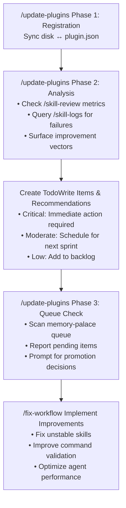

# Update Plugin Registrations

Audit plugin.json files against actual disk contents and fix registration gaps.

## Arguments

- `plugin-name` - Optional: specific plugin to audit (default: all plugins)
- `--dry-run` - Show discrepancies without making changes (default behavior)
- `--fix` - Automatically update plugin.json files to add/remove registrations

## What It Does

### Phase 1: Registration Audit
1. **Scans each plugin directory** for commands, skills, agents, hooks on disk
2. **Compares with plugin.json** registrations
3. **Reports discrepancies**: missing registrations, stale entries
4. **Optionally fixes** by updating plugin.json files with proper sorting

### Phase 2: Performance & Improvement Analysis (Automatic)
5. **Analyzes skill execution metrics** using memory-palace logs
6. **Identifies unstable skills** with stability_gap > 0.3
7. **Surfaces recent failures** and performance degradation
8. **Recommends improvements** based on execution history

### Phase 3: Knowledge Queue Promotion Check (Automatic)
9. **Scans memory-palace queue** for pending research items
10. **Reports items awaiting evaluation** with age and priority
11. **Prompts for promotion decisions** on high-value items
12. **Prevents knowledge loss** from stale queue entries

## Workflow

### Phase 1: Registration Audit

Execute the Python script with the provided arguments:

```bash
# Audit all plugins (dry run - show discrepancies only)
python3 plugins/sanctum/scripts/update_plugin_registrations.py --dry-run

# Audit specific plugin
python3 plugins/sanctum/scripts/update_plugin_registrations.py parseltongue --dry-run

# Fix all plugins (update plugin.json files)
python3 plugins/sanctum/scripts/update_plugin_registrations.py --fix

# Fix specific plugin
python3 plugins/sanctum/scripts/update_plugin_registrations.py abstract --fix
```

### Phase 2: Performance & Improvement Analysis

After registration audit completes, automatically analyze improvement opportunities:

#### Step 1: Check Skill Performance Metrics

For each plugin being updated, invoke `/skill-review` to analyze execution history:

```bash
# If updating specific plugin
/skill-review --plugin <plugin-name> --recommendations

# If updating all plugins
/skill-review --all-plugins --recommendations
```

**Look for:**
- Unstable skills (stability_gap > 0.3)
- Recent failure patterns
- Performance degradation trends
- Low success rates (< 80%)

#### Step 2: Surface Recent Failures

Query skill execution logs for actionable failures:

```bash
# Last 7 days of failures for this plugin
/skill-logs --plugin <plugin-name> --failures-only --last 7d
```

**Extract:**
- Common error messages
- Recurring failure patterns
- Environmental dependencies causing issues

#### Step 3: Check for Workflow Improvements

Look for documented workflow inefficiencies:

1. Check if `sanctum:workflow-improvement` skill has been invoked recently
2. Review git history for recent fixes to commands/skills/agents in this plugin
3. Check issue tracker for open improvement issues

**Command to check recent workflow fixes:**
```bash
git log --oneline --grep="improve\|fix\|optimize" --since="30 days ago" -- plugins/<plugin-name>/
```

#### Step 4: Generate Improvement Recommendations

Based on phases 1-3, create actionable recommendations:

**Format:**
```markdown
## Improvement Recommendations for <plugin-name>

### Critical (Immediate Action)
- [ ] Skill: <skill-name> - Stability gap: 0.45 - Review error handling
- [ ] Command: <command-name> - 5 failures in last week - Missing validation

### Moderate (Schedule for Next Sprint)
- [ ] Agent: <agent-name> - Performance degradation detected - Review token usage
- [ ] Skill: <skill-name> - Low success rate (72%) - Improve documentation

### Low Priority (Backlog)
- [ ] Hook: <hook-name> - Occasional timeouts - Add async handling
```

#### Step 5: Create Action Items (AUTOMATIC)

**Critical and Moderate issues are automatically logged to GitHub issues.**

> **Module Reference**: See `plugins/sanctum/skills/shared/modules/auto-issue-creation.md` for the full pattern.

For each Critical or Moderate recommendation:

1. **Check for duplicates** - Search existing issues to avoid creating duplicates
2. **Create GitHub issue** with appropriate labels:
   - Critical: `high-priority`, `plugin:<name>`, component label
   - Moderate: `medium-priority`, `plugin:<name>`, component label
3. **Report created issues** to user at end of command

**Low Priority items** are reported but NOT auto-created (remain in backlog documentation).

**To skip automatic creation**: Use `--no-auto-issues` flag.

**Also create TodoWrite items** for immediate tracking:

```
improvement:<plugin-name>:skill-<name>-stability
improvement:<plugin-name>:command-<name>-validation
improvement:<plugin-name>:agent-<name>-performance
```

### Phase 3: Knowledge Queue Promotion Check

After improvement analysis, check the memory-palace research queue for items needing evaluation.

#### Step 1: Scan Queue for Pending Items

```bash
# List all pending queue entries with age
ls -lt plugins/memory-palace/docs/knowledge-corpus/queue/*.md 2>/dev/null | head -20
```

**Check for:**
- `webfetch-*.md` - Auto-captured web content
- `websearch-*.md` - Auto-captured search results
- Any file with `status: pending_review` in frontmatter

#### Step 2: Report Queue Status

**Format:**
```markdown
## Knowledge Queue Status

### Pending Review (X items)
| File | Age | Topic | Priority |
|------|-----|-------|----------|
| webfetch-article-name-2026-01-15.md | 2 days | "Article Title" | medium |
| websearch-query-2026-01-10.md | 7 days | "Search Query" | medium |

### Action Required
- [ ] 3 items older than 7 days - review or archive
- [ ] 1 high-priority item awaiting decision
```

#### Step 3: Prompt for Evaluation

For each pending item older than 3 days:

1. **Display summary** - Show topic, source, content preview
2. **Request decision**:
   - **Promote**: Move to `knowledge-corpus/` (outside queue), update index
   - **Archive**: Move to `queue/archive/` with rejection rationale
   - **Defer**: Keep in queue, optionally adjust priority
3. **Execute decision** - Move file, update status in frontmatter

**Example evaluation prompt:**
```
Queue Item: webfetch-claude-plugins-guide-2026-01-10.md (7 days old)
Topic: "Claude Code Plugin Development Guide"
Source: https://docs.anthropic.com/plugins/guide
Content: 2,340 chars

Decision options:
  [P]romote to knowledge-corpus/
  [A]rchive (not valuable)
  [D]efer (review later)
  [S]kip (next item)
```

#### Step 4: Execute Promotions

For items marked for promotion:

```bash
# 1. Move from queue to corpus
mv plugins/memory-palace/docs/knowledge-corpus/queue/webfetch-*.md \
   plugins/memory-palace/docs/knowledge-corpus/

# 2. Update frontmatter status
# Change: status: pending_review → status: processed

# 3. Rename to permanent filename (remove webfetch- prefix, timestamp)
# webfetch-article-name-2026-01-15.md → article-name.md
```

#### Step 5: Create TodoWrite Items

Track promotion decisions:

```
queue-review:promoted:<filename>
queue-review:archived:<filename>
queue-review:deferred:<filename>
```

**To skip queue check**: Use `--skip-queue` flag.

## Implementation

This command runs the Python script:

```bash
python3 plugins/sanctum/scripts/update_plugin_registrations.py [plugin-name] [--dry-run] [--fix]
```

### Script Features

- **Smart filtering**: Excludes module directories, __pycache__, test files, __init__.py
- **Nested path handling**: Detects and reports stale nested registrations
- **Alphabetical sorting**: Maintains consistent ordering in plugin.json
- **Safe by default**: Dry-run mode unless --fix is specified
- **Detailed reporting**: Shows missing and stale entries by category

## Discrepancy Types

| Type | Meaning | Action |
|------|---------|--------|
| **Missing** | File on disk, not in plugin.json | Add registration |
| **Stale** | In plugin.json, not on disk | Remove or investigate |
| **Path mismatch** | Wrong path format | Correct path |

## Integration

This command complements:
- `/update-docs` - Updates documentation after plugin changes
- `/update-version` - Bumps versions after significant changes
- `/validate-plugin` - Validates overall plugin structure
- `/skill-review` - Analyzes skill performance metrics (invoked automatically in Phase 2)
- `/skill-logs` - Surfaces recent failures (invoked automatically in Phase 2)
- `/fix-workflow` - Implements improvements for identified issues
- `memory-palace:knowledge-intake` - Evaluates queue items for promotion (Phase 3)

## When to Use

- After adding new commands, skills, agents, or hooks
- During version bumps to ensure completeness
- As part of PR preparation (`/pr` workflow)
- When capabilities-reference.md seems out of sync
- **Periodically (weekly/monthly)** to catch performance degradation early
- **After major refactors** to ensure no regressions in skill stability

## Improvement Integration Loop

This command creates a continuous improvement feedback loop:



## See Also

- `abstract:validate-plugin-structure` - Full plugin validation
- `/update-docs` - Documentation updates
- `capabilities-reference.md` - Central capability listing
- `/skill-review` - Performance analysis and recommendations
- `/skill-logs` - Execution history and failure patterns
- `/fix-workflow` - Workflow improvement retrospectives
- `memory-palace:knowledge-intake` - Queue evaluation criteria
- `plugins/memory-palace/docs/knowledge-corpus/queue/README.md` - Queue workflow docs
